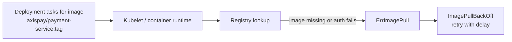

# INC-1 · Your First Incident

| | |
|---|---|
| **Time** | 35 minutes |
| **Difficulty** | Nobody tells you the answer |
| **You need first** | [L1.6](../L1.6-platform-assembly/) — a working platform |
| **You will do** | Find a fault you were not warned about, fix it, and prove the fix |
| **Check you are done** | `make validate-lab LAB=L1.6` passes again |

---

<details>
<summary><b>First time in a terminal? Open this.</b></summary>

- Copy/paste: <kbd>Ctrl</kbd>+<kbd>Shift</kbd>+<kbd>C</kbd> / <kbd>Ctrl</kbd>+<kbd>Shift</kbd>+<kbd>V</kbd> — **with Shift**.
- <kbd>Ctrl</kbd>+<kbd>C</kbd> stops whatever is running. <kbd>↑</kbd> repeats the last command.
- Every command assumes you are in `~/kubernetes`. Check with `pwd`.
- Full version: [`labs/GETTING-STARTED.md`](../../../GETTING-STARTED.md).
</details>

---

## What this concept means

`ImagePullBackOff` means Kubernetes asked the container runtime to fetch an image, but the image could not be pulled successfully. Common causes are a wrong image name, a tag that does not exist, a private registry that needs credentials, or simple registry/network trouble.

The important detail is that your application container usually has **not started yet**. Kubernetes keeps retrying, but it waits longer between attempts — that is the "back-off" part. So the pod can sit there looking stuck when it is really failing, waiting, and trying again.

This is one of the most common real-world Kubernetes errors because image references are easy to mistype and deployments depend completely on them. One bad tag is enough to turn a healthy rollout into a broken one.



---

## Read this before you start

Something in your cluster is about to be broken. **You will not be told what.**

That is deliberate, and it is the most valuable thirty-five minutes of the day. Real faults do not arrive labelled. They arrive as a complaint from someone who cannot see your cluster, and your job is to work backwards from a symptom to a cause.

**You are being assessed on method, not speed.** Someone who follows the six steps and does not finish scores higher than someone who guesses correctly. That is not encouragement — it is how the scoring below actually works, and it is how the final assessment on Friday works too.

**Two rules:**

1. **Do not skip ahead** to the fix. The value is in the finding.
2. **Do not change anything until you can say why.** Randomly restarting things sometimes works, teaches nothing, and in a real incident often makes it worse.

If you are in a class, your instructor will answer questions about **tools** ("how do I see events?") but not about **causes** ("is it the image?"). If you are working alone, resist opening §6 for at least fifteen minutes.

---

## What is in this folder

| File | What it is |
|---|---|
| `README.md` | This incident. |
| `manifests/04-deployment-payment-service.yaml` | The known-good file. You will need it — but not until you know why. |

---

## Step 0 — Inject the fault

If you are in a class, your instructor has already done this. **Skip to the ticket.**

If you are working alone, run this and then **do not read the script**:

```bash
bash platform/admin/incidents/inject-INC-1.sh
```

Wait two minutes before starting, so the symptom has time to appear. Make a cup of tea.

---

## The ticket

This is all you get. It is roughly what a real one looks like.

```
────────────────────────────────────────────────────────────────────────
  AXISPAY OPERATIONS — INCIDENT TICKET
  Ref     OPS-2026-08-10-0231
  Raised  16:34 SAST          Severity  SEV-1
  Source  Merchant Support
────────────────────────────────────────────────────────────────────────

  Merchant MER_7QK2XD9P4A (Kalahari Outfitters) reports that payments
  started failing at approximately 16:28. Their checkout returns an
  error to customers.

  Two other merchants have since confirmed the same thing.

  Nothing was deployed today as far as Merchant Support is aware.

  Ops on call needs an update in 15 minutes.

────────────────────────────────────────────────────────────────────────
```

Note what the ticket does **not** say. It does not mention a pod, a namespace, or Kubernetes. Nobody outside the platform team describes an incident in those terms. Translating "checkout returns an error" into "which component" is the first move, and it is the skill.

---

## The method — use it

Six steps, in order. **Do not skip to step 3 because logs feel productive.** Steps 1 and 2 will usually have told you the answer already, and they take ten seconds each.

| # | Question | The command |
|---|---|---|
| **1** | Is it **Ready**? Not Running — **Ready**. | `kubectl get pods -A -l app.kubernetes.io/part-of=axispay` |
| **2** | What do the **events** say? | `kubectl describe pod <name> -n <ns>` — scroll to the bottom |
| **3** | What do the **logs** say? | `kubectl logs <name> -n <ns> --previous` |
| **4** | Is the **config** what you think? | `kubectl get deploy <name> -n <ns> -o yaml` |
| **5** | Can it **reach** its dependencies? | `kubectl get endpointslices -n <ns>` |
| **6** | What **changed**? | `kubectl rollout history deployment/<name> -n <ns>` |

Print this. You will use it in every incident this week and in Friday's assessment.

---

## Your worksheet

Fill this in as you go. It is not marked, but the people who write it down finish faster — because it stops you re-checking things you already ruled out.

```
Time started: ________

STEP 1 — What is not Ready?
  Namespace: ______________  Workload: ______________
  READY column says: ______  STATUS column says: ______________

STEP 2 — What do the events say?
  The most recent abnormal event:
  ______________________________________________________________
  In your own words, what is it complaining about?
  ______________________________________________________________

STEP 3 — What do the logs say?
  ______________________________________________________________
  (If you cannot get logs — WHY not? That is itself a clue.)

STEP 4 — Is the configuration what you expect?
  The field that looks wrong: _____________________________
  What it says: ______________  What it should say: ______________

STEP 6 — What changed?
  ______________________________________________________________

ROOT CAUSE (one sentence, a CAUSE not a symptom):
  ______________________________________________________________

MY FIX (before you run it — what and why):
  ______________________________________________________________

HOW I PROVED IT WORKED:
  ______________________________________________________________

Time finished: ________
```

---

## If you are completely stuck after fifteen minutes

Open these one at a time, not all at once.

<details>
<summary><b>Nudge 1 — where to look</b></summary>

The ticket says payments are failing. Which of your four services is on the payment path?

Start there — but start with `kubectl get pods`, not with logs. What does the READY column say?
</details>

<details>
<summary><b>Nudge 2 — you found a pod that is not Ready</b></summary>

What is in its `STATUS` column? Write the exact word down.

Now run `kubectl describe pod <name> -n <ns>` and **scroll all the way to the bottom**. The events are the last thing printed, and they are where Kubernetes explains itself.

Read the most recent `Warning`. It is quite explicit.
</details>

<details>
<summary><b>Nudge 3 — you have read the event and want to confirm</b></summary>

The event names something specific. Check whether that thing actually exists:

```bash
minikube -p axispay image ls | grep payment-service
```

Compare what is listed there with what the Deployment is asking for:

```bash
kubectl get deploy payment-service -n axispay-core \
  -o jsonpath='{.spec.template.spec.containers[0].image}'; echo
```
</details>

<details>
<summary><b>Nudge 4 — and how did it get like that?</b></summary>

```bash
kubectl rollout history deployment/payment-service -n axispay-core
kubectl rollout history deployment/payment-service -n axispay-core --revision=2
```

Someone made a change. The history says what, and — if they set it — why.
</details>

---

## What you should have found

**Only open this once you have a root cause written down**, or after twenty-five minutes.

<details>
<summary><b>The full walkthrough</b></summary>

### Step 1 — Is it Ready?

```bash
kubectl get pods -A -l app.kubernetes.io/part-of=axispay
```

```
NAMESPACE      NAME                               READY   STATUS             RESTARTS   AGE
axispay-core   merchant-service-7fc9b5d64-8vtkr   1/1     Running            0          22m
axispay-core   payment-service-6d8f4c2b9-x2ktp    0/1     ImagePullBackOff   0          4m
axispay-core   payment-service-6d8f4c2b9-m9wzq    0/1     ImagePullBackOff   0          4m
axispay-core   payment-service-7d4f8b9c6-h9mzt    1/1     Running            0          22m
axispay-edge   edge-gateway-5f9c8d7b6-hj2ql       1/1     Running            0          22m
```

Two things worth noticing immediately:

- `ImagePullBackOff` — a status you have not seen before.
- **Two different pod-template hashes** (`6d8f4c2b9` and `7d4f8b9c6`). Two versions exist at once. **Something was deployed.** The ticket said nothing was — the ticket was wrong, which is normal.

### Step 2 — What do the events say?

```bash
kubectl describe pod payment-service-6d8f4c2b9-x2ktp -n axispay-core
```

At the bottom:

```
Events:
  Type     Reason     Age                From     Message
  ----     ------     ----               ----     -------
  Normal   Scheduled  4m                 default-scheduler  Successfully assigned ...
  Normal   Pulling    3m (x4 over 4m)    kubelet  Pulling image "axispay/payment-service:1.0.0-rc9"
  Warning  Failed     3m (x4 over 4m)    kubelet  Failed to pull image "axispay/payment-service:1.0.0-rc9": ... not found
  Warning  Failed     3m (x4 over 4m)    kubelet  Error: ErrImagePull
  Normal   BackOff    2m (x8 over 4m)    kubelet  Back-off pulling image "axispay/payment-service:1.0.0-rc9"
```

**There it is, in step 2.** The image tag `1.0.0-rc9` does not exist.

Two details worth learning from this output:

- `(x4 over 4m)` — Kubernetes collapses repeats. It tried four times.
- **`BackOff`** — it is waiting longer between each attempt (10s, 20s, 40s…). That is why a broken pod looks "stuck": it is not stuck, it is being polite. It will keep retrying forever, so if you fix the cause it recovers on its own.

### Step 3 — What do the logs say?

```bash
kubectl logs payment-service-6d8f4c2b9-x2ktp -n axispay-core
```

```
Error from server (BadRequest): container "payment-service" in pod "..." is waiting to start: trying and failing to pull image
```

**No logs — and that is information.** The container never started, so there is nothing to log. If you had begun at step 3 you would have found nothing and might have concluded the problem was elsewhere. This is exactly why the method starts where it does.

### Step 4 — Is the config what you think?

```bash
kubectl get deploy payment-service -n axispay-core \
  -o jsonpath='{.spec.template.spec.containers[0].image}'; echo
```

```
axispay/payment-service:1.0.0-rc9
```

And what actually exists:

```bash
minikube -p axispay image ls | grep payment-service
```

```
docker.io/axispay/payment-service:1.0.0
```

`1.0.0` exists. `1.0.0-rc9` does not.

### Step 6 — What changed?

```bash
kubectl rollout history deployment/payment-service -n axispay-core
```

```
REVISION  CHANGE-CAUSE
1         <none>
2         emergency hotfix for merchant MER_7QK2XD9P4A
```

Someone deployed revision 2 with a plausible-sounding reason and an image tag that was never built.

### The root cause, in one sentence

> `payment-service` was updated to image tag `1.0.0-rc9`, which does not exist in the cluster's image store, so the new pods cannot start.

Notice it is a **cause**, not a symptom. "Payments are failing" is what the merchant said. "Pods are in ImagePullBackOff" is a symptom. The cause is the tag.

### Why the platform did not fall over completely

Look again at that pod list: one **old** pod is still `1/1 Running`.

The Deployment's rolling update strategy will not remove healthy old pods until new ones are ready. The new ones never became ready, so the old ones stayed. **Some payments were still succeeding** — which is why the ticket said "failing" rather than "down", and why some merchants noticed before others.

That is a rolling update protecting you from a bad release, and you did not configure it. On Tuesday you will configure it deliberately.
</details>

---

## The fix

**Do not run this until you have a root cause written down.**

<details>
<summary><b>Two ways to fix it, and which one to choose</b></summary>

### Option A — roll back (what you do at 16:40 on a Friday)

```bash
kubectl rollout undo deployment/payment-service -n axispay-core
kubectl rollout status deployment/payment-service -n axispay-core --timeout=120s
```

**Choose this when.** Service is degraded and you want it restored *now*. Rolling back is one command, well understood, and returns you to a state that was working ten minutes ago. You investigate afterwards.

### Option B — re-apply the known-good manifest

```bash
kubectl apply -f manifests/04-deployment-payment-service.yaml
kubectl rollout status deployment/payment-service -n axispay-core --timeout=120s
```

**Choose this when.** You want the cluster to match what is in version control, rather than "one revision back from whatever was there". If several people have been changing things, `rollout undo` might take you somewhere unexpected — re-applying the file is unambiguous.

### Which is right?

Both are defensible. What is **not** defensible is `kubectl edit`, or `kubectl set image` with a tag you have not verified exists — because then the cluster no longer matches any file, and the next person to apply the manifest silently undoes your fix.

> **The temptation to resist.** You could also "fix" this by building an image tagged `1.0.0-rc9`. Do not. You would be making the cluster match a mistake rather than correcting it.
</details>

---

## Proving it — a fix is not a fix until you show it

This part is not optional, and it is scored.

**1. The pods are healthy:**

```bash
kubectl get pods -n axispay-core -l app.kubernetes.io/name=payment-service
```

Three pods, all `1/1 Running`, **all with the same template hash**. If you still see two different hashes, the rollout has not finished.

**2. The Service has endpoints:**

```bash
kubectl get endpointslices -n axispay-core -l kubernetes.io/service-name=payment-service
```

Three addresses. An empty list means the pods are running but not ready — a different problem, and you would have missed it.

**3. A payment actually works** — this is the one that matters, because it is the thing the merchant complained about:

```bash
kubectl port-forward -n axispay-edge svc/edge-gateway 8080:8080 &
sleep 3
curl -s -X POST http://localhost:8080/api/v1/payments \
  -H 'X-API-Key: axp_live_7Kq2mVx9RtLd' \
  -H 'Idempotency-Key: inc1-verification' \
  -H 'Content-Type: application/json' \
  -d '{"merchant_reference":"AXP-INC1-VERIFY","amount_minor":50000,"currency":"ZAR","card_token":"tok_visa_4242"}' \
  | jq '{payment_id, status}'
kill %1
```

> `&` puts the port-forward in the background so one block of commands can run. `kill %1` stops it afterwards.

**4. The automated check:**

```bash
make validate-lab LAB=L1.6
```

**Only now do you tell Ops it is resolved.** "I rolled it back" is not a resolution. "I rolled it back, all three pods are ready, the Service has three endpoints, and a test payment returned 201" is.

---

## Debrief — answer these honestly

Better done out loud with someone else. These questions matter more than the fix.

**1. What was your first command, and why that one?**
There is no single right answer, but there is a wrong shape: reaching for logs first. `kubectl get pods` costs two seconds and would have pointed you at the right pod immediately.

**2. What did you rule out, and what ruled it out?**
Naming what you eliminated — and the evidence — is the difference between investigating and guessing.

**3. Why were there no logs, and what did that tell you?**
The container never started. Absence of logs is evidence, not a dead end. Recognising that saves ten minutes next time.

**4. Why was one old pod still running and serving traffic?**
The rolling update strategy refused to remove healthy pods until replacements were ready. Kubernetes protected you from a bad release without being asked.

**5. What would have caught this before a merchant did?**
This is the question that turns a lab into an engineer. Reasonable answers:
- an alert on "a Deployment has been not-fully-available for more than five minutes"
- CI that verifies the image tag exists before a deploy is allowed
- an admission rule rejecting images that are not in the registry
- a deploy pipeline that runs `kubectl rollout status` and fails the change

**None of those exist in your platform right now.** On Friday you will build the first one — and you will already know why it is needed.

---

## How this is scored

| Band | What it looks like |
|---|---|
| **4 — Exemplary** | Systematic triage, correct root cause, fix verified three ways, **and** you identified the alert that would have caught it first |
| **3 — Proficient** | Systematic triage, correct root cause, verified fix |
| **2 — Developing** | Reached the fix by pattern-matching or guessing rather than by method |
| **1 — Beginning** | Needed significant help to make progress |

**Someone who follows the method and does not finish scores higher than someone who guesses correctly.** This is stated before every incident this week and it is not negotiable — it is the behaviour that transfers to a real on-call rotation.

---

## If something went wrong

| What you saw | What it means | What to do |
|---|---|---|
| `rollout undo` says `no rollout history found` | Only one revision exists | Use Option B — apply the manifest in this folder |
| Rollout hangs at `Waiting for deployment...` | New pods still cannot start | <kbd>Ctrl</kbd>+<kbd>C</kbd>, then `kubectl get pods` and `describe` again. The cause has changed |
| Pods `Running` but still `0/1` | Different problem — readiness, not the image | Is `merchant-service` up? |
| `curl` gives `502` after the fix | Gateway still holds a stale connection | Wait 10s and retry. If it persists, check the gateway's logs |
| Everything looks fixed, validator fails | Read what it names | The validators say which artefact is missing and how to check it |
| You cannot reproduce the fault | The injection did not run | `bash platform/admin/incidents/inject-INC-1.sh`, wait 2 minutes |

**To reset and try again:**

```bash
bash platform/admin/incidents/resolve-INC-1.sh     # instructor escape hatch
bash platform/admin/incidents/inject-INC-1.sh      # break it again
```

---

## What you learned

- **The six-step method**, on a real fault, with nobody telling you the answer
- **`ImagePullBackOff`** — what it means, and that back-off is politeness rather than being stuck
- **That absence of logs is evidence**, not a dead end
- **That `describe` puts the answer at the bottom**, where people forget to scroll
- **That a rolling update protected you** from a bad release you did not deploy
- **That a fix is not a fix until it is proved** — three ways, not one
- **The question that matters most:** what would have caught this before a merchant did?

**Next:** Day 1 is done. Tomorrow the platform stops being fragile — resource limits, health checks, autoscaling, and a release that drops nothing.

Before you close the laptop:

```bash
make validate-day1
```
