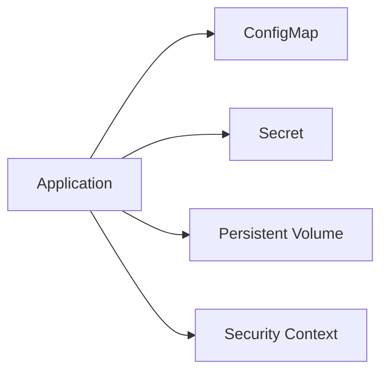

# Storage and configuration

This day is about keeping important values outside the container image.

You will learn how to:
- keep settings in ConfigMaps
- keep passwords and keys in Secrets
- keep data in persistent volumes
- use StatefulSets for stateful apps
- make containers safer with a security context

### What this day is really teaching
This day is about moving things that change often out of the container image and into Kubernetes objects that are easier to manage. In practice, that means you learn how to separate configuration from code, keep sensitive values safe, preserve data across restarts, and make containers less risky to run.

A simple way to think about it is this: the app should focus on business logic, while Kubernetes handles the surrounding settings, storage, and safety rules.

How to use this folder:
1. Open the first lab and read it carefully.
2. Apply the manifest in that lab's `manifests/` folder.
3. Check the result with `kubectl`.
4. Run the lab validation command.
5. Move to the next lab when the check passes.

Use these commands when you are ready:
- `make validate-lab LAB=L3.1`
- `make validate-day3`

What success looks like:
- You understand the main idea of the day.
- You can explain what each lab is trying to teach.
- The validation command for the day passes.