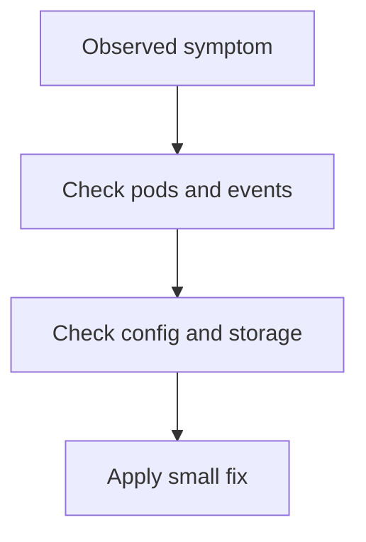

# INC-3 · Storage and configuration

This lab is an incident exercise. You are fixing a problem that is not just one thing.

In simple words: sometimes the real issue is a mix of config, storage, and secrets.

### What this concept means
Incident labs are useful because real problems are usually not single-cause events. A workload might fail because the config is wrong, the storage is not attached, or the secret is missing. The goal is to learn how to inspect the evidence in the right order.

In practice, you start with the symptom, then check the object that should be there, then look for the missing piece. This is a very common pattern in operations work: first observe, then narrow the problem, then apply the smallest fix that helps.




Do this first:
What you should expect to see: you understand the goal of the lab and the files involved.

1. Open the manifest files in this folder.
2. Read the names of the objects they create.
3. Think about what kind of problem you are trying to solve.

Why this matters:
- real problems are often layered
- a storage problem can look like a startup problem
- a config issue can look like a secret issue

Then do this:
What you should expect to see: the command runs without errors and the result matches the explanation above.

```bash
kubectl get pods -A
```

Expected result:
- The output lists the resource names or details you expected to inspect.
- You should be able to see the object or the status you are checking.
This helps you find the workload that is failing.

Then do this:
What you should expect to see: the command runs without errors and the result matches the explanation above.

```bash
kubectl describe pod -n axispay-data <pod-name>
```

Expected result:
- The output lists the resource names or details you expected to inspect.
- You should be able to see the object or the status you are checking.
This gives the first useful clues about the problem.

Then do this:
What you should expect to see: the command runs without errors and the result matches the explanation above.

```bash
kubectl get configmap -A
kubectl get pvc -A
kubectl get secret -A
```

Expected result:
- The output lists the resource names or details you expected to inspect.
- You should be able to see the object or the status you are checking.
This checks whether the expected config, storage, or secret is present.

Then do this:
What you should expect to see: the command runs without errors and the result matches the explanation above.

Apply the smallest fix that restores the workload.

Why this matters:
- the first fix should be small and targeted
- you do not want to change many things at once

Check your work:
What you should expect to see: the validation command finishes successfully.
```bash
make validate-lab LAB=INC-3
```

Expected result:
- The validation command finishes successfully.
- You should see a passing message for the lab.
