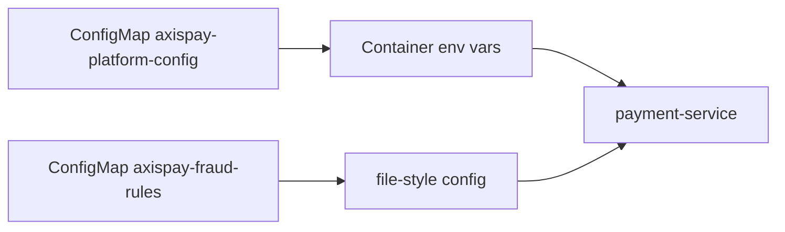

# L3.1 · ConfigMaps

| | |
|---|---|
| **Time** | 35 minutes |
| **Difficulty** | First real runtime configuration change |
| **You need first** | Day 2 platform running |
| **You will do** | Create ConfigMaps, attach one to `payment-service`, then prove env vars are a snapshot |
| **Check you are done** | `make validate-lab LAB=L3.1` |

---

<details>
<summary><b>First time in a terminal? Open this.</b></summary>

- Copy/paste in the terminal with <kbd>Ctrl</kbd>+<kbd>Shift</kbd>+<kbd>C</kbd> and <kbd>Ctrl</kbd>+<kbd>Shift</kbd>+<kbd>V</kbd>.
- Every command assumes you are at the repository root. Check with `pwd`.
- Full version: [`labs/GETTING-STARTED.md`](../../../GETTING-STARTED.md).
</details>

---

## What you are going to do

You are going to create two ConfigMaps:

- `axispay-platform-config` — shared application settings such as `LOG_LEVEL`, `DEFAULT_CURRENCY`, and service hostnames.
- `axispay-fraud-rules` — a file-style config value containing YAML fraud rules.

Then you will inject the shared config into `payment-service`, patch one value, and prove an important rule:

> **ConfigMaps used as environment variables do not update inside already-running containers.**

That single behaviour explains a lot of production confusion.



---

## What is in this folder

| File | What it is |
|---|---|
| `README.md` | This lab. |
| `manifests/01-configmap-platform.yaml` | The two ConfigMaps you are about to create. |

---

## Step 1 — Create the ConfigMaps

**Run this:**

```bash
kubectl apply -f manifests/
```

Expected result:

```text
$ kubectl apply -f manifests/
configmap/axispay-platform-config created
configmap/axispay-fraud-rules created
```

That is just the API acknowledgement. It only tells you the objects were accepted, not that your application is using them yet.

---

## Step 2 — Inspect what was created

**Run this:**

```bash
kubectl get configmap -n axispay-core
kubectl describe configmap axispay-platform-config -n axispay-core
```

Expected result:

```text
$ kubectl get configmap -n axispay-core
NAME                     DATA   AGE
axispay-fraud-rules      1      8s
axispay-platform-config  17     8s
kube-root-ca.crt         1      2d18h

$ kubectl describe configmap axispay-platform-config -n axispay-core
Name:         axispay-platform-config
Namespace:    axispay-core
Labels:       <none>
Annotations:  <none>

Data
====
AUTH_SERVICE_URL:
----
http://auth-service.axispay-edge.svc.cluster.local:8080
DEFAULT_CURRENCY:
----
ZAR
LOG_LEVEL:
----
info
POSTGRES_HOST:
----
postgres-0.postgres.axispay-data.svc.cluster.local
SUPPORTED_CURRENCIES:
----
ZAR,USD,EUR,GBP,NGN,KES,BWP
BinaryData
====

Events:  <none>
```

Notice that Kubernetes is happy to store both simple key/value settings and file-like configuration.

---

## Step 3 — Wire the ConfigMap into `payment-service`

The `ConfigMap` exists, but `payment-service` still will not see those values until you tell the Deployment to import them.

**Run this:**

```bash
kubectl set env deployment/payment-service -n axispay-core --from=configmap/axispay-platform-config
kubectl rollout status deployment/payment-service -n axispay-core
kubectl exec -n axispay-core deploy/payment-service -- printenv | grep -E 'DEFAULT_CURRENCY|SUPPORTED_CURRENCIES|POSTGRES_HOST'
```

Expected result:

```text
$ kubectl set env deployment/payment-service -n axispay-core --from=configmap/axispay-platform-config
deployment.apps/payment-service env updated

$ kubectl rollout status deployment/payment-service -n axispay-core
Waiting for deployment "payment-service" rollout to finish: 1 out of 3 new replicas have been updated...
Waiting for deployment "payment-service" rollout to finish: 2 out of 3 new replicas have been updated...
Waiting for deployment "payment-service" rollout to finish: 1 old replicas are pending termination...
deployment "payment-service" successfully rolled out

$ kubectl exec -n axispay-core deploy/payment-service -- printenv | grep -E 'DEFAULT_CURRENCY|SUPPORTED_CURRENCIES|POSTGRES_HOST'
DEFAULT_CURRENCY=ZAR
POSTGRES_HOST=postgres-0.postgres.axispay-data.svc.cluster.local
SUPPORTED_CURRENCIES=ZAR,USD,EUR,GBP,NGN,KES,BWP
```

`kubectl exec deploy/...` chooses one ready pod from the Deployment and runs the command there.

---

## Step 4 — Patch the ConfigMap and prove env vars are a snapshot

**Run this:**

```bash
kubectl patch configmap axispay-platform-config -n axispay-core --type merge -p '{"data":{"DEFAULT_CURRENCY":"USD"}}'
kubectl exec -n axispay-core deploy/payment-service -- printenv | grep DEFAULT_CURRENCY
```

Expected result:

```text
$ kubectl patch configmap axispay-platform-config -n axispay-core --type merge -p '{"data":{"DEFAULT_CURRENCY":"USD"}}'
configmap/axispay-platform-config patched

$ kubectl exec -n axispay-core deploy/payment-service -- printenv | grep DEFAULT_CURRENCY
DEFAULT_CURRENCY=ZAR
```

This is the key lesson. The ConfigMap changed, but the running container still has the old environment variable value.

If you restart the Deployment later, the new pods will start with `DEFAULT_CURRENCY=USD`.

---

## If something went wrong

### Mistake 1: wrong namespace

```text
$ kubectl get configmap axispay-platform-config -n axispay-data
Error from server (NotFound): configmaps "axispay-platform-config" not found
```

Why: the ConfigMap lives in `axispay-core`, not `axispay-data`.

Fix: re-run the command with `-n axispay-core`.

### Mistake 2: expecting live env updates

```text
$ kubectl patch configmap axispay-platform-config -n axispay-core --type merge -p '{"data":{"DEFAULT_CURRENCY":"EUR"}}'
configmap/axispay-platform-config patched

$ kubectl exec -n axispay-core deploy/payment-service -- printenv | grep DEFAULT_CURRENCY
DEFAULT_CURRENCY=ZAR
```

Why: env vars are copied into the container when it starts.

Fix: restart the pod or Deployment if you want env-based config to change.

---

## Cheat Sheet / Tips & Tricks

Quick commands:
- `kubectl get configmap -n axispay-core` — list the Day 3 ConfigMaps in the application namespace.
- `kubectl get configmap axispay-platform-config -n axispay-core -o yaml` — inspect all shared settings such as `POSTGRES_HOST` and `DEFAULT_CURRENCY`.
- `kubectl set env deployment/payment-service -n axispay-core --from=configmap/axispay-platform-config` — load every key from the ConfigMap into `payment-service` as environment variables.
- `kubectl patch configmap axispay-platform-config -n axispay-core --type merge -p '{"data":{"DEFAULT_CURRENCY":"USD"}}'` — change one setting without opening an editor.
- `kubectl rollout restart deployment/payment-service -n axispay-core` — restart the app when you need env-based ConfigMap changes to take effect.

Tips & tricks:
- Editing a ConfigMap does not restart pods automatically. If the app reads the value only at startup, you must restart the workload.
- Env vars are a snapshot. Mounted ConfigMap files can refresh later, but even then the app must re-read the file to notice the change.
- Use `kubectl diff -f manifests/` before `kubectl apply -f manifests/` when you want to preview a config change safely.
- If a command says `NotFound`, check the namespace first. These ConfigMaps live in `axispay-core`.

---

## Check your work

**Run this:**

```bash
make validate-lab LAB=L3.1
```

Expected result:

```text
$ make validate-lab LAB=L3.1

L3.1 — ConfigMaps
----------------------------------------------------------------
  ✓ configmap axispay-core/axispay-platform-config exists
  ✓ configmap axispay-core/axispay-fraud-rules exists
  ✓ key LOG_LEVEL = info
  ✓ key POSTGRES_HOST = postgres-0.postgres.axispay-data.svc.cluster.local
  ✓ key SUPPORTED_CURRENCIES = ZAR,USD,EUR,GBP,NGN,KES,BWP

A workload consumes it
----------------------------------------------------------------
  ✓ payment-service has ConfigMap values in its environment

✓ L3.1 PASSED — 6/6 checks
```
