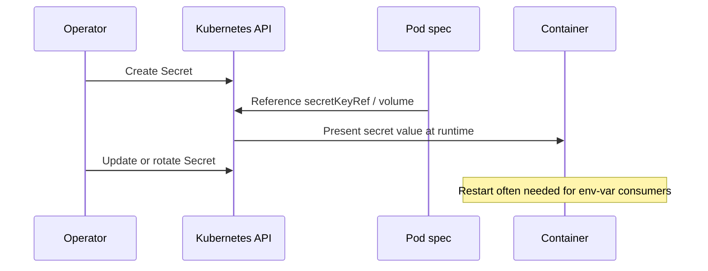
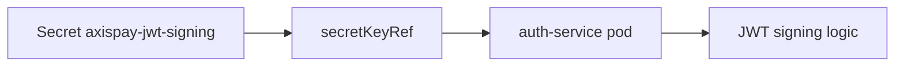

# L3.2 · Secrets

| | |
|---|---|
| **Time** | 35 minutes |
| **Difficulty** | Easy to apply, important to understand correctly |
| **You need first** | L3.1 complete |
| **You will do** | Create Secrets, attach one to `auth-service`, and decode one to prove base64 is not encryption |
| **Check you are done** | `make validate-lab LAB=L3.2` |

---

<details>
<summary><b>First time in a terminal? Open this.</b></summary>

- Use the repository root as your working directory.
- If a command prints a long block, scroll to the bottom before deciding whether it worked.
- Full version: [`labs/GETTING-STARTED.md`](../../../GETTING-STARTED.md).
</details>

---

## What this concept means

A Kubernetes `Secret` is for configuration data that is sensitive, such as passwords, tokens, and signing keys. For a Java developer, the easiest analogy is an external credentials store: the application still receives key/value data, but the platform marks it as something that should be handled more carefully than normal config.

A `Secret` is not the same thing as encryption. In YAML and API responses, Secret values are base64-encoded, which only changes the format so binary data can travel safely. If someone is allowed to read the Secret, they can decode it. The reason Secrets exist as a separate object type is mostly about intent, access control, audit rules, and operational handling.

The basic lifecycle is simple: create the Secret, reference it from a pod as an environment variable or mounted file, let Kubernetes present it to the container, and rotate it when the value changes. If the Secret is consumed as env vars, applications usually need a restart to pick up the new value.



---

## What you are going to do

A Secret is for values that are **sensitive**, not values that are simply convenient.

In this lab you create five Secrets that match the Day 3 manifests:

- `axispay-db-credentials` in `axispay-data`
- `axispay-db-credentials` in `axispay-core`
- `axispay-jwt-signing` in `axispay-edge`
- `axispay-redis-credentials` in `axispay-data`
- `axispay-rabbitmq-credentials` in `axispay-data`

Then you will point `auth-service` at the JWT Secret and inspect the pod spec to confirm the value is referenced by key, not written as plaintext.



---

## What is in this folder

| File | What it is |
|---|---|
| `README.md` | This lab. |
| `manifests/01-secrets.yaml` | All five Day 3 Secrets. |

---

## Step 1 — Create the Secrets

**Run this:**

```bash
kubectl apply -f manifests/
```

Expected result:

```text
$ kubectl apply -f manifests/
secret/axispay-db-credentials created
secret/axispay-db-credentials created
secret/axispay-jwt-signing created
secret/axispay-redis-credentials created
secret/axispay-rabbitmq-credentials created
```

The repeated `axispay-db-credentials` line is correct: there are two Secrets with the same name in different namespaces.

---

## Optional: create your own Secret and save it as YAML without committing the real value

This section shows the real-world workflow for creating a Kubernetes Secret when you cannot place the actual secret value into Git. The key idea is simple:

1. keep the sensitive value outside the repository, in a local file or a secret manager
2. use that source to create the Secret in Kubernetes
3. optionally save the generated YAML to a local file or temporary location, but do not commit it to the repo

This is the pattern you would use in a real team environment, because committing secrets to Git is dangerous and usually violates security policy.

### Why this workflow exists

There are two different things people often mix up:

- the secret value itself, such as a password or token
- the Kubernetes manifest that describes how that value should be stored and consumed

You should never store the actual secret value in Git. But you may still need a YAML representation of the Secret for deployment, automation, or documentation. The safe approach is to generate that YAML from a trusted source at the moment you deploy, rather than writing the secret value directly into the file by hand.

### Option A — create a Secret from a local env file

This is a very practical approach for a developer machine, a lab environment, or a CI runner that has access to a secure local workspace.

#### Step A1 — create a local file outside the repository

Create a folder such as `.secrets/` and place your values there. This folder should not be committed to Git.

```bash
mkdir -p .secrets
cat > .secrets/axispay-db.env <<'EOF'
POSTGRES_USER=axispay_app
POSTGRES_PASSWORD=super-secret-value
EOF
```

What is happening here?

- `.secrets/` is just a local folder for sensitive values
- `axispay-db.env` is a simple key/value file
- the values are supplied by you at runtime, not by the repository

This is a good practice because the secret stays in a place you control, and it can be excluded from Git using `.gitignore`.

#### Step A2 — create the Secret from that local file

Now use `kubectl` to create the Secret directly in Kubernetes:

```bash
kubectl create secret generic axispay-db-credentials \
  -n axispay-data \
  --from-env-file=.secrets/axispay-db.env \
  --dry-run=client -o yaml > /tmp/axispay-db-credentials.yaml
```

Let us unpack that command:

- `kubectl create secret generic ...` tells Kubernetes to create a generic Secret object
- `axispay-db-credentials` is the Secret name
- `-n axispay-data` puts it in the correct namespace
- `--from-env-file=.secrets/axispay-db.env` loads the values from the local file you just created
- `--dry-run=client -o yaml` tells kubectl to print the object description as YAML without applying it yet
- `> /tmp/axispay-db-credentials.yaml` saves the generated Secret YAML to a temporary file

Why save it to `/tmp/` instead of the repository?

- `/tmp/` is outside the repo and easy to clean up
- it avoids accidentally committing a Secret manifest to Git
- it lets you inspect the resulting YAML before applying it

#### Step A3 — inspect the generated YAML

```bash
cat /tmp/axispay-db-credentials.yaml
```

You will see that the values are stored under `data:` and that they look base64-encoded. That is expected. Kubernetes does this automatically for Secret data. The important thing is that the original values were supplied from your local file, not from Git.

#### Step A4 — apply the Secret if needed

If you want to create it in the cluster instead of only generating the YAML, you can apply the file:

```bash
kubectl apply -f /tmp/axispay-db-credentials.yaml
```

This creates the Secret in the cluster using the generated YAML.

### Option B — create a Secret directly from literal values

This is useful when you have only one or two values and want a quick one-off secret.

```bash
kubectl create secret generic axispay-jwt-signing \
  -n axispay-edge \
  --from-literal=JWT_SIGNING_KEY='super-secret-jwt-key' \
  --dry-run=client -o yaml > /tmp/axispay-jwt-signing.yaml
```

What each part does:

- `generic` means a standard Kubernetes Secret with simple key/value pairs
- `axispay-jwt-signing` is the Secret name
- `-n axispay-edge` ensures the Secret is created in the correct namespace
- `--from-literal=JWT_SIGNING_KEY='super-secret-jwt-key'` provides one secret value directly
- `--dry-run=client -o yaml` prints the Secret as YAML without changing the cluster yet
- `> /tmp/axispay-jwt-signing.yaml` saves the YAML locally

This is useful for demos or quick labs, but for production teams it is usually better to pull values from a secret manager rather than typing them directly into the shell.

### Option C — write the manifest manually using stringData

Sometimes you want to author the Secret YAML yourself. In that case, you might write a file like this:

```yaml
apiVersion: v1
kind: Secret
metadata:
  name: my-example-secret
  namespace: axispay-data
type: Opaque
stringData:
  POSTGRES_USER: axispay_app
  POSTGRES_PASSWORD: super-secret-value
```

This is easy to read, but it is still not safe to commit to Git unless you are in a training environment and the values are harmless dummy values.

Why use `stringData`?

- it is easier for humans to read than base64-encoded `data`
- Kubernetes converts it into the proper Secret storage format when the object is created

Why not use `stringData` in production for real secrets?

- it is still just a manifest file in plaintext if you commit it
- it is easy to accidentally leak the values if the file is shared or stored in the repo
- secret managers are safer because they centralize rotation, access control, and auditing

### What the generated YAML looks like

If you create a Secret from the CLI, the output is often similar to this:

```yaml
apiVersion: v1
kind: Secret
metadata:
  name: axispay-db-credentials
  namespace: axispay-data
type: Opaque
data:
  POSTGRES_USER: YXhpc3BheV9hcHA=
  POSTGRES_PASSWORD: c3VwZXItc2VjcmV0LXZhbHVl
```

The values are base64-encoded. That is expected. The YAML exists so Kubernetes can understand the object, but the values are still not meant to be stored in plain text in Git.

### Why base64 appears in the YAML

This is an important distinction:

- `stringData` is human-readable input
- `data` is the encoded form that Kubernetes stores internally

Base64 is not encryption. It is just an encoding format. If someone has access to the Secret object, they can decode it. That is why access control and secret managers matter so much.

### Recommended practice for teams

If you are working in a real team or production environment, the recommended practice is:

1. store secrets in a secret manager such as Vault, AWS Secrets Manager, Azure Key Vault, or GCP Secret Manager
2. let your deployment pipeline fetch values from the manager
3. create the Secret from those values at deployment time
4. avoid storing plaintext secrets in source control

A common GitOps or CI/CD approach is:

- keep a template Secret manifest in Git
- inject the real values during deployment from a secret manager or CI secret store
- never commit the real data itself

### Make sure secrets do not get committed by accident

A simple safeguard is to add your local secret folder to `.gitignore`:

```gitignore
.secrets/
*.env
```

That way, even if you create a local file with real values, it will not accidentally be committed to Git.

### Summary

The practical takeaway is:

- do not put real secrets in Git
- create them from a local file, CLI input, or a secret manager
- generate Secret YAML locally if you need it
- keep the generated file outside the repository or delete it after use

---

## Step 2 — Inspect them in the right namespaces

**Run this:**

```bash
kubectl get secret -n axispay-data
kubectl get secret -n axispay-edge
kubectl describe secret axispay-jwt-signing -n axispay-edge
```

Expected result:

```text
$ kubectl get secret -n axispay-data
NAME                          TYPE     DATA   AGE
axispay-db-credentials        Opaque   3      7s
axispay-rabbitmq-credentials  Opaque   2      7s
axispay-redis-credentials     Opaque   1      7s

$ kubectl get secret -n axispay-edge
NAME                  TYPE     DATA   AGE
axispay-jwt-signing   Opaque   1      9s

$ kubectl describe secret axispay-jwt-signing -n axispay-edge
Name:         axispay-jwt-signing
Namespace:    axispay-edge
Labels:       <none>
Annotations:  <none>

Type:  Opaque

Data
====
JWT_SIGNING_KEY:  40 bytes
```

`describe` shows the key names and sizes, but not the decoded secret values.

---

## Step 3 — Make `auth-service` read the JWT key from the Secret

**Run this:**

```bash
kubectl set env deployment/auth-service -n axispay-edge --from=secret/axispay-jwt-signing
kubectl rollout status deployment/auth-service -n axispay-edge
kubectl describe pod -n axispay-edge -l app.kubernetes.io/name=auth-service
```

Expected result:

```text
$ kubectl set env deployment/auth-service -n axispay-edge --from=secret/axispay-jwt-signing
deployment.apps/auth-service env updated

$ kubectl rollout status deployment/auth-service -n axispay-edge
Waiting for deployment "auth-service" rollout to finish: 1 out of 2 new replicas have been updated...
Waiting for deployment "auth-service" rollout to finish: 1 old replicas are pending termination...
deployment "auth-service" successfully rolled out

$ kubectl describe pod -n axispay-edge -l app.kubernetes.io/name=auth-service
Name:             auth-service-6bf69c4c8f-4n8qh
Namespace:        axispay-edge
Priority:         0
Service Account:  default
Node:             axispay-m02/192.168.49.12
Start Time:       Tue, 18 Aug 2026 21:48:04 +0200
Labels:           app.kubernetes.io/name=auth-service
                  pod-template-hash=6bf69c4c8f
Status:           Running
IP:               10.244.2.37
Containers:
  auth-service:
    State:          Running
    Ready:          True
    Environment:
      ENVIRONMENT:      training
      JWT_SIGNING_KEY:  <set to the key 'JWT_SIGNING_KEY' in secret 'axispay-jwt-signing'>  Optional: false
    Mounts:
      /var/run/secrets/kubernetes.io/serviceaccount from kube-api-access-vr8vf (ro)
Events:
  Type    Reason     Age   From               Message
  ----    ------     ----  ----               -------
  Normal  Scheduled  38s   default-scheduler  Successfully assigned axispay-edge/auth-service-6bf69c4c8f-4n8qh to axispay-m02
  Normal  Pulled     37s   kubelet            Container image "axispay/auth-service:1.0.0" already present on machine
  Normal  Started    36s   kubelet            Started container auth-service
```

That `set to the key ... in secret ...` line is exactly what you want to see.

---

## Step 4 — Decode one Secret on purpose

This is the uncomfortable but necessary lesson: a Secret is not automatically encrypted in a way that makes it unreadable to anyone who can fetch it.

**Run this:**

```bash
kubectl get secret axispay-db-credentials -n axispay-data -o jsonpath='{.data.POSTGRES_PASSWORD}' | base64 -d
```

Expected result:

```text
$ kubectl get secret axispay-db-credentials -n axispay-data -o jsonpath='{.data.POSTGRES_PASSWORD}' | base64 -d
training-only-Zx7Kq2Np8Rw4
```

The value was base64-encoded in the API object. That is encoding, not strong protection.

---

## If something went wrong

### Wrong namespace

```text
$ kubectl get secret axispay-jwt-signing -n axispay-core
Error from server (NotFound): secrets "axispay-jwt-signing" not found
```

Why: that Secret lives in `axispay-edge`.

Fix: use `-n axispay-edge`.

### Plaintext still in the pod spec

```text
$ kubectl describe pod -n axispay-edge -l app.kubernetes.io/name=auth-service | grep JWT_SIGNING_KEY
JWT_SIGNING_KEY:  day1-insecure-demo-value
```

Why: the Deployment is still using a literal env var value.

Fix: re-run `kubectl set env deployment/auth-service -n axispay-edge --from=secret/axispay-jwt-signing` and wait for the rollout.

---

## Cheat Sheet / Tips & Tricks

Quick commands:
- `kubectl get secret -n axispay-data` — list the database, Redis, and RabbitMQ Secrets used by the data tier.
- `kubectl describe secret axispay-jwt-signing -n axispay-edge` — see Secret key names and sizes without printing their values.
- `kubectl get secret axispay-db-credentials -n axispay-data -o jsonpath='{.data.POSTGRES_PASSWORD}' | base64 -d` — decode one value on purpose for troubleshooting.
- `kubectl set env deployment/auth-service -n axispay-edge --from=secret/axispay-jwt-signing` — inject the JWT key into `auth-service` from the Secret.
- `kubectl describe pod -n axispay-edge -l app.kubernetes.io/name=auth-service` — confirm the pod uses `secretKeyRef` instead of a plaintext value.

Tips & tricks:
- Kubernetes Secrets are base64-encoded by default, not magically encrypted. Anyone who can read the Secret can decode it.
- Secrets are namespaced. `axispay-jwt-signing` exists in `axispay-edge`, not `axispay-core`.
- `kubectl describe secret ...` is safer for demos because it shows keys and sizes, not the secret value itself.
- If a Secret is exposed as an environment variable, changing the Secret later still requires a pod restart for most apps.

---

## Check your work

**Run this:**

```bash
make validate-lab LAB=L3.2
```

Expected result:

```text
$ make validate-lab LAB=L3.2

L3.2 — Secrets
----------------------------------------------------------------
  ✓ secret axispay-data/axispay-db-credentials exists
  ✓ secret axispay-core/axispay-db-credentials exists
  ✓ secret axispay-edge/axispay-jwt-signing exists
  ✓ secret axispay-data/axispay-redis-credentials exists

The JWT key must NO LONGER be visible in describe
----------------------------------------------------------------
  ✓ auth-service reads the key via secretKeyRef, not a plaintext value

Secret values are base64, NOT encrypted (this is the lesson, not a bug)
----------------------------------------------------------------
  ✓ decoded in one command — anyone with get secrets can read it

✓ L3.2 PASSED — 6/6 checks
```
