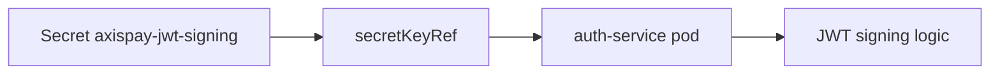

# L3.2 · Secrets

| | |
|---|---|
| **Time** | 35 minutes |
| **Difficulty** | Easy to apply, important to understand correctly |
| **You need first** | L3.1 complete |
| **You will do** | Create Secrets, attach one to `auth-service`, and decode one to prove base64 is not encryption |
| **Check you are done** | `make validate-lab LAB=L3.2` |

---

<details>
<summary><b>First time in a terminal? Open this.</b></summary>

- Use the repository root as your working directory.
- If a command prints a long block, scroll to the bottom before deciding whether it worked.
- Full version: [`labs/GETTING-STARTED.md`](../../../GETTING-STARTED.md).
</details>

---

## What you are going to do

A Secret is for values that are **sensitive**, not values that are simply convenient.

In this lab you create five Secrets that match the Day 3 manifests:

- `axispay-db-credentials` in `axispay-data`
- `axispay-db-credentials` in `axispay-core`
- `axispay-jwt-signing` in `axispay-edge`
- `axispay-redis-credentials` in `axispay-data`
- `axispay-rabbitmq-credentials` in `axispay-data`

Then you will point `auth-service` at the JWT Secret and inspect the pod spec to confirm the value is referenced by key, not written as plaintext.



---

## What is in this folder

| File | What it is |
|---|---|
| `README.md` | This lab. |
| `manifests/01-secrets.yaml` | All five Day 3 Secrets. |

---

## Step 1 — Create the Secrets

**Run this:**

```bash
kubectl apply -f manifests/
```

Expected result:

```text
$ kubectl apply -f manifests/
secret/axispay-db-credentials created
secret/axispay-db-credentials created
secret/axispay-jwt-signing created
secret/axispay-redis-credentials created
secret/axispay-rabbitmq-credentials created
```

The repeated `axispay-db-credentials` line is correct: there are two Secrets with the same name in different namespaces.

---

## Step 2 — Inspect them in the right namespaces

**Run this:**

```bash
kubectl get secret -n axispay-data
kubectl get secret -n axispay-edge
kubectl describe secret axispay-jwt-signing -n axispay-edge
```

Expected result:

```text
$ kubectl get secret -n axispay-data
NAME                          TYPE     DATA   AGE
axispay-db-credentials        Opaque   3      7s
axispay-rabbitmq-credentials  Opaque   2      7s
axispay-redis-credentials     Opaque   1      7s

$ kubectl get secret -n axispay-edge
NAME                  TYPE     DATA   AGE
axispay-jwt-signing   Opaque   1      9s

$ kubectl describe secret axispay-jwt-signing -n axispay-edge
Name:         axispay-jwt-signing
Namespace:    axispay-edge
Labels:       <none>
Annotations:  <none>

Type:  Opaque

Data
====
JWT_SIGNING_KEY:  40 bytes
```

`describe` shows the key names and sizes, but not the decoded secret values.

---

## Step 3 — Make `auth-service` read the JWT key from the Secret

**Run this:**

```bash
kubectl set env deployment/auth-service -n axispay-edge --from=secret/axispay-jwt-signing
kubectl rollout status deployment/auth-service -n axispay-edge
kubectl describe pod -n axispay-edge -l app.kubernetes.io/name=auth-service
```

Expected result:

```text
$ kubectl set env deployment/auth-service -n axispay-edge --from=secret/axispay-jwt-signing
deployment.apps/auth-service env updated

$ kubectl rollout status deployment/auth-service -n axispay-edge
Waiting for deployment "auth-service" rollout to finish: 1 out of 2 new replicas have been updated...
Waiting for deployment "auth-service" rollout to finish: 1 old replicas are pending termination...
deployment "auth-service" successfully rolled out

$ kubectl describe pod -n axispay-edge -l app.kubernetes.io/name=auth-service
Name:             auth-service-6bf69c4c8f-4n8qh
Namespace:        axispay-edge
Priority:         0
Service Account:  default
Node:             axispay-m02/192.168.49.12
Start Time:       Tue, 18 Aug 2026 21:48:04 +0200
Labels:           app.kubernetes.io/name=auth-service
                  pod-template-hash=6bf69c4c8f
Status:           Running
IP:               10.244.2.37
Containers:
  auth-service:
    State:          Running
    Ready:          True
    Environment:
      ENVIRONMENT:      training
      JWT_SIGNING_KEY:  <set to the key 'JWT_SIGNING_KEY' in secret 'axispay-jwt-signing'>  Optional: false
    Mounts:
      /var/run/secrets/kubernetes.io/serviceaccount from kube-api-access-vr8vf (ro)
Events:
  Type    Reason     Age   From               Message
  ----    ------     ----  ----               -------
  Normal  Scheduled  38s   default-scheduler  Successfully assigned axispay-edge/auth-service-6bf69c4c8f-4n8qh to axispay-m02
  Normal  Pulled     37s   kubelet            Container image "axispay/auth-service:1.0.0" already present on machine
  Normal  Started    36s   kubelet            Started container auth-service
```

That `set to the key ... in secret ...` line is exactly what you want to see.

---

## Step 4 — Decode one Secret on purpose

This is the uncomfortable but necessary lesson: a Secret is not automatically encrypted in a way that makes it unreadable to anyone who can fetch it.

**Run this:**

```bash
kubectl get secret axispay-db-credentials -n axispay-data -o jsonpath='{.data.POSTGRES_PASSWORD}' | base64 -d
```

Expected result:

```text
$ kubectl get secret axispay-db-credentials -n axispay-data -o jsonpath='{.data.POSTGRES_PASSWORD}' | base64 -d
training-only-Zx7Kq2Np8Rw4
```

The value was base64-encoded in the API object. That is encoding, not strong protection.

---

## If something went wrong

### Wrong namespace

```text
$ kubectl get secret axispay-jwt-signing -n axispay-core
Error from server (NotFound): secrets "axispay-jwt-signing" not found
```

Why: that Secret lives in `axispay-edge`.

Fix: use `-n axispay-edge`.

### Plaintext still in the pod spec

```text
$ kubectl describe pod -n axispay-edge -l app.kubernetes.io/name=auth-service | grep JWT_SIGNING_KEY
JWT_SIGNING_KEY:  day1-insecure-demo-value
```

Why: the Deployment is still using a literal env var value.

Fix: re-run `kubectl set env deployment/auth-service -n axispay-edge --from=secret/axispay-jwt-signing` and wait for the rollout.

---

## Cheat Sheet / Tips & Tricks

Quick commands:
- `kubectl get secret -n axispay-data` — list the database, Redis, and RabbitMQ Secrets used by the data tier.
- `kubectl describe secret axispay-jwt-signing -n axispay-edge` — see Secret key names and sizes without printing their values.
- `kubectl get secret axispay-db-credentials -n axispay-data -o jsonpath='{.data.POSTGRES_PASSWORD}' | base64 -d` — decode one value on purpose for troubleshooting.
- `kubectl set env deployment/auth-service -n axispay-edge --from=secret/axispay-jwt-signing` — inject the JWT key into `auth-service` from the Secret.
- `kubectl describe pod -n axispay-edge -l app.kubernetes.io/name=auth-service` — confirm the pod uses `secretKeyRef` instead of a plaintext value.

Tips & tricks:
- Kubernetes Secrets are base64-encoded by default, not magically encrypted. Anyone who can read the Secret can decode it.
- Secrets are namespaced. `axispay-jwt-signing` exists in `axispay-edge`, not `axispay-core`.
- `kubectl describe secret ...` is safer for demos because it shows keys and sizes, not the secret value itself.
- If a Secret is exposed as an environment variable, changing the Secret later still requires a pod restart for most apps.

---

## Check your work

**Run this:**

```bash
make validate-lab LAB=L3.2
```

Expected result:

```text
$ make validate-lab LAB=L3.2

L3.2 — Secrets
----------------------------------------------------------------
  ✓ secret axispay-data/axispay-db-credentials exists
  ✓ secret axispay-core/axispay-db-credentials exists
  ✓ secret axispay-edge/axispay-jwt-signing exists
  ✓ secret axispay-data/axispay-redis-credentials exists

The JWT key must NO LONGER be visible in describe
----------------------------------------------------------------
  ✓ auth-service reads the key via secretKeyRef, not a plaintext value

Secret values are base64, NOT encrypted (this is the lesson, not a bug)
----------------------------------------------------------------
  ✓ decoded in one command — anyone with get secrets can read it

✓ L3.2 PASSED — 6/6 checks
```
