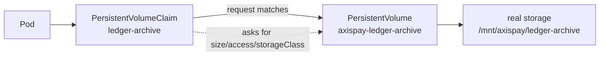
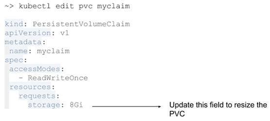

# L3.3 · Persistent volumes

| | |
|---|---|
| **Time** | 35 minutes |
| **Difficulty** | Conceptually simple, operationally important |
| **You need first** | L3.1 and L3.2 complete |
| **You will do** | Create a manual PV and PVC, inspect the binding, and notice the reclaim policy |
| **Check you are done** | `make validate-lab LAB=L3.3` |

---

<details>
<summary><b>First time in a terminal? Open this.</b></summary>

- A container filesystem is temporary unless you mount external storage.
- Read every storage transcript carefully: `Bound`, `Available`, and `Pending` mean different things.
- Full version: [`labs/GETTING-STARTED.md`](../../../GETTING-STARTED.md).
</details>

---

## What this concept means

A `PersistentVolume` (PV) is the actual storage object in the cluster, and a `PersistentVolumeClaim` (PVC) is the application's request for storage. Think of the PVC as an order form and the PV as the real disk that satisfies it. The application does not need to know where the disk lives or how it was prepared.

Binding is Kubernetes matching the request to a volume that fits. Size, access mode, and storage class all have to line up before the PVC becomes `Bound`. Once that happens, pods can mount the claim and use the storage.

Pods use a claim instead of pointing directly at a PV because that keeps the workload decoupled from storage details. The app says "I need 1Gi of `ReadWriteOnce` storage," while the platform decides which volume should provide it. That separation is what makes storage reusable, replaceable, and safer to manage.



---

## What you are going to do

Here you create the classic Kubernetes storage chain:

- a **PersistentVolume** called `axispay-ledger-archive`
- a **PersistentVolumeClaim** called `ledger-archive`
- a reclaim policy of **Retain**, because losing ledger data is not acceptable

The main idea is this:

- the **PVC** is the application's request
- the **PV** is the actual storage object
- the pod uses the **PVC**, not the PV directly



Diagram source: Kubernetes documentation/blog (CC BY 4.0), “Resizing Persistent Volumes using Kubernetes”.

---

## What is in this folder

| File | What it is |
|---|---|
| `README.md` | This lab. |
| `manifests/01-storageclass.yaml` | A Day 3 `StorageClass` you will use later for dynamic provisioning. |
| `manifests/02-pv-ledger-archive.yaml` | A manual PV plus a PVC that binds to it. |

---

## Step 1 — Create the storage objects

**Run this:**

```bash
kubectl apply -f manifests/
```

Expected result:

```text
$ kubectl apply -f manifests/
storageclass.storage.k8s.io/axispay-standard created
persistentvolume/axispay-ledger-archive created
persistentvolumeclaim/ledger-archive created
```

If you are using a local single-node cluster, make sure the host path exists on the actual node before you apply the manifest. On the node itself, the equivalent of the YAML path `/mnt/axispay/ledger-archive` is:

```bash
sudo mkdir -p /mnt/axispay/ledger-archive
sudo chmod 0777 /mnt/axispay/ledger-archive
```

That directory must exist because the PV uses `hostPath` and `DirectoryOrCreate`.

A few plain Kubernetes commands that are useful when you are creating storage objects:

```bash
kubectl get storageclass
kubectl get pv
kubectl get pvc -A
kubectl apply -f manifests/01-storageclass.yaml
kubectl apply -f manifests/02-pv-ledger-archive.yaml
```

If you want to create the same objects from scratch without relying on the folder-based apply, you can also use the files directly:

```bash
kubectl create -f manifests/01-storageclass.yaml
kubectl create -f manifests/02-pv-ledger-archive.yaml
```

---

## Step 2 — Check the binding

**Run this:**

```bash
kubectl get storageclass axispay-standard
kubectl get pv axispay-ledger-archive
kubectl get pvc ledger-archive -n axispay-core
```

Expected result:

```text
$ kubectl get storageclass axispay-standard
NAME               PROVISIONER                RECLAIMPOLICY   VOLUMEBINDINGMODE      ALLOWVOLUMEEXPANSION   AGE
axispay-standard   k8s.io/minikube-hostpath   Retain          WaitForFirstConsumer   true                   11s

$ kubectl get pv axispay-ledger-archive
NAME                     CAPACITY   ACCESS MODES   RECLAIM POLICY   STATUS   CLAIM                        STORAGECLASS     VOLUMEMODE   AGE
axispay-ledger-archive   2Gi        RWO            Retain           Bound    axispay-core/ledger-archive axispay-manual   Filesystem   10s

$ kubectl get pvc ledger-archive -n axispay-core
NAME             STATUS   VOLUME                   CAPACITY   ACCESS MODES   STORAGECLASS     VOLUMEMODE   AGE
ledger-archive   Bound    axispay-ledger-archive   2Gi        RWO            axispay-manual   Filesystem   10s
```

`Bound` is the good state. It means Kubernetes matched the claim to a real volume.

---

## Step 3 — Inspect the PV properly

**Run this:**

```bash
kubectl describe pv axispay-ledger-archive
```

Expected result:

```text
$ kubectl describe pv axispay-ledger-archive
Name:            axispay-ledger-archive
Labels:          <none>
StorageClass:    axispay-manual
Status:          Bound
Claim:           axispay-core/ledger-archive
Reclaim Policy:  Retain
Access Modes:    RWO
VolumeMode:      Filesystem
Capacity:        2Gi
Node Affinity:
  Required Terms:
    Term 0:        kubernetes.io/hostname in [axispay-m02]
Message:
Source:
    Type:          HostPath (bare host directory volume)
    Path:          /mnt/axispay/ledger-archive
    HostPathType:  DirectoryOrCreate
Events:            <none>
```

Two details matter here:

1. **`Retain`** means deleting the claim will not silently destroy the data.
2. **Node affinity** means this disk only makes sense on the node where that path exists.

---

## If something went wrong

If the claim and volume do not match, `Pending` is what you will see.

Here are the most useful vanilla troubleshooting commands for persistent storage:

```bash
kubectl get pv axispay-ledger-archive
kubectl get pvc ledger-archive -n axispay-core
kubectl describe pv axispay-ledger-archive
kubectl describe pvc ledger-archive -n axispay-core
kubectl get events -n axispay-core --sort-by=.metadata.creationTimestamp
kubectl get nodes
kubectl get node axispay-m02 -o wide
```

What to look for:

- `kubectl describe pvc ...` shows whether the claim failed to bind and why
- `kubectl get events ...` often reveals the real reason a PVC stays `Pending`
- `kubectl get nodes` and `kubectl get node ... -o wide` help confirm the node name and whether the node is ready
- if the volume is still not binding, compare the PV's `storageClassName`, `accessModes`, size, and node affinity with the PVC request

If the host path is the issue, check the node directly:

```bash
sudo ls -la /mnt/axispay/ledger-archive
sudo mkdir -p /mnt/axispay/ledger-archive
```

If you need to recreate the objects after changing the YAML, the usual sequence is:

```bash
kubectl delete pvc ledger-archive -n axispay-core
kubectl delete pv axispay-ledger-archive
kubectl delete storageclass axispay-standard
kubectl apply -f manifests/
```

A few important notes:

- delete the PVC first, then the PV, because the PVC is the workload-facing request
- for a manual PV with `Retain`, deleting the PVC does not automatically erase the data on disk
- if you change the host path or node name in the YAML, recreate the PV because those values are part of the object's identity and binding behavior

If you want to inspect the live object from the API rather than the file, you can also view it as YAML:

```bash
kubectl get pv axispay-ledger-archive -o yaml
kubectl get pvc ledger-archive -n axispay-core -o yaml
```

That is especially useful when you want to compare what the cluster is storing with what you expected from the manifest.

```text
$ kubectl get pvc ledger-archive -n axispay-core
NAME             STATUS    VOLUME   CAPACITY   ACCESS MODES   STORAGECLASS     VOLUMEMODE   AGE
ledger-archive   Pending                                                     axispay-manual   Filesystem   36s

$ kubectl describe pvc ledger-archive -n axispay-core
Name:          ledger-archive
Namespace:     axispay-core
StorageClass:  axispay-manual
Status:        Pending
Volume:
Labels:        <none>
Annotations:   <none>
Capacity:
Access Modes:
VolumeMode:    Filesystem
Events:
  Type     Reason         Age                 From                         Message
  ----     ------         ----                ----                         -------
  Warning  FailedBinding  9s (x4 over 36s)   persistentvolume-controller  no persistent volumes available for this claim and no storage class is set
```

Why: the claim no longer matches any available PV.

Fix: re-apply `manifests/02-pv-ledger-archive.yaml` and check the claim's `storageClassName`, size, and access mode.

---

## Cheat Sheet / Tips & Tricks

Quick commands:
- `kubectl get pv axispay-ledger-archive` — check whether the manual PV exists and whether it is `Available` or `Bound`.
- `kubectl get pvc ledger-archive -n axispay-core` — see whether the application's claim has attached to the volume.
- `kubectl get pv,pvc -A` — compare cluster-wide volumes and claims in one table when binding is confusing.
- `kubectl describe pv axispay-ledger-archive` — inspect reclaim policy, node affinity, and the host path behind the disk.
- `kubectl describe pvc ledger-archive -n axispay-core` — read the Events section when the claim is stuck in `Pending`.

Tips & tricks:
- The pod should use the PVC, not the PV directly. Think of the PVC as the app's storage request.
- `Pending` usually means the claim does not match a real volume yet. Check size, access mode, and `storageClassName` together.
- `Retain` is the safe policy for important data because deleting the claim does not automatically delete the stored files.
- This PV uses `hostPath` plus node affinity, so the data is tied to one node. If the workload lands elsewhere, storage will not work.

---

## Check your work

**Run this:**

```bash
make validate-lab LAB=L3.3
```

Expected result:

```text
$ make validate-lab LAB=L3.3

L3.3 — PersistentVolumes and Claims
----------------------------------------------------------------
  ✓ PV axispay-ledger-archive exists
  ✓ pvc axispay-core/ledger-archive exists
  ✓ PVC is Bound
  ✓ reclaimPolicy=Retain — a ledger survives an accidental delete
  ✓ hostPath PV declares nodeAffinity

✓ L3.3 PASSED — 5/5 checks
```
