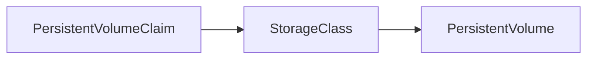

# L3.4 · StorageClass

This lab is about asking Kubernetes for storage automatically.

In simple words: instead of creating storage by hand every time, you ask Kubernetes for it when you need it.

### What this concept means
A StorageClass is a way to describe what kind of storage you want without manually creating every volume yourself. It acts like a template for storage provisioning, so Kubernetes can create the right volume based on the cluster's storage system.

This matters because many environments have different storage backends. One team may use local disk, another may use network storage, and another may use cloud storage. A StorageClass lets the workload ask for storage in a portable way while the cluster handles the details.




Do this first:
What you should expect to see: you understand the goal of the lab and the files involved.

1. Open `manifests/01-storageclass.yaml`.
2. Open `manifests/02-pv-ledger-archive.yaml`.
3. Notice that the storage class says what kind of storage you want.

Why this matters:
- admins can change storage behavior in one place
- teams do not need to know every low-level storage detail
- the same manifest can work in different environments

Then do this:
What you should expect to see: the command runs without errors and the result matches the explanation above.

```bash
kubectl apply -f manifests/
```

Expected result:
- The command finishes without errors.
- You should see messages such as `created` or `configured` for the resources.
- A follow-up `kubectl get` command should show the objects you created.
This asks Kubernetes to create the storage for you.

Then do this:
What you should expect to see: the command runs without errors and the result matches the explanation above.

```bash
kubectl get storageclass
kubectl get pvc -A
```

Expected result:
- The output lists the resource names or details you expected to inspect.
- You should be able to see the object or the status you are checking.
This shows that the storage class and claim exist.

Then do this:
What you should expect to see: the command runs without errors and the result matches the explanation above.

Think about the difference between saying "I need storage" and manually creating every volume yourself.

Why this matters:
- a StorageClass is a template for storage
- Kubernetes can create the storage for you
- this is much easier to repeat

Check your work:
What you should expect to see: the validation command finishes successfully.
```bash
make validate-lab LAB=L3.4
```

Expected result:
- The validation command finishes successfully.
- You should see a passing message for the lab.
