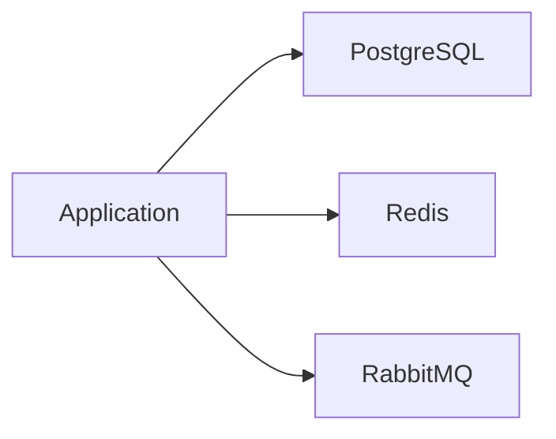

# L3.5 · Data tier

This lab is about creating the services that the platform needs to store and move data.

In simple words: your app usually needs a database, a cache, and a message broker.

### What this concept means
The data tier is the set of services that support the application with durable data and messaging. In this lab, that usually means PostgreSQL for structured data, Redis for caching, and RabbitMQ for asynchronous messages between services.

These systems are not just extra services. They are part of the platform's backbone. If a database is missing, the application cannot save its important state. If Redis is missing, performance may drop. If RabbitMQ is missing, messages may pile up or stop moving.




Do this first:
What you should expect to see: you understand the goal of the lab and the files involved.

1. Open the files in `manifests/`.
2. Look for the files for PostgreSQL, Redis, RabbitMQ, config, and secrets.
3. Notice that these are separate services with separate jobs.

Why this matters:
- the app depends on these services
- they need their own config and storage
- they should be started in a controlled way

Then do this:
What you should expect to see: the command runs without errors and the result matches the explanation above.

```bash
kubectl apply -f manifests/
```

Expected result:
- The command finishes without errors.
- You should see messages such as `created` or `configured` for the resources.
- A follow-up `kubectl get` command should show the objects you created.
This creates the data-tier resources in the cluster.

Then do this:
What you should expect to see: the command runs without errors and the result matches the explanation above.

```bash
kubectl get pods -n axispay-data
kubectl get svc -n axispay-data
```

Expected result:
- The output lists the resource names or details you expected to inspect.
- You should be able to see the object or the status you are checking.
This shows whether the data services are starting up and becoming ready.

Then do this:
What you should expect to see: the command runs without errors and the result matches the explanation above.

Think about the role of each service:
- PostgreSQL stores structured data
- Redis helps with fast cache access
- RabbitMQ moves messages between services

Why this matters:
- the app is not just one process
- it depends on supporting services behind the scenes

Check your work:
What you should expect to see: the validation command finishes successfully.
```bash
make validate-lab LAB=L3.5
```

Expected result:
- The validation command finishes successfully.
- You should see a passing message for the lab.
