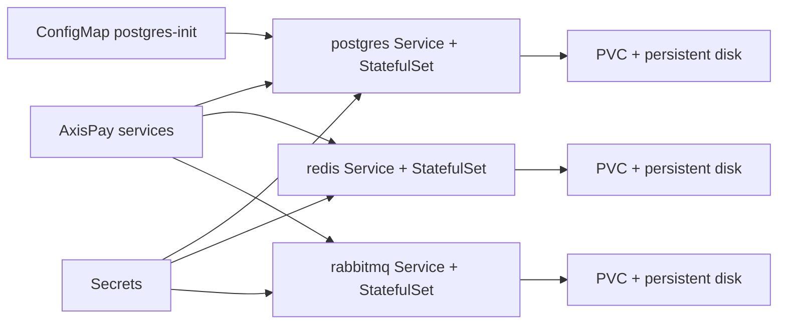
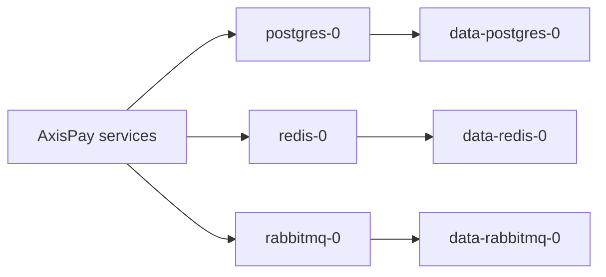

# L3.5 · Data tier

| | |
|---|---|
| **Time** | 60 minutes |
| **Difficulty** | The biggest build of the day |
| **You need first** | L3.1–L3.4 complete |
| **You will do** | Deploy PostgreSQL, Redis, and RabbitMQ with persistent storage, then seed PostgreSQL and query it |
| **Check you are done** | `make validate-lab LAB=L3.5` |

---

<details>
<summary><b>First time in a terminal? Open this.</b></summary>

- Stateful workloads start more slowly than stateless web pods. Give them time.
- Readiness probes matter more than `Running` here.
- Full version: [`labs/GETTING-STARTED.md`](../../../GETTING-STARTED.md).
</details>

---

## What this concept means

A real application's data tier is more than "run a database container." It combines storage, network identity, credentials, and startup configuration so other services can find it and trust it. For a Java team, this is the platform equivalent of standing up PostgreSQL, Redis, and RabbitMQ with the right hostnames, disks, and secrets before the application can work.

Data-bearing workloads need more care than stateless web services. If a web pod dies, Kubernetes can usually replace it with another identical pod. If a database pod dies, you also care about its disk, its stable name, whether it starts in the right order, and whether clients reconnect to the correct endpoint.

In this lab, each service combines the same building blocks in a slightly different way: a headless Service for identity, a StatefulSet for ordered pods, a PVC for persistent data, and ConfigMap or Secret inputs for initialization and credentials.



---

## What you are going to do

In Day 1 and Day 2 the platform was mostly application code. In this lab you add the platform services that make real payment processing possible:

- **PostgreSQL** — system of record
- **Redis** — shared in-memory state and counters
- **RabbitMQ** — asynchronous messaging

The manifests in this folder create a dedicated namespace, a database schema ConfigMap, Secrets, Services, and three StatefulSets with PVC templates.



---

## What is in this folder

| File | What it is |
|---|---|
| `00-namespace-data.yaml` | Creates `axispay-data`. |
| `00-configmap-postgres-init.yaml` | The PostgreSQL schema as a ConfigMap. |
| `01-secrets.yaml` | Database, Redis, and RabbitMQ credentials. |
| `01-postgres.yaml` | Headless Service + PostgreSQL StatefulSet. |
| `02-redis.yaml` | Headless Service + Redis StatefulSet. |
| `03-rabbitmq.yaml` | Headless Service + RabbitMQ StatefulSet. |

---

## Step 1 — Create the whole data tier

**Run this:**

```bash
kubectl apply -f manifests/
```

Expected result:

```text
$ kubectl apply -f manifests/
namespace/axispay-data unchanged
configmap/postgres-init created
secret/axispay-db-credentials unchanged
secret/axispay-db-credentials unchanged
secret/axispay-jwt-signing unchanged
secret/axispay-redis-credentials unchanged
secret/axispay-rabbitmq-credentials unchanged
service/postgres created
statefulset.apps/postgres created
service/redis created
statefulset.apps/redis created
service/rabbitmq created
statefulset.apps/rabbitmq created
```

The mix of `created` and `unchanged` is normal because some Secrets were already created in L3.2.

---

## Step 2 — Wait for the StatefulSets to become ready

**Run this:**

```bash
kubectl rollout status statefulset/postgres -n axispay-data --timeout=180s
kubectl rollout status statefulset/redis -n axispay-data --timeout=180s
kubectl rollout status statefulset/rabbitmq -n axispay-data --timeout=180s
```

Expected result:

```text
$ kubectl rollout status statefulset/postgres -n axispay-data --timeout=180s
Waiting for 1 pods to be ready...
partitioned roll out complete: 1 new pods have been updated...

$ kubectl rollout status statefulset/redis -n axispay-data --timeout=180s
Waiting for 1 pods to be ready...
partitioned roll out complete: 1 new pods have been updated...

$ kubectl rollout status statefulset/rabbitmq -n axispay-data --timeout=180s
Waiting for 1 pods to be ready...
partitioned roll out complete: 1 new pods have been updated...
```

---

## Step 3 — Inspect pods, Services, and PVCs together

**Run this:**

```bash
kubectl get pods -n axispay-data
kubectl get svc -n axispay-data
kubectl get pvc -n axispay-data
```

Expected result:

```text
$ kubectl get pods -n axispay-data
NAME          READY   STATUS    RESTARTS   AGE
postgres-0    1/1     Running   0          2m11s
rabbitmq-0    1/1     Running   0          2m02s
redis-0       1/1     Running   0          2m06s

$ kubectl get svc -n axispay-data
NAME       TYPE        CLUSTER-IP   EXTERNAL-IP   PORT(S)             AGE
postgres   ClusterIP   None         <none>        5432/TCP            2m13s
rabbitmq   ClusterIP   None         <none>        5672/TCP,15672/TCP  2m03s
redis      ClusterIP   None         <none>        6379/TCP            2m07s

$ kubectl get pvc -n axispay-data
NAME              STATUS   VOLUME                                     CAPACITY   ACCESS MODES   STORAGECLASS       VOLUMEMODE   AGE
data-postgres-0   Bound    pvc-8fa1a0d6-f4dc-4ef1-9d15-2f79d0f4fd8b   5Gi        RWO            axispay-standard   Filesystem   2m11s
data-rabbitmq-0   Bound    pvc-5368ef02-64e1-4d60-84f2-f7e993f3fc2b   2Gi        RWO            axispay-standard   Filesystem   2m02s
data-redis-0      Bound    pvc-a263f09e-4324-4045-ae0e-4b563eb795da   1Gi        RWO            axispay-standard   Filesystem   2m06s
```

Headless Services show `CLUSTER-IP   None`. That is intentional for StatefulSets.

---

## Step 4 — Read the PostgreSQL startup logs

**Run this:**

```bash
kubectl logs postgres-0 -n axispay-data | tail -n 12
```

Expected result:

```text
$ kubectl logs postgres-0 -n axispay-data | tail -n 12
2026-08-18 19:54:21.514 UTC [1] LOG:  starting PostgreSQL 17.4 on x86_64-pc-linux-musl, compiled by gcc (Alpine 14.2.0) 14.2.0, 64-bit
2026-08-18 19:54:21.515 UTC [1] LOG:  listening on IPv4 address "0.0.0.0", port 5432
2026-08-18 19:54:21.515 UTC [1] LOG:  listening on IPv6 address "::", port 5432
2026-08-18 19:54:21.528 UTC [1] LOG:  listening on Unix socket "/var/run/postgresql/.s.PGSQL.5432"
2026-08-18 19:54:21.547 UTC [29] LOG:  database system was shut down at 2026-08-18 19:54:20 UTC
2026-08-18 19:54:21.571 UTC [1] LOG:  database system is ready to accept connections
```

If PostgreSQL never becomes ready, this log is one of the first places you should look.

---

## Step 5 — Seed the database

**Run this:**

```bash
./platform/scripts/setup/05-seed-database.sh
```

Expected result:

```text
$ ./platform/scripts/setup/05-seed-database.sh
Waiting for postgres-0 to be ready...
pod/postgres-0 condition met
Applying schema...
BEGIN
CREATE TABLE
CREATE TABLE
CREATE TABLE
COMMIT
Loading seed data (~28,000 statements, this takes 30-60s)...

Verifying...
  merchants      25
  customers      400
  payments       5000
  ledger_entries 14865
  settlements    40
  LEDGER IMBALANCE (must be 0): 0

Seeded. Try:  kubectl -n axispay-data exec -it postgres-0 -- psql -U axispay_app -d axispay
```

That last line is important: the data is not decorative. You can query it directly.

---

## Step 6 — Prove the database contents are real

**Run this:**

```bash
kubectl exec -n axispay-data postgres-0 -- psql -U axispay_app -d axispay -c "SELECT COUNT(*) FROM payments;"
kubectl exec -n axispay-data postgres-0 -- psql -U axispay_app -d axispay -c "SELECT * FROM v_ledger_balance;"
```

Expected result:

```text
$ kubectl exec -n axispay-data postgres-0 -- psql -U axispay_app -d axispay -c "SELECT COUNT(*) FROM payments;"
 count
-------
  5000
(1 row)

$ kubectl exec -n axispay-data postgres-0 -- psql -U axispay_app -d axispay -c "SELECT * FROM v_ledger_balance;"
 currency | total_debits | total_credits | imbalance
----------+--------------+---------------+-----------
 BWP      |     41203890 |      41203890 |         0
 EUR      |     53310800 |      53310800 |         0
 GBP      |     68604580 |      68604580 |         0
 KES      |    180445100 |     180445100 |         0
 NGN      |    122586680 |     122586680 |         0
 USD      |     95761525 |      95761525 |         0
 ZAR      |    855556745 |     855556745 |         0
(7 rows)
```

This is the business lesson of the day: the ledger balances because the schema enforces the invariant.

---

## If something went wrong

```text
$ kubectl describe pvc data-postgres-0 -n axispay-data
Name:          data-postgres-0
Namespace:     axispay-data
StorageClass:  axispay-standard
Status:        Bound
Volume:        pvc-8fa1a0d6-f4dc-4ef1-9d15-2f79d0f4fd8b
Labels:        app.kubernetes.io/part-of=axispay
Finalizers:    [kubernetes.io/pvc-protection]
Capacity:      5Gi
Access Modes:  RWO
VolumeMode:    Filesystem
Used By:       postgres-0
Events:
  Type    Reason                 Age   From                                                                 Message
  ----    ------                 ----  ----                                                                 -------
  Normal  WaitForFirstConsumer   40s   persistentvolume-controller                                          waiting for first consumer to be created before binding
  Normal  Provisioning           38s   k8s.io/minikube-hostpath_minikube-hostpath-controller-5d8d7b6c8f   External provisioner is provisioning volume for claim "axispay-data/data-postgres-0"
  Normal  ProvisioningSucceeded  38s   k8s.io/minikube-hostpath_minikube-hostpath-controller-5d8d7b6c8f   Successfully provisioned volume pvc-8fa1a0d6-f4dc-4ef1-9d15-2f79d0f4fd8b
```

Common mistake:

```text
$ kubectl exec -n axispay-data postgres-0 -- psql -U axispay_app -d axispay -c "SELECT COUNT(*) FROM payments;"
 count
-------
     0
(1 row)
```

Why: the seed script has not been run yet.

Fix: run `./platform/scripts/setup/05-seed-database.sh` and query again.

---

## Cheat Sheet / Tips & Tricks

Quick commands:
- `kubectl rollout status statefulset/postgres -n axispay-data --timeout=180s` — wait for PostgreSQL to be genuinely ready before testing anything above it.
- `kubectl get pods,svc,pvc -n axispay-data` — view pods, headless Services, and per-pod disks together.
- `kubectl logs postgres-0 -n axispay-data | tail -n 12` — read the latest PostgreSQL startup messages when readiness is slow.
- `kubectl exec -n axispay-data postgres-0 -- psql -U axispay_app -d axispay -c "SELECT COUNT(*) FROM payments;"` — prove the seeded data is really inside the database.
- `kubectl describe pvc data-postgres-0 -n axispay-data` — troubleshoot storage events for the PostgreSQL pod.

Tips & tricks:
- `Running` is not enough for databases and brokers. Wait for readiness probes and rollout status too.
- `ClusterIP None` on `postgres`, `redis`, and `rabbitmq` is correct here because these are headless Services for StatefulSets.
- If `SELECT COUNT(*) FROM payments;` returns `0`, the storage may be fine and the real issue is simply that the seed script was not run yet.
- Each StatefulSet replica gets its own PVC (`data-postgres-0`, `data-redis-0`, `data-rabbitmq-0`). That one-to-one mapping is expected.

---

## Check your work

**Run this:**

```bash
make validate-lab LAB=L3.5
```

Expected result:

```text
$ make validate-lab LAB=L3.5

L3.5 — Data tier
----------------------------------------------------------------
  ✓ StatefulSet postgres: 1 ready
  ✓ StatefulSet redis: 1 ready
  ✓ StatefulSet rabbitmq: 1 ready
  ✓ PVC data-postgres-0 Bound
  ✓ PVC data-redis-0 Bound
  ✓ PVC data-rabbitmq-0 Bound

Seed data
----------------------------------------------------------------
  ✓ 5000 payments loaded

THE INVARIANT — the ledger must balance
----------------------------------------------------------------
  ✓ ledger imbalance is 0 in every currency (sum DR == sum CR)
  ✓ every payment satisfies amount = fee + net

✓ L3.5 PASSED — 9/9 checks
```
