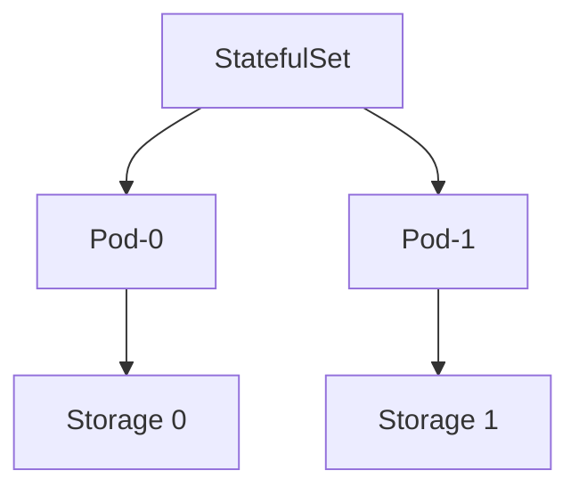

# L3.6 · StatefulSets

This lab is about understanding why some apps should use a StatefulSet.

In simple words: if an app needs a stable identity and stable storage, a StatefulSet is usually the better choice.

### What this concept means
A StatefulSet is used when a workload needs stable identity and stable storage. That is common for databases and other services where each pod should keep its own identity and not be treated as interchangeable.

In a Deployment, pods are more like copies. In a StatefulSet, each pod is more like a member of a known set, often with a predictable name and its own storage. This matters when the data or the startup order must remain consistent.




Do this first:
What you should expect to see: you understand the goal of the lab and the files involved.

1. Open the lesson material for this lab.
2. Read the explanation of why a database-like app is different from a normal web app.
3. Think about the difference between a pod that can be replaced and a pod that must keep its identity.

Why this matters:
- databases often need stable names
- they often need their own storage
- replacing them carelessly can cause problems

Then do this:
What you should expect to see: the command runs without errors and the result matches the explanation above.

Read the example and compare it with a Deployment.

Then do this:
What you should expect to see: the command runs without errors and the result matches the explanation above.

Think about the question: would this workload be happy if every pod got a new identity every time it restarted?

Why this matters:
- StatefulSets are for workloads that care about identity and order
- Deployments are for workloads that are more interchangeable

Check your work:
What you should expect to see: the validation command finishes successfully.
```bash
make validate-lab LAB=L3.6
```

Expected result:
- The validation command finishes successfully.
- You should see a passing message for the lab.
