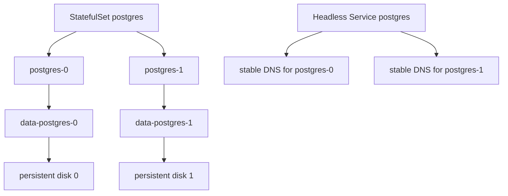
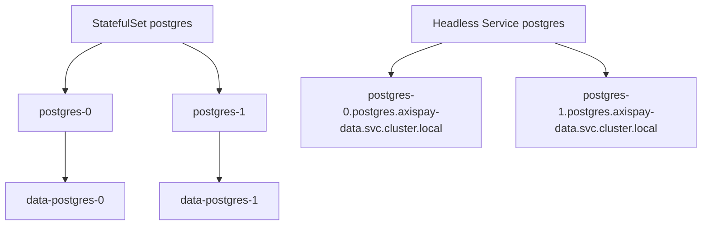

# L3.6 · StatefulSets

| | |
|---|---|
| **Time** | 50 minutes |
| **Difficulty** | Conceptual unless you watch the identity and storage carefully |
| **You need first** | L3.5 complete |
| **You will do** | Inspect the data-tier StatefulSets, prove stable identity, and understand the node-local storage trap |
| **Check you are done** | `make validate-lab LAB=L3.6` |

---

<details>
<summary><b>First time in a terminal? Open this.</b></summary>

- Do not think “StatefulSet = better Deployment”. It solves a different problem.
- The stable name `postgres-0` matters as much as the disk.
- Full version: [`labs/GETTING-STARTED.md`](../../../GETTING-STARTED.md).
</details>

---

## What this concept means

A `StatefulSet` is for workloads whose replicas are not interchangeable. A `Deployment` is great for stateless Java services because any replica can answer the same request. Databases, queues, and similar systems often need each replica to keep its own identity and its own storage.

StatefulSets give you three important guarantees: stable pod names, ordered creation and update, and stable per-pod storage. If Kubernetes creates `postgres-0`, the matching claim stays tied to that ordinal, so `postgres-0` comes back as `postgres-0` and reattaches its own disk instead of getting a random replacement.

That does not magically create a clustered database. StatefulSet solves identity, ordering, and storage attachment. Replication, leader election, backups, and database-level failover are still separate concerns.



---

## What you are going to do

A Deployment gives you interchangeable replicas with random pod suffixes. That is perfect for web services.

A StatefulSet gives you three things a database often needs:

1. **stable pod names** such as `postgres-0`
2. **stable per-replica PVCs** such as `data-postgres-0`
3. **ordered behaviour** around startup, shutdown, and updates



---

## What is in this folder

| File | What it is |
|---|---|
| `README.md` | This lab. |

There is no separate `manifests/` folder here because you are inspecting the PostgreSQL, Redis, and RabbitMQ StatefulSets created in L3.5.

---

## Step 1 — Inspect the StatefulSet, Service, pod, and PVC together

**Run this:**

```bash
kubectl get statefulset -n axispay-data
kubectl get svc postgres -n axispay-data
kubectl get pod postgres-0 -n axispay-data -o wide
kubectl get pvc data-postgres-0 -n axispay-data
```

Expected result:

```text
$ kubectl get statefulset -n axispay-data
NAME       READY   AGE
postgres   1/1     24m
rabbitmq   1/1     23m
redis      1/1     24m

$ kubectl get svc postgres -n axispay-data
NAME       TYPE        CLUSTER-IP   EXTERNAL-IP   PORT(S)    AGE
postgres   ClusterIP   None         <none>        5432/TCP   24m

$ kubectl get pod postgres-0 -n axispay-data -o wide
NAME         READY   STATUS    RESTARTS   AGE   IP            NODE         NOMINATED NODE   READINESS GATES
postgres-0   1/1     Running   0          24m   10.244.2.18   axispay-m02  <none>           <none>

$ kubectl get pvc data-postgres-0 -n axispay-data
NAME              STATUS   VOLUME                                     CAPACITY   ACCESS MODES   STORAGECLASS       VOLUMEMODE   AGE
data-postgres-0   Bound    pvc-8fa1a0d6-f4dc-4ef1-9d15-2f79d0f4fd8b   5Gi        RWO            axispay-standard   Filesystem   24m
```

Read that as one story:

- headless Service → `ClusterIP None`
- stable pod identity → `postgres-0`
- stable disk → `data-postgres-0`

---

## Step 2 — Prove the pod knows its own stable identity

**Run this:**

```bash
kubectl exec -n axispay-data postgres-0 -- hostname
kubectl exec -n axispay-data postgres-0 -- psql -U axispay_app -d axispay -c "SELECT COUNT(*) FROM payments;"
```

Expected result:

```text
$ kubectl exec -n axispay-data postgres-0 -- hostname
postgres-0

$ kubectl exec -n axispay-data postgres-0 -- psql -U axispay_app -d axispay -c "SELECT COUNT(*) FROM payments;"
 count
-------
  5000
(1 row)
```

That pod name is not cosmetic. Other workloads can target that exact replica by DNS.

---

## Step 3 — Delete the pod and watch the identity come back

The controller will recreate the pod, but because this is a StatefulSet, the new pod keeps the same ordinal and reattaches the same PVC.

**Run this:**

```bash
kubectl delete pod postgres-0 -n axispay-data
kubectl rollout status statefulset/postgres -n axispay-data --timeout=180s
kubectl get pod postgres-0 -n axispay-data
kubectl exec -n axispay-data postgres-0 -- psql -U axispay_app -d axispay -c "SELECT COUNT(*) FROM payments;"
```

Expected result:

```text
$ kubectl delete pod postgres-0 -n axispay-data
pod "postgres-0" deleted

$ kubectl rollout status statefulset/postgres -n axispay-data --timeout=180s
Waiting for 1 pods to be ready...
partitioned roll out complete: 1 new pods have been updated...

$ kubectl get pod postgres-0 -n axispay-data
NAME         READY   STATUS    RESTARTS   AGE
postgres-0   1/1     Running   0          19s

$ kubectl exec -n axispay-data postgres-0 -- psql -U axispay_app -d axispay -c "SELECT COUNT(*) FROM payments;"
 count
-------
  5000
(1 row)
```

Same name. Same data. Different container instance.

---

## Step 4 — The storage trap you must understand

If the pod is forced onto the wrong node, Kubernetes must refuse to start it rather than attach an empty disk and pretend everything is fine.

**This is what the failure looks like:**

```text
$ kubectl describe pod postgres-0 -n axispay-data
Name:             postgres-0
Namespace:        axispay-data
Priority:         0
Node:             <none>
Status:           Pending
IP:
Controlled By:    StatefulSet/postgres
Volumes:
  data:
    Type:       PersistentVolumeClaim (a reference to a PersistentVolumeClaim in the same namespace)
    ClaimName:  data-postgres-0
    ReadOnly:   false
Events:
  Type     Reason             Age                    From               Message
  ----     ------             ----                   ----               -------
  Warning  FailedScheduling   27s (x6 over 2m11s)   default-scheduler  0/3 nodes are available: 1 node(s) had volume node affinity conflict, 2 node(s) were unschedulable.
```

Why: the PV is tied to the node where the data actually exists.

Fix: uncordon or free the correct node instead of forcing the workload onto a different one.

---

## Common misunderstanding — “If I scale to 3, do I now have a database cluster?”

No.

You would have three independent PostgreSQL pods with stable names and their own disks. Kubernetes gives you identity, storage, and ordering. It does **not** give you replication, failover, backups, or leader election. For that, you need an Operator or another database-aware system.

---

---

## If something went wrong

If the pod comes back with the **same name** but the **data is gone**, you are not looking at the Day 3 PostgreSQL StatefulSet any more. You are looking at the wrong workload pattern — usually a Deployment with `emptyDir`, or a new PVC rather than the original `data-postgres-0`.

Use these two checks immediately:

```text
$ kubectl get pod postgres-0 -n axispay-data
NAME         READY   STATUS    RESTARTS   AGE
postgres-0   1/1     Running   0          23s

$ kubectl get pvc data-postgres-0 -n axispay-data
NAME              STATUS   VOLUME                                     CAPACITY   ACCESS MODES   STORAGECLASS       VOLUMEMODE   AGE
data-postgres-0   Bound    pvc-8fa1a0d6-f4dc-4ef1-9d15-2f79d0f4fd8b   5Gi        RWO            axispay-standard   Filesystem   27m
```

If either the pod name or PVC name is different, you have lost the stable identity that makes the StatefulSet useful.

## Cheat Sheet / Tips & Tricks

Quick commands:
- `kubectl get statefulset -n axispay-data` — list the PostgreSQL, Redis, and RabbitMQ StatefulSets together.
- `kubectl get pod postgres-0 -n axispay-data -o wide` — confirm the stable pod name, IP, and node placement.
- `kubectl get pvc data-postgres-0 -n axispay-data` — verify the stable disk name attached to the PostgreSQL replica.
- `kubectl exec -n axispay-data postgres-0 -- hostname` — prove the pod sees its own ordinal identity as `postgres-0`.
- `kubectl delete pod postgres-0 -n axispay-data && kubectl rollout status statefulset/postgres -n axispay-data --timeout=180s` — recreate the pod and confirm the same identity returns.

Tips & tricks:
- StatefulSet pod names are stable on purpose: `postgres-0`, `redis-0`, and `rabbitmq-0` are part of how clients and storage find the right replica.
- Deleting a StatefulSet pod is not the same as deleting its data. The controller recreates the pod and reattaches the same PVC.
- Scaling a StatefulSet database to more replicas does not magically create replication or failover. Kubernetes gives identity and storage, not database clustering.
- If scheduling fails with a volume node affinity conflict, fix the node/storage placement problem instead of forcing the pod onto another node.

---

## Check your work

**Run this:**

```bash
make validate-lab LAB=L3.6
```

Expected result:

```text
$ make validate-lab LAB=L3.6

L3.6 — StatefulSets
----------------------------------------------------------------
  ✓ postgres -> headless Service 'postgres'
  ✓ postgres has volumeClaimTemplates
  ✓ redis -> headless Service 'redis'
  ✓ redis has volumeClaimTemplates
  ✓ rabbitmq -> headless Service 'rabbitmq'
  ✓ rabbitmq has volumeClaimTemplates

Stable identity
----------------------------------------------------------------
  ✓ pod is named postgres-0 (ordinal identity, not a random suffix)

Init container ordering
----------------------------------------------------------------
  ○ init container not added yet — see L3.6 step 6

The anti-pattern must be gone
----------------------------------------------------------------
  ✓ bad-postgres cleaned up

✓ L3.6 PASSED — 7/7 checks with 1 advisory note
```
