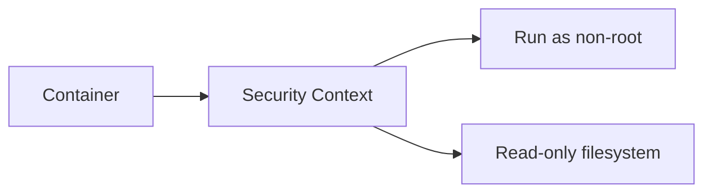

# L3.7 · Security context

This lab is about making a container safer by changing how it runs.

In simple words: do not run a container as root if it does not need to.

### What this concept means
A security context is a way to tell Kubernetes how a container should run. It can reduce risk by making the container run as a non-root user, stop privilege escalation, or make the filesystem read-only.

This is important because many containers are not designed to be exposed to the world. A small hardening step can reduce the impact of mistakes or attacks. It is not the same as a full security program, but it is a practical and common first step.




Do this first:
What you should expect to see: you understand the goal of the lab and the files involved.

1. Open `manifests/01-securitycontext.yaml`.
2. Open `manifests/02-hardened-deployments.yaml`.
3. Notice the settings that make the container more locked down.

Why this matters:
- a container running as root has more power
- a read-only file system makes changes harder
- small security changes can reduce risk

Then do this:
What you should expect to see: the command runs without errors and the result matches the explanation above.

```bash
kubectl apply -f manifests/
```

Expected result:
- The command finishes without errors.
- You should see messages such as `created` or `configured` for the resources.
- A follow-up `kubectl get` command should show the objects you created.
This applies the safer settings to the workload.

Then do this:
What you should expect to see: the command runs without errors and the result matches the explanation above.

```bash
kubectl describe pod -n axispay-core <pod-name>
```

Expected result:
- The output lists the resource names or details you expected to inspect.
- You should be able to see the object or the status you are checking.
This shows the security values that were applied to the pod.

Then do this:
What you should expect to see: the command runs without errors and the result matches the explanation above.

Think about how the container behaves differently now.

Why this matters:
- hardening is a basic safety step
- it is better to start with safe defaults than to fix things later

Check your work:
What you should expect to see: the validation command finishes successfully.
```bash
make validate-lab LAB=L3.7
```

Expected result:
- The validation command finishes successfully.
- You should see a passing message for the lab.
