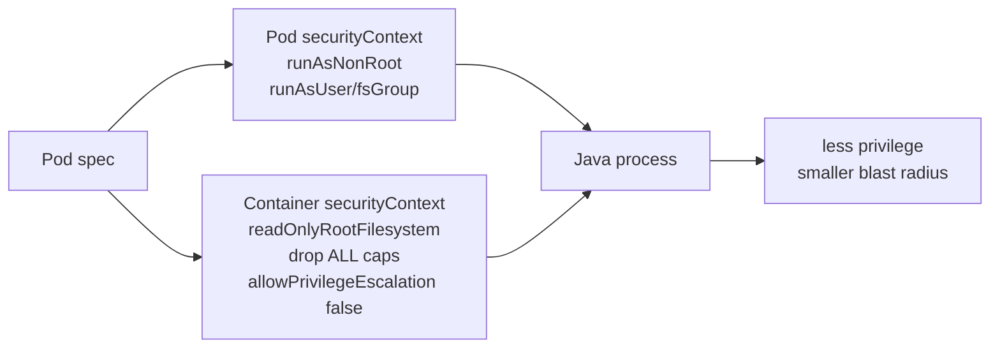
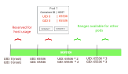

# L3.7 · Security context

| | |
|---|---|
| **Time** | 30 minutes |
| **Difficulty** | Small YAML change, big security effect |
| **You need first** | L3.5 complete |
| **You will do** | Apply a pod and container hardening baseline, then verify UID, capabilities, and writable paths |
| **Check you are done** | `make validate-lab LAB=L3.7` |

---

<details>
<summary><b>First time in a terminal? Open this.</b></summary>

- `runAsNonRoot` and `readOnlyRootFilesystem` are safety controls, not performance tuning.
- A container can be `Running` and still be dangerously over-privileged.
- Full version: [`labs/GETTING-STARTED.md`](../../../GETTING-STARTED.md).
</details>

---

## What this concept means

A Kubernetes `securityContext` is where you tell the platform what a pod or container is allowed to run as and what privileges it should have. For most Java services, root access is unnecessary. If the process only needs to listen on an application port and read its config, giving it root is extra risk without extra value.

`runAsNonRoot: true` tells Kubernetes to refuse a pod that would start as root. `readOnlyRootFilesystem: true` makes the main container filesystem immutable, which limits what an attacker or a buggy process can change. Dropping Linux capabilities removes many of the small kernel-level powers that containers often receive by default.

Pod-level settings such as `runAsUser` and `fsGroup` define the baseline identity for the workload. Container-level settings such as `allowPrivilegeEscalation: false` and dropped capabilities further tighten each process. Together, these settings turn "it runs" into "it runs with fewer ways to hurt the cluster."



---

## What you are going to do

This lab applies the same hardening pattern to several AxisPay Deployments:

- pod runs as UID/GID `10001`
- `runAsNonRoot: true`
- `seccompProfile: RuntimeDefault`
- container drops **all** Linux capabilities
- `allowPrivilegeEscalation: false`
- root filesystem is read-only, with a small writable `/tmp`



Diagram source: Kubernetes blog/documentation (CC BY 4.0), “User namespaces beta”. This diagram is about user-identity isolation, which is closely related to why Day 3 hardening moves containers away from root.

---

## What is in this folder

| File | What it is |
|---|---|
| `README.md` | This lab. |
| `manifests/01-securitycontext.yaml` | A ConfigMap that documents the baseline hardening settings. |
| `manifests/02-hardened-deployments.yaml` | Full Deployment manifests for the edge and core services, ready for `kubectl apply`. |

---

## What these manifests are doing

The two YAML files in this lab are deliberately different:

- `manifests/01-securitycontext.yaml` creates a `ConfigMap` that stores example pod-level and container-level security settings as plain text snippets. This object is a reference and documentation aid. It does not itself enforce the policy on a workload.
- `manifests/02-hardened-deployments.yaml` contains full `Deployment` objects for `edge-gateway`, `auth-service`, `merchant-service`, `payment-service`, `fraud-service`, and `routing-service`. Each Deployment contains a pod-level `securityContext` and a container-level `securityContext`.

The important hardening fields are:

- `runAsNonRoot: true` — kubelet refuses to start the container if it would run as root
- `runAsUser: 10001` and `runAsGroup: 10001` — lock the process to a known non-root UID/GID
- `fsGroup: 10001` — allow mounted volumes to be written by the non-root identity
- `seccompProfile.type: RuntimeDefault` — reduce the risk of dangerous syscalls
- `allowPrivilegeEscalation: false` — prevent the container from getting more privileges at runtime
- `readOnlyRootFilesystem: true` — make the container image filesystem read-only
- `capabilities.drop: ["ALL"]` — remove Linux capabilities that the process does not need
- `emptyDir` mounted at `/tmp` — provide a small writable scratch area even though the root filesystem is read-only

This is why the YAMLs are not just “random config.” They define a baseline that moves the application away from root, restricts what it can do, and makes the runtime safer.

---

## Useful kubectl commands for this lab

These are the plain Kubernetes commands you will use most often when working with this lab.

### Create or apply objects

Use these when you want to create or update resources from YAML:

```bash
kubectl apply -f manifests/
```

What it does: creates or updates the objects from the files in the `manifests/` folder.

```bash
kubectl create -f manifests/01-securitycontext.yaml
```

What it does: creates a resource from a single file. Use it when you want to create only one object and do not want to update an existing one.

```bash
kubectl replace --force -f manifests/02-hardened-deployments.yaml
```

What it does: replaces the live object with the YAML from the file. This is useful if you want a full overwrite rather than a normal update.

### Edit existing objects

Use these when you want to change a live workload without rewriting the whole file first:

```bash
kubectl edit deployment/payment-service -n axispay-core
```

What it does: opens the live Deployment manifest in your editor so you can adjust fields such as `securityContext` or replica count.

```bash
kubectl patch deployment/payment-service -n axispay-core --type='merge' -p '{"spec":{"template":{"spec":{"securityContext":{"runAsUser":10002}}}}}'
```

What it does: changes a specific field in-place. This is faster than editing the full YAML when you only need one small change.

### Delete objects

Use these when you want to remove resources you created:

```bash
kubectl delete deployment edge-gateway -n axispay-edge
```

What it does: removes one Deployment.

```bash
kubectl delete -f manifests/02-hardened-deployments.yaml
```

What it does: deletes every object described by the YAML file.

```bash
kubectl delete configmap axispay-security-baseline -n axispay-core
```

What it does: removes the reference ConfigMap.

### Troubleshoot running workloads

Use these when you need to understand what is actually happening in the cluster:

```bash
kubectl get deploy,pod -n axispay-core
```

What it does: shows Deployments and Pods in the namespace so you can see whether the rollout is healthy.

```bash
kubectl describe pod -n axispay-core -l app.kubernetes.io/name=payment-service
```

What it does: shows the pod events, the applied securityContext, the container state, and any scheduling or startup problems.

```bash
kubectl get events -A --sort-by=.metadata.creationTimestamp
```

What it does: shows recent cluster events, which is often the fastest place to spot why a pod is failing to start.

```bash
kubectl logs deployment/payment-service -n axispay-core
```

What it does: prints the container logs if the application is running but behaving incorrectly.

```bash
kubectl exec -n axispay-core deploy/payment-service -- id
```

What it does: runs a command inside the container, which is the fastest way to verify the runtime user and permissions.

---

## Step 1 — Apply the hardening baseline

**Run this:**

```bash
kubectl apply -f manifests/
```

Expected result:

```text
$ kubectl apply -f manifests/
configmap/axispay-security-baseline created
deployment.apps/edge-gateway configured
deployment.apps/auth-service configured
deployment.apps/merchant-service configured
deployment.apps/payment-service configured
deployment.apps/fraud-service configured
deployment.apps/routing-service configured
```

The Deployments are reconfigured, so Kubernetes will roll out new pods from the hardened template.

---

## Step 2 — Wait for one hardened rollout and inspect it

**Run this:**

```bash
kubectl rollout status deployment/payment-service -n axispay-core
kubectl describe pod -n axispay-core -l app.kubernetes.io/name=payment-service
```

Expected result:

```text
$ kubectl rollout status deployment/payment-service -n axispay-core
Waiting for deployment "payment-service" rollout to finish: 1 out of 3 new replicas have been updated...
Waiting for deployment "payment-service" rollout to finish: 2 out of 3 new replicas have been updated...
deployment "payment-service" successfully rolled out

$ kubectl describe pod -n axispay-core -l app.kubernetes.io/name=payment-service
Name:             payment-service-6b9d5f5d6c-jh2sx
Namespace:        axispay-core
Priority:         0
Node:             axispay-m03/192.168.49.13
Start Time:       Tue, 18 Aug 2026 22:06:34 +0200
Status:           Running
IP:               10.244.3.18
Controlled By:    ReplicaSet/payment-service-6b9d5f5d6c
Containers:
  payment-service:
    State:          Running
    Ready:          True
    Security Context:
      Allow Privilege Escalation:  false
      Read Only Root Filesystem:   true
      Capabilities:
        Drop:
          ALL
    Mounts:
      /tmp from tmp (rw)
      /var/run/secrets/kubernetes.io/serviceaccount from kube-api-access-7fcv8 (ro)
Conditions:
  Type              Status
  Initialized       True
  Ready             True
  ContainersReady   True
  PodScheduled      True
Events:
  Type    Reason     Age   From               Message
  ----    ------     ----  ----               -------
  Normal  Scheduled  49s   default-scheduler  Successfully assigned axispay-core/payment-service-6b9d5f5d6c-jh2sx to axispay-m03
  Normal  Started    46s   kubelet            Started container payment-service
```

---

## Step 3 — Verify the runtime user and effective capabilities

**Run this:**

```bash
kubectl exec -n axispay-core deploy/payment-service -- id
kubectl exec -n axispay-core deploy/payment-service -- grep CapEff /proc/1/status
```

Expected result:

```text
$ kubectl exec -n axispay-core deploy/payment-service -- id
uid=10001 gid=10001 groups=10001

$ kubectl exec -n axispay-core deploy/payment-service -- grep CapEff /proc/1/status
CapEff:	0000000000000000
```

This is the proof that matters:

- not root
- no effective Linux capabilities

---

## Step 4 — Prove `/tmp` is writable but the root filesystem is not

**Run this:**

```bash
kubectl exec -n axispay-core deploy/payment-service -- sh -c 'touch /tmp/ok && echo wrote-tmp && touch /root/should-fail'
```

Expected result:

```text
$ kubectl exec -n axispay-core deploy/payment-service -- sh -c 'touch /tmp/ok && echo wrote-tmp && touch /root/should-fail'
wrote-tmp
touch: /root/should-fail: Read-only file system
command terminated with exit code 1
```

That is the exact behaviour you want: only the explicitly allowed scratch path is writable.

---

## If something went wrong

If a container still runs as root, the runtime evidence looks very different:

```text
$ kubectl exec -n axispay-core deploy/payment-service -- id
uid=0(root) gid=0(root) groups=0(root)

$ kubectl exec -n axispay-core deploy/payment-service -- grep CapEff /proc/1/status
CapEff:	00000000a80425fb
```

Why: the pod template did not apply the Day 3 hardening settings.

Fix: re-apply `manifests/02-hardened-deployments.yaml` and wait for the rollout to finish.

---

## Cheat Sheet / Tips & Tricks

Quick commands:
- `kubectl describe pod -n axispay-core -l app.kubernetes.io/name=payment-service` — inspect the applied security settings on a live hardened pod.
- `kubectl exec -n axispay-core deploy/payment-service -- id` — verify the process runs as UID/GID `10001`, not root.
- `kubectl exec -n axispay-core deploy/payment-service -- grep CapEff /proc/1/status` — prove the container has zero effective Linux capabilities.
- `kubectl exec -n axispay-core deploy/payment-service -- sh -c 'touch /tmp/ok && echo wrote-tmp && touch /root/should-fail'` — test the writable scratch space and read-only root filesystem.
- `kubectl get deploy payment-service -n axispay-core -o yaml` — inspect pod-level and container-level `securityContext` fields in the template.

Tips & tricks:
- A pod can be `Running` and still be unsafe. Always check the actual runtime user and capabilities.
- `runAsNonRoot: true` protects you only when the image and pod settings really result in a non-root UID such as `10001`.
- `readOnlyRootFilesystem: true` usually means you must provide a writable scratch path like `/tmp` for apps that need temporary files.
- Pod-level settings handle identity (`runAsUser`, `fsGroup`, `seccompProfile`), while container-level settings handle privilege details such as `allowPrivilegeEscalation` and dropped capabilities.

---

## Check your work

**Run this:**

```bash
make validate-lab LAB=L3.7
```

Expected result:

```text
$ make validate-lab LAB=L3.7

L3.7 — securityContext hardening
----------------------------------------------------------------
  ✓ edge-gateway: non-root, read-only rootfs, drop ALL, no escalation
  ✓ auth-service: non-root, read-only rootfs, drop ALL, no escalation
  ✓ merchant-service: non-root, read-only rootfs, drop ALL, no escalation
  ✓ payment-service: non-root, read-only rootfs, drop ALL, no escalation
  ✓ fraud-service: non-root, read-only rootfs, drop ALL, no escalation
  ✓ routing-service: non-root, read-only rootfs, drop ALL, no escalation

Effective runtime user
----------------------------------------------------------------
  ✓ runs as uid 10001 (not root)
  ✓ CapEff=0000000000000000 — zero capabilities

Data tier runs non-root too
----------------------------------------------------------------
  ✓ postgres: runAsNonRoot with fsGroup=999
  ✓ redis: runAsNonRoot with fsGroup=999
  ✓ rabbitmq: runAsNonRoot with fsGroup=999

✓ L3.7 PASSED — 11/11 checks
```
