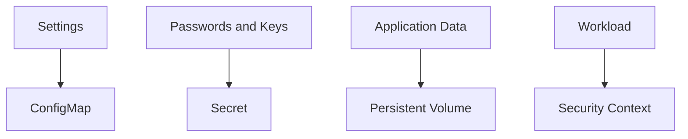

# Day 3 labs

These labs should be done in order. Each one builds on the one before it.

What each lab teaches:
- L3.1 ConfigMaps: move settings out of a deployment
- L3.2 Secrets: keep passwords and keys in a safer place
- L3.3 Persistent volumes: keep data after a restart
- L3.4 StorageClass: ask Kubernetes for storage automatically
- L3.5 Data tier: run PostgreSQL, Redis, and RabbitMQ
- L3.6 StatefulSets: give a database-like app stable identity and storage
- L3.7 Security context: stop running as root
- INC-3: practice the day’s ideas together

How to work through a lab:
1. Read the lab README.
2. Open the `manifests/` folder.
3. Apply the YAML.
4. Check the object with `kubectl`.
5. Run the validation command.

What success looks like:
- You can explain the purpose of the lab.
- You can run the commands and see the expected objects or outputs.
- The validation command passes.

### What this day is really teaching
Day 3 is the point where you stop thinking of Kubernetes as only a place to run pods. You begin to see it as a platform that can also hold configuration, secrets, storage, and rules for how workloads behave.

The common theme is separation: keep settings separate from code, keep sensitive values separate from normal configuration, and keep data separate from the container filesystem.

