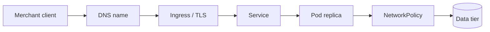

# Networking and exposure

Day 4 is where the platform stops being "some pods in a cluster" and starts behaving like a real application platform.

For a Java developer, this is the day that answers practical questions like:
- How does one service find another without hard-coding IP addresses?
- How does traffic come in from outside the cluster?
- Why can a pod be healthy but still unreachable?
- How do you keep payment traffic on the right nodes and survive node maintenance?

Diagram source: Kubernetes documentation (CC BY 4.0).

## What you will learn

By the end of the day you should be able to explain and demonstrate:
- why a `Service` is a stable address in front of changing pods
- how Kubernetes DNS turns service names into reachable addresses
- how an Ingress controller accepts HTTP/HTTPS traffic for host names such as `api.axispay.local`
- how `NetworkPolicy` changes the cluster from open-by-default to explicit allow rules
- how scheduler rules, affinity, taints, and spread constraints affect where pods run
- how `PodDisruptionBudget` protects a workload during a drain

## What this day is really teaching

Day 4 is about traffic, trust, and safe operations.

A running container is not enough. Real platforms also need:
- a stable way to reach workloads
- service discovery that survives restarts
- a safe entry point from outside the cluster
- explicit network boundaries between tiers
- deliberate placement for reliability and compliance
- maintenance rules that do not take too much capacity away at once

## How to use this folder

1. Read the day overview here first.
2. Open `labs/README.md` and follow the labs in order.
3. Before each lab, inspect the manifest in that lab's `manifests/` directory.
4. Apply the YAML, check the live objects with `kubectl`, then run the validator.
5. At the end of the day, run the full Day 4 checkpoint.

## Recommended lab order

| Lab | Main idea | What you should be able to say afterwards |
|---|---|---|
| L4.1 | Service types | "I know when I want ClusterIP, NodePort, ExternalName, or headless." |
| L4.2 | DNS | "A Service name is part of the platform contract, not a convenience." |
| L4.3 | Ingress + TLS | "External HTTP traffic reaches a Service through an Ingress controller, and TLS protects that path." |
| L4.4 | NetworkPolicy | "Traffic can fail because policy blocks it, even when pods and Services are healthy." |
| L4.5 | Placement | "Scheduling is not random once I add affinity, spread, selectors, taints, and tolerations." |
| L4.6 | PDB + drain | "Maintenance is safe only when eviction rules and workload readiness line up." |
| INC-4 | Three faults | "I can debug the path from client to ingress to service to pod to policy without guessing." |

## Useful validation commands

- `make validate-lab LAB=L4.1`
- `make validate-lab LAB=L4.4`
- `make validate-day4`

## Cheat Sheet / Tips & Tricks

Quick commands:
- `kubectl get svc -A` — list Services and quickly spot `ClusterIP`, `NodePort`, `ExternalName`, and headless entries.
- `kubectl describe svc edge-gateway-nodeport -n axispay-edge` — inspect selector, ports, NodePort, and live endpoints in one screen.
- `kubectl get endpointslice -n axispay-core -l kubernetes.io/service-name=payment-service-headless -o wide` — see which pod IPs are behind a headless Service.
- `kubectl run dns-check --rm -it --image=busybox:1.36 --restart=Never -- nslookup payment-service.axispay-core.svc.cluster.local` — test Service DNS from inside the cluster.
- `kubectl get ingress -A && kubectl describe ingress axispay-api -n axispay-edge` — verify host, path, backend Service, address, and TLS wiring.
- `kubectl get networkpolicy -A` — list the traffic rules that are active across namespaces.
- `kubectl exec -n axispay-edge deploy/edge-gateway -- python3 -c "import socket; socket.create_connection(('payment-service.axispay-core.svc.cluster.local',8080),timeout=5); print('CONNECTED')"` — prove an allowed in-cluster path really works.
- `kubectl get pods -n axispay-core -l app.kubernetes.io/name=payment-service -o wide` — see which node each payment replica landed on.
- `kubectl describe pod <pending-pod> -n axispay-core` — read the Events section when placement rules leave a pod Pending.
- `kubectl get pdb -A && kubectl describe pdb payment-service -n axispay-core` — check maintenance safety before you drain a node.
- `kubectl drain minikube-m02 --ignore-daemonsets --delete-emptydir-data` — simulate maintenance safely; finish with `kubectl uncordon minikube-m02`.

Tips & tricks:
- Start with the namespace. A right resource name in the wrong namespace is still the wrong target.
- `kubectl apply --dry-run=client -o yaml -f <file>` is the fastest way to sanity-check YAML before sending it to the API server.
- `kubectl explain service.spec`, `kubectl explain ingress.spec.tls`, or `kubectl explain networkpolicy.spec` helps when a field name feels unfamiliar.
- `kubectl get events -A --sort-by=.lastTimestamp | tail -n 20` often shows the real failure faster than guessing.
- `kubectl get pods --show-labels` is the quickest way to debug Service selectors and NetworkPolicy pod selectors.
- `kubectl port-forward svc/edge-gateway 8080:8080 -n axispay-edge` is handy when you only need to prove the app responds without involving Ingress.
- Prefer `kubectl get ... -o wide` and `kubectl describe ...` before diving into logs; many Day 4 issues are wiring issues, not app-code issues.
- Failure clues matter: `NXDOMAIN` usually means name/DNS, `404` usually means Ingress host/path, `503` often means no ready backend, and a timeout often means policy or reachability.
- Ingress will never get traffic if the controller is not running or the `ingressClassName` does not match what the controller watches.
- Once you add default-deny policies, remember DNS egress first or every higher-layer check starts failing in confusing ways.

## What success looks like

- You can explain the difference between naming, routing, exposure, and policy.
- You can look at a failed request and decide which layer to inspect first.
- You can show concrete evidence with `kubectl get`, `kubectl describe`, `kubectl exec`, `curl`, and the provided validation scripts.
- `make validate-day4` passes when you are finished.
