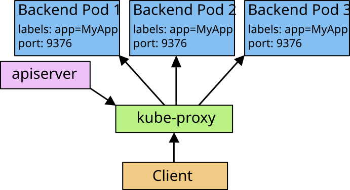
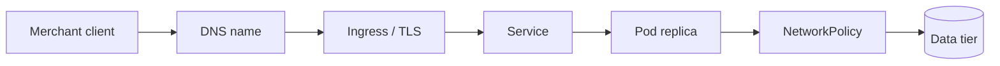

# Networking and exposure

Day 4 is where the platform stops being "some pods in a cluster" and starts behaving like a real application platform.

For a Java developer, this is the day that answers practical questions like:
- How does one service find another without hard-coding IP addresses?
- How does traffic come in from outside the cluster?
- Why can a pod be healthy but still unreachable?
- How do you keep payment traffic on the right nodes and survive node maintenance?


Diagram source: Kubernetes documentation (CC BY 4.0).

## What you will learn

By the end of the day you should be able to explain and demonstrate:
- why a `Service` is a stable address in front of changing pods
- how Kubernetes DNS turns service names into reachable addresses
- how an Ingress controller accepts HTTP/HTTPS traffic for host names such as `api.axispay.local`
- how `NetworkPolicy` changes the cluster from open-by-default to explicit allow rules
- how scheduler rules, affinity, taints, and spread constraints affect where pods run
- how `PodDisruptionBudget` protects a workload during a drain

## What this day is really teaching

Day 4 is about traffic, trust, and safe operations.

A running container is not enough. Real platforms also need:
- a stable way to reach workloads
- service discovery that survives restarts
- a safe entry point from outside the cluster
- explicit network boundaries between tiers
- deliberate placement for reliability and compliance
- maintenance rules that do not take too much capacity away at once



## How to use this folder

1. Read the day overview here first.
2. Open `labs/README.md` and follow the labs in order.
3. Before each lab, inspect the manifest in that lab's `manifests/` directory.
4. Apply the YAML, check the live objects with `kubectl`, then run the validator.
5. At the end of the day, run the full Day 4 checkpoint.

## Recommended lab order

| Lab | Main idea | What you should be able to say afterwards |
|---|---|---|
| L4.1 | Service types | "I know when I want ClusterIP, NodePort, ExternalName, or headless." |
| L4.2 | DNS | "A Service name is part of the platform contract, not a convenience." |
| L4.3 | Ingress + TLS | "External HTTP traffic reaches a Service through an Ingress controller, and TLS protects that path." |
| L4.4 | NetworkPolicy | "Traffic can fail because policy blocks it, even when pods and Services are healthy." |
| L4.5 | Placement | "Scheduling is not random once I add affinity, spread, selectors, taints, and tolerations." |
| L4.6 | PDB + drain | "Maintenance is safe only when eviction rules and workload readiness line up." |
| INC-4 | Three faults | "I can debug the path from client to ingress to service to pod to policy without guessing." |

## Useful validation commands

- `make validate-lab LAB=L4.1`
- `make validate-lab LAB=L4.4`
- `make validate-day4`

## Cheat Sheet / Tips & Tricks

Quick commands:
- `kubectl get svc -A` — list Services and quickly spot `ClusterIP`, `NodePort`, `ExternalName`, and headless entries.
- `kubectl describe svc edge-gateway-nodeport -n axispay-edge` — inspect selector, ports, NodePort, and live endpoints in one screen.
- `kubectl get endpointslice -n axispay-core -l kubernetes.io/service-name=payment-service-headless -o wide` — see which pod IPs are behind a headless Service.
- `kubectl run dns-check --rm -it --image=busybox:1.36 --restart=Never -- nslookup payment-service.axispay-core.svc.cluster.local` — test Service DNS from inside the cluster.
- `kubectl get ingress -A && kubectl describe ingress axispay-api -n axispay-edge` — verify host, path, backend Service, address, and TLS wiring.
- `kubectl get networkpolicy -A` — list the traffic rules that are active across namespaces.
- `kubectl exec -n axispay-edge deploy/edge-gateway -- python3 -c "import socket; socket.create_connection(('payment-service.axispay-core.svc.cluster.local',8080),timeout=5); print('CONNECTED')"` — prove an allowed in-cluster path really works.
- `kubectl get pods -n axispay-core -l app.kubernetes.io/name=payment-service -o wide` — see which node each payment replica landed on.
- `kubectl describe pod <pending-pod> -n axispay-core` — read the Events section when placement rules leave a pod Pending.
- `kubectl get pdb -A && kubectl describe pdb payment-service -n axispay-core` — check maintenance safety before you drain a node.
- `kubectl drain minikube-m02 --ignore-daemonsets --delete-emptydir-data` — simulate maintenance safely; finish with `kubectl uncordon minikube-m02`.

Tips & tricks:
- Start with the namespace. A right resource name in the wrong namespace is still the wrong target.
- `kubectl apply --dry-run=client -o yaml -f <file>` is the fastest way to sanity-check YAML before sending it to the API server.
- `kubectl explain service.spec`, `kubectl explain ingress.spec.tls`, or `kubectl explain networkpolicy.spec` helps when a field name feels unfamiliar.
- `kubectl get events -A --sort-by=.lastTimestamp | tail -n 20` often shows the real failure faster than guessing.
- `kubectl get pods --show-labels` is the quickest way to debug Service selectors and NetworkPolicy pod selectors.
- `kubectl port-forward svc/edge-gateway 8080:8080 -n axispay-edge` is handy when you only need to prove the app responds without involving Ingress.
- Prefer `kubectl get ... -o wide` and `kubectl describe ...` before diving into logs; many Day 4 issues are wiring issues, not app-code issues.
- Failure clues matter: `NXDOMAIN` usually means name/DNS, `404` usually means Ingress host/path, `503` often means no ready backend, and a timeout often means policy or reachability.
- Ingress will never get traffic if the controller is not running or the `ingressClassName` does not match what the controller watches.
- Once you add default-deny policies, remember DNS egress first or every higher-layer check starts failing in confusing ways.

## What success looks like

- You can explain the difference between naming, routing, exposure, and policy.
- You can look at a failed request and decide which layer to inspect first.
- You can show concrete evidence with `kubectl get`, `kubectl describe`, `kubectl exec`, `curl`, and the provided validation scripts.
- `make validate-day4` passes when you are finished.

---

## Rebuild everything from scratch (disaster recovery)

Use this when your cluster crashed, you are coming back to Day 4 after a break and something feels broken, or you want a clean **Day 1 + Day 2 + Day 3 + Day 4** platform again before continuing with Services, DNS, Ingress/TLS, NetworkPolicy, placement, and PodDisruptionBudgets.

Why not just re-apply an old lab manifest? Because Kubernetes tries to merge your old YAML with the live object already in the cluster. If that live state has drifted, the merge can fail with confusing errors such as:

```text
The Deployment "payment-service" is invalid:
* spec.template.spec.containers[0].env[0].valueFrom: Invalid value: "": may not be specified when `value` is not empty
```

Deleting the AxisPay namespaces first removes that drifted state, so Kubernetes creates fresh objects instead of trying to patch a broken mix of old and new configuration.

**Run this:**

```bash
make rebuild-day4
```

This is the important part: **you do not need to run four separate commands**. `make rebuild-day4` is one command that wipes the old Day 1–4 platform, then rebuilds **Day 1**, then **Day 2**, then **Day 3**, then **Day 4** in the correct dependency order. Even though you are on Day 4, this single command gives you a complete, working **Day 1 + Day 2 + Day 3 + Day 4** platform from absolutely nothing.

Expected result:

```text
$ make rebuild-day4
==> Deleting all AxisPay namespaces — this removes every workload, PVC and secret
namespace "axispay-edge" deleted
namespace "axispay-core" deleted
namespace "axispay-async" deleted
namespace "axispay-ops" deleted
namespace "axispay-data" deleted
namespace "axispay-observability" deleted
Namespaces removed. Run 'make rebuild-day1' (or rebuild-day2 / day3 / day4 / day5) to recreate the platform.

namespace/axispay-edge created
namespace/axispay-core created
namespace/axispay-async created

==> Deploying Day 1
deployment.apps/edge-gateway created
deployment.apps/auth-service created
deployment.apps/merchant-service created
deployment.apps/payment-service created
service/edge-gateway created
service/auth-service created
service/merchant-service created
service/payment-service created
pod/payment-service-bare created
...
✓ DAY 1 CHECKPOINT PASSED — 12/12 checks

==> Deploying Day 2
namespace/axispay-ops created
resourcequota/axispay-core-quota created
limitrange/axispay-core-limits created
deployment.apps/fraud-service created
deployment.apps/routing-service created
deployment.apps/loadgen created
service/fraud-service created
service/routing-service created
service/node-agent created
service/loadgen created
horizontalpodautoscaler.autoscaling/payment-service created
horizontalpodautoscaler.autoscaling/fraud-service created
daemonset.apps/node-agent created
job.batch/recon-worker created
cronjob.batch/settlement-cron created
...
✓ DAY 2 CHECKPOINT PASSED — 21/21 checks

==> Deploying Day 3
namespace/axispay-data created
configmap/axispay-platform-config created
secret/axispay-db-credentials created
storageclass.storage.k8s.io/axispay-standard created
persistentvolume/axispay-ledger-archive created
statefulset.apps/postgres created
statefulset.apps/redis created
statefulset.apps/rabbitmq created
deployment.apps/ledger-service created
deployment.apps/customer-service created
...
✓ DAY 3 CHECKPOINT PASSED — 29/29 checks

==> Deploying Day 4
configmap/axispay-async-config created
secret/axispay-db-credentials created
deployment.apps/settlement-service created
service/settlement-service created
deployment.apps/notification-service created
service/notification-service created
deployment.apps/audit-service created
service/audit-service created
deployment.apps/reporting-service created
service/reporting-service created
poddisruptionbudget.policy/payment-service created
poddisruptionbudget.policy/edge-gateway created
poddisruptionbudget.policy/auth-service created
poddisruptionbudget.policy/merchant-service created
poddisruptionbudget.policy/fraud-service created
poddisruptionbudget.policy/postgres created
secret/axispay-tls created
ingress.networking.k8s.io/axispay-api created
ingress.networking.k8s.io/axispay-portal created
networkpolicy.networking.k8s.io/default-deny-all created
networkpolicy.networking.k8s.io/default-deny-all created
networkpolicy.networking.k8s.io/default-deny-all created
networkpolicy.networking.k8s.io/allow-dns-egress created
networkpolicy.networking.k8s.io/allow-dns-egress created
networkpolicy.networking.k8s.io/allow-dns-egress created
networkpolicy.networking.k8s.io/allow-edge-to-payment created
networkpolicy.networking.k8s.io/allow-edge-to-merchant created
networkpolicy.networking.k8s.io/allow-payment-to-core-services created
networkpolicy.networking.k8s.io/allow-async-to-payment-read created
networkpolicy.networking.k8s.io/allow-core-to-data created
networkpolicy.networking.k8s.io/allow-core-internal created
networkpolicy.networking.k8s.io/allow-core-and-async-to-data created
networkpolicy.networking.k8s.io/allow-async-egress created
networkpolicy.networking.k8s.io/allow-prometheus-scrape created
networkpolicy.networking.k8s.io/allow-prometheus-scrape created
networkpolicy.networking.k8s.io/default-deny-all created
networkpolicy.networking.k8s.io/allow-dns-egress created
networkpolicy.networking.k8s.io/allow-ingress-controller created
networkpolicy.networking.k8s.io/allow-edge-egress-to-core created
networkpolicy.networking.k8s.io/allow-gateway-to-auth created
networkpolicy.networking.k8s.io/allow-prometheus-scrape created
deployment.apps/payment-service configured
deployment.apps/fraud-service configured
deployment.apps/payment-service configured
service/edge-gateway-nodeport created
service/acquirer-gateway created
service/payment-service-headless created

$ kubectl get ingress -A
NAMESPACE       NAME             CLASS   HOSTS                ADDRESS       PORTS     AGE
axispay-edge    axispay-api      nginx   api.axispay.local    192.168.49.2 80, 443   11s
axispay-async   axispay-portal   nginx   portal.axispay.local 192.168.49.2 80, 443   11s

Cluster
----------------------------------------------------------------
  ✓ 1/1 nodes Ready
  ✓ Calico present — NetworkPolicy is actually enforced

Namespaces
----------------------------------------------------------------
  ✓ axispay-edge
  ✓ axispay-core
  ✓ axispay-ops
  ✓ axispay-async
  ✓ axispay-data

Day 4 — ingress, DNS and segmentation
----------------------------------------------------------------
  ✓ Ingress present
  ✓ default-deny in place
  ✓ simulate-netpol.py: every policy assertion holds

End-to-end — a payment still works
----------------------------------------------------------------
  ✓ payment accepted through the Ingress (201)

✓ DAY 4 CHECKPOINT PASSED — 40/40 checks
```

On a fresh rebuild, Day 4 usually pauses longest while the Day 3 stateful workloads become ready and the Ingress controller updates the `ADDRESS` field. That is normal.

If you are already further along in the course, use the matching higher rebuild target instead, for example `make rebuild-day5`.

**Warning:** this command is destructive. It deletes everything in the AxisPay namespaces, including current workloads, Secrets, PVCs, and any data stored in those volumes. Only run it when you are fine losing the current state.
