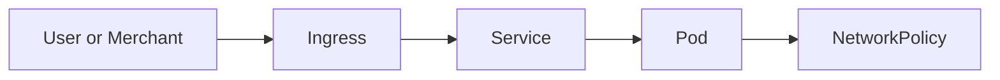

# Networking and exposure

This day is about letting traffic reach the right place in a safe way.

You will learn how to:
- expose services inside the cluster
- use DNS for service discovery
- expose apps to the outside world with Ingress and TLS
- control traffic with NetworkPolicy
- place workloads on the right nodes
- protect apps during maintenance

### What this day is really teaching
Day 4 is about traffic. It shows how services talk to each other, how requests reach the cluster, and how you can control who may talk to whom. In a real system this is one of the most important parts of reliability and security.

The big idea is that a running app is not enough by itself. You also need routing, naming, access control, and safe maintenance rules so the system can be used without surprises.

How to use this folder:
1. Read the lab before you apply anything.
2. Apply the lab manifest.
3. Check the result with `kubectl`.
4. Run the validation command.
5. Move to the next lab.

Use these commands when you are ready:
- `make validate-lab LAB=L4.1`
- `make validate-day4`

What success looks like:
- You understand the main idea of the day.
- You can explain what each lab is trying to teach.
- The validation command for the day passes.