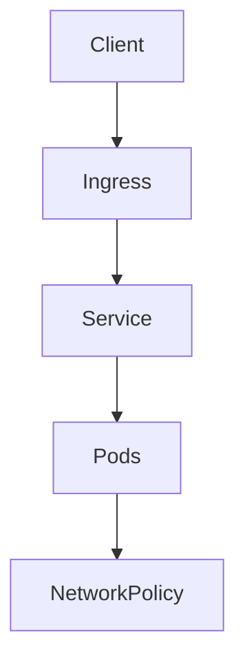

# INC-4 · Three faults

This lab is an incident exercise for networking.

In simple words: traffic can fail for many reasons, and the cause is not always obvious.

### What this concept means
Incident work in networking often involves tracing the path of traffic step by step. The request might fail because the Service is wrong, the Ingress rule is wrong, the controller is not applying the rule, or the NetworkPolicy is blocking the path.

A good habit is to inspect the route from the outside in. Start from the client, then check the ingress, then the Service, then the pods, and only then look at policy. This reduces the chance of fixing the wrong layer.




Do this first:
What you should expect to see: you understand the goal of the lab and the files involved.

1. Open the Service, Ingress, and policy objects in this lab.
2. Ask where traffic should go.
3. Ask which object could be blocking the path.

Why this matters:
- a route can be wrong even when the service exists
- a policy can block traffic even when the app is running
- a small mistake can look like a big outage

Then do this:
What you should expect to see: the command runs without errors and the result matches the explanation above.

```bash
kubectl get svc -A
kubectl get ingress -A
kubectl get networkpolicy -A
```

Expected result:
- The output lists the resource names or details you expected to inspect.
- You should be able to see the object or the status you are checking.
This gives the evidence you need to compare the traffic path with the objects.

Then do this:
What you should expect to see: the command runs without errors and the result matches the explanation above.

Try the request that should work.

Then do this:
What you should expect to see: the command runs without errors and the result matches the explanation above.

Fix the smallest issue that restores the traffic path.

Why this matters:
- the best fix is usually the smallest one
- debugging is easier when you check the route, the service, and the policy in order

Check your work:
What you should expect to see: the validation command finishes successfully.
```bash
make validate-lab LAB=INC-4
```

Expected result:
- The validation command finishes successfully.
- You should see a passing message for the lab.
