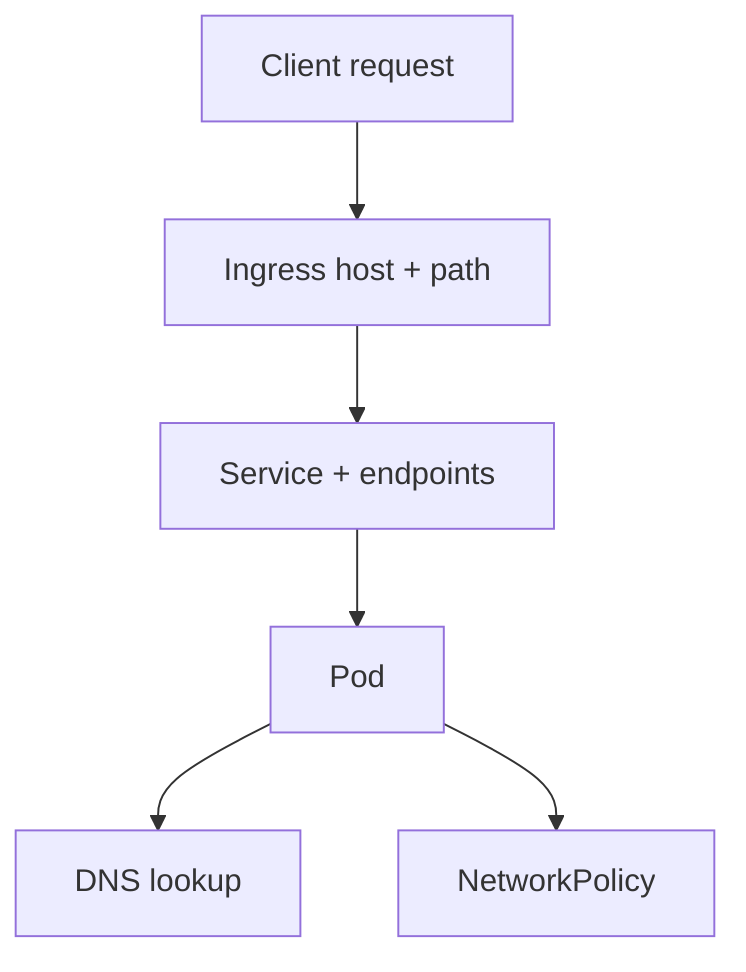

# INC-4 · Three faults

This lab is an incident exercise for networking.

In simple words: traffic can fail for several unrelated reasons at the same time, and the loudest symptom is not always the most important one.

### What this concept means
INC-4 is about incident discipline. You are given multiple faults that touch different layers of the request path:
- an Ingress rule is wrong
- CoreDNS has been damaged
- a NetworkPolicy is too broad and silently blocks an important path

The right habit is to inspect the path from the outside in and fix the smallest broken layer you can prove.



Do this first:
What you should expect to see: you know that this incident contains more than one independent fault.

1. Start by listing what should happen on a healthy request to `https://api.axispay.local/api/v1/_info`.
2. Decide which layer you can check without changing anything.
3. Promise yourself not to delete a correct security control just because it makes the symptom disappear.

Why this matters:
- the first visible failure is not always the root cause
- deleting a valid policy can "fix" the symptom and still make the platform less secure
- incident work is mostly structured elimination, not intuition

Then do this:
What you should expect to see: the Ingress object exists, but the route details reveal the first fault.

```bash
kubectl get ingress -A
kubectl describe ingress axispay-api -n axispay-edge
```

Expected result:

```text
$ kubectl get ingress -A
NAMESPACE      NAME            CLASS   HOSTS                ADDRESS        PORTS     AGE
axispay-async  axispay-portal  nginx   portal.axispay.local 192.168.49.2   80, 443   43m
axispay-edge   axispay-api     nginx   api.axispay.local    192.168.49.2   80, 443   43m

$ kubectl describe ingress axispay-api -n axispay-edge
Name:             axispay-api
Namespace:        axispay-edge
Address:          192.168.49.2
Ingress Class:    nginx
TLS:
  axispay-tls terminates api.axispay.local
Rules:
  Host               Path             Backends
  ----               ----             --------
  api.axispay.local
                     /api/v1/health   edge-gateway:http (10.244.0.21:8080,10.244.2.14:8080)
Annotations:         <none>
Events:
  Type    Reason  Age   From                      Message
  ----    ------  ----  ----                      -------
  Normal  Sync    35s   nginx-ingress-controller  Scheduled for sync
```

That path should have been `/api/v1` with `Prefix`, not `/api/v1/health`.

Then do this:
What you should expect to see: the external request fails with a routing symptom.

```bash
curl -sk https://api.axispay.local/api/v1/_info
```

Expected result:

```text
$ curl -sk https://api.axispay.local/api/v1/_info
<html>
<head><title>404 Not Found</title></head>
<body>
<center><h1>404 Not Found</h1></center>
<hr><center>nginx</center>
</body>
</html>
```

This is the loud fault. Fix it first because it directly breaks the customer-visible path.

Then do this:
What you should expect to see: the second fault lives in DNS, not in the application.

```bash
kubectl get configmap coredns -n kube-system -o jsonpath='{.data.Corefile}'
```

Expected result:

```text
$ kubectl get configmap coredns -n kube-system -o jsonpath='{.data.Corefile}'
.:53 {
    errors
    health
    kubernets cluster.local in-addr.arpa ip6.arpa {
       pods insecure
       fallthrough in-addr.arpa ip6.arpa
       ttl 30
    }
    prometheus :9153
    forward . /etc/resolv.conf
    cache 30
    loop
    reload
    loadbalance
}
```

The typo is subtle but real: `kubernets cluster.local` should be `kubernetes cluster.local`.

Then do this:
What you should expect to see: the silent security fault is visible only when you inspect the policy directly.

```bash
kubectl get networkpolicy -n axispay-core tighten-fraud-ingress
kubectl describe networkpolicy tighten-fraud-ingress -n axispay-core
```

Expected result:

```text
$ kubectl get networkpolicy -n axispay-core tighten-fraud-ingress
NAME                    POD-SELECTOR                    AGE
tighten-fraud-ingress   app.kubernetes.io/name=fraud-service   42m

$ kubectl describe networkpolicy tighten-fraud-ingress -n axispay-core
Name:         tighten-fraud-ingress
Namespace:    axispay-core
Created on:   2026-08-18 15:17:44 +0200 SAST
Labels:       app.kubernetes.io/part-of=axispay
Annotations:  kubernetes.io/change-cause=tighten network policy — restrict fraud-service ingress
Spec:
  PodSelector:     app.kubernetes.io/name=fraud-service
  Allowing ingress traffic:
    From:
      PodSelector: app.kubernetes.io/name=reporting-service
    Ports:
      TCP 8080
  Policy Types: Ingress
```

This is the dangerous one because it can reduce approval success without producing a dramatic crash.

Then do this:
What you should expect to see: after you restore the correct CoreDNS config, the rollout reaches a healthy state again.

```bash
kubectl rollout status deployment/coredns -n kube-system --timeout=120s
```

Expected result:

```text
$ kubectl rollout status deployment/coredns -n kube-system --timeout=120s
Waiting for deployment "coredns" rollout to finish: 1 old replica is pending termination...
Waiting for deployment "coredns" rollout to finish: 1 of 2 updated replicas are available...
deployment "coredns" successfully rolled out
```

Common failures or mistakes:

```text
$ curl -sk https://api.axispay.local/api/v1/payments
<html>
<head><title>404 Not Found</title></head>
<body>
<center><h1>404 Not Found</h1></center>
<hr><center>nginx</center>
</body>
</html>
```

Why it happens and how to fix it: the Ingress rule was narrowed to one exact health path. Restore the correct path and path type before touching anything deeper.

```text
$ kubectl exec -n axispay-edge deploy/edge-gateway -- python3 -c "import socket; socket.getaddrinfo('merchant-service.axispay-core.svc.cluster.local',8080)"
Traceback (most recent call last):
  File "<string>", line 1, in <module>
socket.gaierror: [Errno -3] Temporary failure in name resolution
command terminated with exit code 1
```

Why it happens and how to fix it: CoreDNS is broken, so the caller cannot even resolve the next hop. Fix the DNS layer, then retry the application path.

Why this matters:
- incidents reward method, not heroics
- the smallest safe fix is usually the best fix
- preserving good security controls during pressure is part of the skill being tested here

## Cheat Sheet / Tips & Tricks

Quick commands:
- `curl -sk https://api.axispay.local/api/v1/_info` — start with the real customer-visible symptom.
- `kubectl describe ingress axispay-api -n axispay-edge` — verify that host, path, backend, and TLS still match the intended route.
- `kubectl get configmap coredns -n kube-system -o jsonpath='{.data.Corefile}'` — inspect the CoreDNS config directly when name resolution looks suspicious.
- `kubectl exec -n axispay-edge deploy/edge-gateway -- python3 -c "import socket; socket.getaddrinfo('merchant-service.axispay-core.svc.cluster.local',8080)"` — prove whether the app pod can still resolve internal Service names.
- `kubectl describe networkpolicy tighten-fraud-ingress -n axispay-core` — inspect the silent security fault without deleting good controls first.
- `kubectl rollout status deployment/coredns -n kube-system --timeout=120s` — wait for DNS to become healthy again after you fix the Corefile.

Tips & tricks:
- Debug this lab from the outside in: client -> Ingress -> Service -> pod -> DNS -> policy.
- A `404` from nginx usually points to the Ingress rule, not to the application container.
- `Temporary failure in name resolution` means fix DNS before you spend time on HTTP routing or application logs.
- Do not “solve” the exercise by deleting a valid deny rule; the goal is to restore the intended path without weakening the platform.

Check your work:
What you should expect to see: the end-of-day checkpoint passes and the network-policy simulation is healthy again.

```bash
python3 platform/admin/validate/simulate-netpol.py
make validate-day4
```

Expected result:

```text
$ python3 platform/admin/validate/simulate-netpol.py
[1/39] edge -> payment-service on tcp/8080: ALLOW
[2/39] edge -> merchant-service on tcp/8080: ALLOW
[3/39] edge -> postgres on tcp/5432: DENY
...
[39/39] observability -> edge on tcp/8080: ALLOW
39/39 assertions passed

$ make validate-day4
Day 4 checkpoint
----------------------------------------------------------------
  ✓ Day 4 platform validators passed
  ✓ Ingress and TLS routes healthy
  ✓ Network segmentation still blocks edge-gateway -> PostgreSQL
  ✓ Placement and disruption controls still present

✓ DAY 4 PASSED
```
