# L4.1 · Service types

This lab is about how a Service gives pods a stable way to be reached.

In simple words: pods come and go, but a Service gives you a steady address.

### What this concept means
A Service gives pods a stable address even when the pods behind it are replaced. In Kubernetes, pods are not fixed endpoints, so a Service acts like a stable front door for a matching set of pods.

Different Service types exist because traffic arrives from different places:
- `ClusterIP` is for traffic inside the cluster
- `NodePort` opens a port on every node
- `ExternalName` is a DNS alias to something outside the cluster
- a **headless** Service (`clusterIP: None`) returns pod IPs directly instead of one virtual IP


Diagram source: Kubernetes documentation (CC BY 4.0).

Do this first:
What you should expect to see: you understand which Service names, namespaces, and ports this lab adds.

1. Open `manifests/01-service-types.yaml`.
2. Notice that it creates:
   - `edge-gateway-nodeport` in `axispay-edge`
   - `acquirer-gateway` in `axispay-core`
   - `payment-service-headless` in `axispay-core`
3. Notice that all three are different ways of solving different reachability problems.

Why this matters:
- pods are not reliable addresses
- the correct Service type depends on where the caller is
- the wrong Service type can make an app harder to operate or less secure

Then do this:
What you should expect to see: Kubernetes accepts three Service objects.

```bash
kubectl apply -f manifests/
```

Expected result:

```text
$ kubectl apply -f manifests/
service/edge-gateway-nodeport created
service/acquirer-gateway created
service/payment-service-headless created
```

This creates one external-facing example (`NodePort`), one DNS alias (`ExternalName`), and one headless Service for direct pod discovery.

Then do this:
What you should expect to see: the output shows the new Service types in context with the rest of the platform.

```bash
kubectl get svc -A
```

Expected result:

```text
$ kubectl get svc -A
NAMESPACE      NAME                      TYPE          CLUSTER-IP       EXTERNAL-IP                     PORT(S)             AGE
axispay-async  audit-service             ClusterIP     10.100.88.21    <none>                          8080/TCP            1d2h
axispay-async  notification-service      ClusterIP     10.99.17.44     <none>                          8080/TCP            1d2h
axispay-async  reporting-service         ClusterIP     10.100.51.8     <none>                          8080/TCP            1d2h
axispay-async  settlement-service        ClusterIP     10.97.182.63    <none>                          8080/TCP            1d2h
axispay-core   acquirer-gateway          ExternalName  <none>           acquirer.meridian.example.com  <none>              14s
axispay-core   customer-service          ClusterIP     10.96.191.204   <none>                          8080/TCP            1d3h
axispay-core   fraud-service             ClusterIP     10.103.145.90   <none>                          8080/TCP            1d2h
axispay-core   ledger-service            ClusterIP     10.96.213.71    <none>                          8080/TCP            1d3h
axispay-core   merchant-service          ClusterIP     10.98.14.81     <none>                          8080/TCP            1d3h
axispay-core   payment-service           ClusterIP     10.103.77.21    <none>                          8080/TCP            1d3h
axispay-core   payment-service-headless  ClusterIP     None            <none>                          8080/TCP            14s
axispay-data   postgres                  ClusterIP     None            <none>                          5432/TCP            1d3h
axispay-data   rabbitmq                  ClusterIP     None            <none>                          5672/TCP,15672/TCP  1d3h
axispay-data   redis                     ClusterIP     None            <none>                          6379/TCP            1d3h
axispay-edge   auth-service              ClusterIP     10.99.44.212    <none>                          8080/TCP            1d3h
axispay-edge   edge-gateway              ClusterIP     10.98.224.173   <none>                          8080/TCP            1d3h
axispay-edge   edge-gateway-nodeport     NodePort      10.101.63.144   <none>                          8080:30080/TCP      14s
default        kubernetes                ClusterIP     10.96.0.1       <none>                          443/TCP             1d3h
```

Read this output carefully:
- `NodePort` means every node listens on `30080`
- `ExternalName` has no cluster IP because it is a DNS alias, not a proxy
- `clusterIP: None` means the headless Service does not create one virtual IP

Then do this:
What you should expect to see: the headless Service resolves to individual pod endpoints, not one virtual IP.

```bash
kubectl get endpointslice -n axispay-core -l kubernetes.io/service-name=payment-service-headless -o wide
```

Expected result:

```text
$ kubectl get endpointslice -n axispay-core -l kubernetes.io/service-name=payment-service-headless -o wide
NAME                              ADDRESSTYPE   PORTS   ENDPOINTS                            AGE
payment-service-headless-7r8vk    IPv4          8080    10.244.0.32,10.244.1.27,10.244.2.30  18s
```

This is the headless-Service idea in one screen: clients can discover each payment pod directly.

Then do this:
What you should expect to see: `kubectl describe` shows the selector, target port, and live endpoints that make the Service work.

```bash
kubectl describe svc edge-gateway-nodeport -n axispay-edge
```

Expected result:

```text
$ kubectl describe svc edge-gateway-nodeport -n axispay-edge
Name:                     edge-gateway-nodeport
Namespace:                axispay-edge
Labels:                   <none>
Annotations:              <none>
Selector:                 app.kubernetes.io/instance=axispay,app.kubernetes.io/name=edge-gateway
Type:                     NodePort
IP Family Policy:         SingleStack
IP Families:              IPv4
IP:                       10.101.63.144
IPs:                      10.101.63.144
Port:                     http  8080/TCP
TargetPort:               http/TCP
NodePort:                 http  30080/TCP
Endpoints:                10.244.0.21:8080,10.244.2.14:8080
Session Affinity:         None
External Traffic Policy:  Cluster
Events:                   <none>
```

This is the fastest way to debug a Service:
- if `Selector` is wrong, you get no endpoints
- if `TargetPort` is wrong, traffic reaches the pod IP but the container is not listening there
- if `Endpoints` is empty, the Service exists but cannot send traffic anywhere

Common failure or mistake:

```text
$ kubectl describe svc edge-gateway-nodeport -n axispay-edge
Name:         edge-gateway-nodeport
Namespace:    axispay-edge
Selector:     app.kubernetes.io/name=edge-gatewaay,app.kubernetes.io/instance=axispay
Type:         NodePort
IP:           10.101.63.144
Port:         http  8080/TCP
TargetPort:   http/TCP
NodePort:     http  30080/TCP
Endpoints:    <none>
```

Why it happens and how to fix it: the selector label does not match the pod labels, so the Service has nobody to send traffic to. Compare the selector with `kubectl get pods -n axispay-edge --show-labels`, fix the typo, and re-apply.

Why this matters:
- internal traffic usually wants `ClusterIP`
- external traffic often starts with `Ingress`, but `NodePort` is still useful underneath many bare-metal setups
- headless Services matter when the client wants direct pod identities instead of a load-balanced VIP

## Cheat Sheet / Tips & Tricks

Quick commands:
- `kubectl get svc -A` — list every Service and confirm which ones are `NodePort`, `ExternalName`, or headless.
- `kubectl describe svc edge-gateway-nodeport -n axispay-edge` — check selector, `targetPort`, `nodePort`, and live endpoints for the external-facing example.
- `kubectl get endpoints payment-service -n axispay-core` — see which pod IPs the normal `ClusterIP` Service is sending traffic to.
- `kubectl get endpointslice -n axispay-core -l kubernetes.io/service-name=payment-service-headless -o wide` — see the direct pod IPs returned by the headless Service.
- `kubectl get pods -n axispay-edge --show-labels` — compare pod labels with the Service selector when endpoints are missing.

Tips & tricks:
- A `ClusterIP` Service is only reachable from inside the cluster. Use `NodePort`, Ingress, or `kubectl port-forward` when you need access from your laptop.
- `ExternalName` is a DNS alias, not a proxy, so it does not create pod endpoints or a cluster IP.
- If `kubectl describe svc ...` shows `Endpoints: <none>`, the selector probably does not match your pods.
- Headless Services are great when the client needs direct pod identities, but they do not give you one load-balanced virtual IP.

Check your work:
What you should expect to see: the validator confirms the Service types and the headless behavior.

```bash
make validate-lab LAB=L4.1
```

Expected result:

```text
$ make validate-lab LAB=L4.1

L4.1 — Service taxonomy
----------------------------------------------------------------
  ✓ edge-gateway-nodeport is NodePort
  ✓ acquirer-gateway is ExternalName
  ✓ payment-service-headless is ClusterIP
  ✓ payment-service-headless is headless (clusterIP: None)

Four networking rules — pod-to-pod without NAT
----------------------------------------------------------------
  ✓ Service axispay-core/payment-service has 3 endpoint(s)

✓ L4.1 PASSED — 5/5 checks
```
