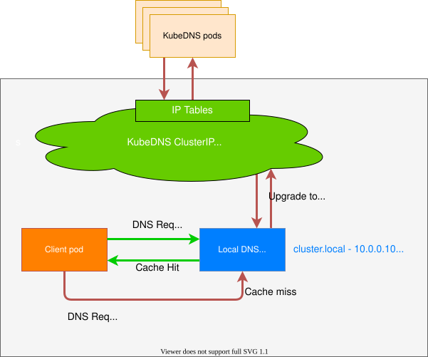

# L4.2 · DNS

This lab is about making services reach each other by name.

In simple words: instead of remembering IP addresses, you use names.

### What this concept means
DNS in Kubernetes is the reason services can talk to each other by name instead of by hard-coded IP addresses. When a Service exists, Kubernetes gives it a DNS name that other workloads can resolve inside the cluster.

That matters because pod IPs are disposable. If you hard-code an IP, your app eventually talks to the wrong thing. If you use the Service name, Kubernetes can move or replace pods without forcing every caller to change.


Diagram source: Kubernetes documentation (CC BY 4.0).

Do this first:
What you should expect to see: you understand which names you are about to resolve.

1. Make sure the Services from the earlier labs already exist.
2. Keep `payment-service.axispay-core.svc.cluster.local` in mind as the fully qualified service name.
3. Remember that a headless Service such as `payment-service-headless` returns pod IPs rather than one virtual IP.

Why this matters:
- names are easier to manage than IPs
- DNS is the platform contract between callers and Services
- DNS failures often look like application failures until you inspect them closely

Then do this:
What you should expect to see: the Service name resolves to the `payment-service` cluster IP from inside the cluster.

```bash
kubectl run dns-check --rm -it --image=busybox:1.36 --restart=Never -- nslookup payment-service.axispay-core.svc.cluster.local
```

Expected result:

```text
$ kubectl run dns-check --rm -it --image=busybox:1.36 --restart=Never -- nslookup payment-service.axispay-core.svc.cluster.local
Server:         10.96.0.10
Address:        10.96.0.10:53

Name:   payment-service.axispay-core.svc.cluster.local
Address: 10.103.77.21

pod "dns-check" deleted
```

This tells you three useful things at once:
- the query reached cluster DNS (`10.96.0.10`)
- the name exists
- it resolved to the `ClusterIP` of `payment-service`

Then do this:
What you should expect to see: a headless Service returns multiple pod IPs instead of one Service IP.

```bash
kubectl run dns-check-headless --rm -it --image=busybox:1.36 --restart=Never -- nslookup payment-service-headless.axispay-core.svc.cluster.local
```

Expected result:

```text
$ kubectl run dns-check-headless --rm -it --image=busybox:1.36 --restart=Never -- nslookup payment-service-headless.axispay-core.svc.cluster.local
Server:         10.96.0.10
Address:        10.96.0.10:53

Name:   payment-service-headless.axispay-core.svc.cluster.local
Address: 10.244.0.32
Address: 10.244.1.27
Address: 10.244.2.30

pod "dns-check-headless" deleted
```

This is the key difference from the previous lookup: one name, many pod addresses.

Then do this:
What you should expect to see: the pod resolver config shows the cluster search domains and the default `ndots:5` behavior.

```bash
kubectl exec -n axispay-edge deploy/edge-gateway -- cat /etc/resolv.conf
```

Expected result:

```text
$ kubectl exec -n axispay-edge deploy/edge-gateway -- cat /etc/resolv.conf
search axispay-edge.svc.cluster.local svc.cluster.local cluster.local
nameserver 10.96.0.10
options ndots:5
```

This is why short names such as `auth-service` often work from inside the same namespace: the resolver appends the search domains for you.

Then do this:
What you should expect to see: `kubectl describe` shows that the Service name points at real endpoints.

```bash
kubectl describe svc payment-service -n axispay-core
```

Expected result:

```text
$ kubectl describe svc payment-service -n axispay-core
Name:                     payment-service
Namespace:                axispay-core
Labels:                   app.kubernetes.io/component=core
                          app.kubernetes.io/instance=axispay
                          app.kubernetes.io/name=payment-service
Selector:                 app.kubernetes.io/instance=axispay,app.kubernetes.io/name=payment-service
Type:                     ClusterIP
IP Family Policy:         SingleStack
IP Families:              IPv4
IP:                       10.103.77.21
IPs:                      10.103.77.21
Port:                     http  8080/TCP
TargetPort:               http/TCP
Endpoints:                10.244.0.32:8080,10.244.1.27:8080,10.244.2.30:8080
Session Affinity:         None
Events:                   <none>
```

If DNS resolves but the request still times out, this is the next thing to inspect. A name can exist even when the Service has no healthy endpoints.

Common failure or mistake:

```text
$ kubectl run dns-fail --rm -it --image=busybox:1.36 --restart=Never -- nslookup payments-service.axispay-core.svc.cluster.local
Server:         10.96.0.10
Address:        10.96.0.10:53

** server can't find payments-service.axispay-core.svc.cluster.local: NXDOMAIN

pod "dns-fail" deleted
```

Why it happens and how to fix it: `payments-service` is not the real Service name; the manifest and validator use `payment-service`. Check `kubectl get svc -n axispay-core` and retry with the correct name.

Another common failure after NetworkPolicy changes looks like this:

```text
httpx.ConnectError: [Errno -3] Temporary failure in name resolution
```

Why it happens and how to fix it: DNS egress to CoreDNS is blocked. Re-check the `allow-dns-egress` policy before blaming the application.

Why this matters:
- most service-to-service calls on Day 4 depend on DNS first
- a DNS problem can break every higher layer at once
- knowing the difference between a Service IP and headless pod IPs helps you reason about what the client is really connecting to

## Cheat Sheet / Tips & Tricks

Quick commands:
- `kubectl run dns-check --rm -it --image=busybox:1.36 --restart=Never -- nslookup payment-service.axispay-core.svc.cluster.local` — resolve the normal Service FQDN from inside the cluster.
- `kubectl run dns-check-headless --rm -it --image=busybox:1.36 --restart=Never -- nslookup payment-service-headless.axispay-core.svc.cluster.local` — confirm the headless name returns pod IPs.
- `kubectl exec -n axispay-edge deploy/edge-gateway -- cat /etc/resolv.conf` — inspect search domains, nameserver, and `ndots` inside a running pod.
- `kubectl describe svc payment-service -n axispay-core` — verify that the DNS name points at a Service with real endpoints.
- `kubectl get svc -n axispay-core` — sanity-check the exact Service name before assuming DNS is broken.

Tips & tricks:
- The full in-cluster Service name is usually `<service>.<namespace>.svc.cluster.local`.
- Short names such as `payment-service` usually work only from the same namespace or because the pod search domains fill in the rest.
- `NXDOMAIN` usually means the name is wrong; a timeout after name resolution usually points somewhere deeper, such as policy or the app itself.
- If DNS starts failing right after NetworkPolicy changes, check whether `allow-dns-egress` is still present before debugging application code.

Check your work:
What you should expect to see: the validator confirms that CoreDNS is up and that a pod can resolve the FQDN.

```bash
make validate-lab LAB=L4.2
```

Expected result:

```text
$ make validate-lab LAB=L4.2

L4.2 — CoreDNS
----------------------------------------------------------------
  ✓ CoreDNS has 2 ready replica(s)
  ✓ kube-dns Service exists

Resolution from inside the cluster
----------------------------------------------------------------
  ✓ FQDN resolves from a pod

✓ L4.2 PASSED — 3/3 checks
```
