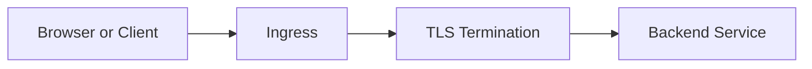

# L4.3 · Ingress and TLS

This lab is about exposing an app to the outside world with a hostname and HTTPS.

In simple words: Ingress is the door, and TLS is the lock.

### What this concept means
Ingress is the entry point for traffic from outside the cluster. It is a routing rule that decides how requests should reach the right service. In real systems, this is where host names, paths, and TLS are handled.

TLS is the layer that protects the connection while it travels over the network. In this lab, the Ingress object and the ingress controller work together to receive requests, decide where they go, and protect the connection with HTTPS.




Do this first:
What you should expect to see: you understand the goal of the lab and the files involved.

1. Open `manifests/01-ingress.yaml`.
2. Notice the host names, routing rules, and TLS secret.
3. Think about how traffic reaches the app from outside the cluster.

Why this matters:
- users and merchants need a stable way to reach the app
- Ingress decides where the traffic goes
- TLS protects the connection while it travels

Then do this:
What you should expect to see: the command runs without errors and the result matches the explanation above.

```bash
kubectl apply -f manifests/
```

Expected result:
- The command finishes without errors.
- You should see messages such as `created` or `configured` for the resources.
- A follow-up `kubectl get` command should show the objects you created.
This creates the routing rules and TLS secret.

Then do this:
What you should expect to see: the command runs without errors and the result matches the explanation above.

```bash
kubectl get ingress -A
```

Expected result:
- The output lists the resource names or details you expected to inspect.
- You should be able to see the object or the status you are checking.
This shows whether the Ingress objects were accepted and have an address.

Then do this:
What you should expect to see: the command runs without errors and the result matches the explanation above.

```bash
curl -sk https://api.axispay.local/api/v1/_info
```

Expected result:
- The command returns a response from the service.
- You should see either a successful body or an HTTP status code.
This checks the route and the TLS connection.

Why this matters:
- an Ingress rule does not work by itself
- the ingress controller must apply it
- traffic needs both a route and a working backend service

Check your work:
What you should expect to see: the validation command finishes successfully.
```bash
make validate-lab LAB=L4.3
```

Expected result:
- The validation command finishes successfully.
- You should see a passing message for the lab.
