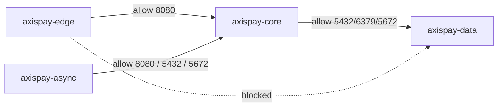

# L4.4 · NetworkPolicy

This lab is about deciding which pods are allowed to talk to each other.

In simple words: you are drawing a security boundary around the platform.

### What this concept means
A NetworkPolicy controls which pods may send traffic to which other pods. It is one of the main tools for limiting accidental reachability and reducing the blast radius of a mistake or compromise.

The pattern for serious systems is usually:
1. default deny
2. add DNS back explicitly
3. add only the call paths the application really needs



Do this first:
What you should expect to see: you understand that the manifest set is intentionally broad because it defines the allowed traffic map for the whole platform.

1. Open the files in `manifests/`.
2. Read `01-default-deny.yaml` and `02-allow-dns.yaml` first.
3. Then read the namespace-specific allow rules.
4. Notice that some rules are about **ingress** to a destination, while others are about **egress** from a source.

Why this matters:
- policy is about allowed traffic, not about whether pods exist
- traffic can fail even when Services, endpoints, and pods all look healthy
- the blocked path is often the thing you most need to prove in an audit

Then do this:
What you should expect to see: Kubernetes accepts the full policy set across the edge, core, async, and data namespaces.

```bash
kubectl apply -f manifests/
```

Expected result:

```text
$ kubectl apply -f manifests/
networkpolicy.networking.k8s.io/default-deny-all created
networkpolicy.networking.k8s.io/default-deny-all created
networkpolicy.networking.k8s.io/default-deny-all created
networkpolicy.networking.k8s.io/allow-dns-egress created
networkpolicy.networking.k8s.io/allow-dns-egress created
networkpolicy.networking.k8s.io/allow-dns-egress created
networkpolicy.networking.k8s.io/allow-edge-to-payment created
networkpolicy.networking.k8s.io/allow-edge-to-merchant created
networkpolicy.networking.k8s.io/allow-payment-to-core-services created
networkpolicy.networking.k8s.io/allow-async-to-payment-read created
networkpolicy.networking.k8s.io/allow-core-to-data created
networkpolicy.networking.k8s.io/allow-core-internal created
networkpolicy.networking.k8s.io/allow-core-and-async-to-data created
networkpolicy.networking.k8s.io/allow-async-egress created
networkpolicy.networking.k8s.io/allow-prometheus-scrape created
networkpolicy.networking.k8s.io/allow-prometheus-scrape created
networkpolicy.networking.k8s.io/default-deny-all created
networkpolicy.networking.k8s.io/allow-dns-egress created
networkpolicy.networking.k8s.io/allow-ingress-controller created
networkpolicy.networking.k8s.io/allow-edge-egress-to-core created
networkpolicy.networking.k8s.io/allow-gateway-to-auth created
networkpolicy.networking.k8s.io/allow-prometheus-scrape created
```

This is intentionally verbose. Security work is often lots of small explicit allow rules.

Then do this:
What you should expect to see: each namespace now has policy objects, and the names tell you the allowed direction.

```bash
kubectl get networkpolicy -A
```

Expected result:

```text
$ kubectl get networkpolicy -A
NAMESPACE      NAME                        POD-SELECTOR                                   AGE
axispay-async  allow-async-egress          <none>                                         9s
axispay-async  allow-dns-egress            <none>                                         9s
axispay-async  allow-prometheus-scrape     <none>                                         9s
axispay-async  default-deny-all            <none>                                         9s
axispay-core   allow-async-to-payment-read app.kubernetes.io/name=payment-service         9s
axispay-core   allow-core-internal         app.kubernetes.io/name=payment-service         9s
axispay-core   allow-core-to-data          app.kubernetes.io/name in (payment,...)        9s
axispay-core   allow-dns-egress            <none>                                         9s
axispay-core   allow-edge-to-merchant      app.kubernetes.io/name=merchant-service        9s
axispay-core   allow-edge-to-payment       app.kubernetes.io/name=payment-service         9s
axispay-core   allow-payment-to-core-services app.kubernetes.io/name in (...)             9s
axispay-core   default-deny-all            <none>                                         9s
axispay-data   allow-core-and-async-to-data <none>                                        9s
axispay-data   allow-dns-egress            <none>                                         9s
axispay-data   default-deny-all            <none>                                         9s
axispay-edge   allow-dns-egress            <none>                                         9s
axispay-edge   allow-edge-egress-to-core   <none>                                         9s
axispay-edge   allow-gateway-to-auth       app.kubernetes.io/name=auth-service            9s
axispay-edge   allow-ingress-controller    app.kubernetes.io/name=edge-gateway            9s
axispay-edge   allow-prometheus-scrape     <none>                                         9s
axispay-edge   default-deny-all            <none>                                         9s
```

Then do this:
What you should expect to see: a legitimate application path is still reachable after the policies are applied.

```bash
kubectl exec -n axispay-edge deploy/edge-gateway -- python3 -c "import socket; socket.create_connection(('payment-service.axispay-core.svc.cluster.local',8080),timeout=5); print('CONNECTED payment-service:8080')"
```

Expected result:

```text
$ kubectl exec -n axispay-edge deploy/edge-gateway -- python3 -c "import socket; socket.create_connection(('payment-service.axispay-core.svc.cluster.local',8080),timeout=5); print('CONNECTED payment-service:8080')"
CONNECTED payment-service:8080
```

This path works because the source and destination are both explicitly allowed.

Then do this:
What you should expect to see: a forbidden path times out because the packets are dropped before they ever reach PostgreSQL.

```bash
kubectl exec -n axispay-edge deploy/edge-gateway -- python3 -c "import socket; socket.create_connection(('postgres-0.postgres.axispay-data.svc.cluster.local',5432),timeout=5)"
```

Expected result:

```text
$ kubectl exec -n axispay-edge deploy/edge-gateway -- python3 -c "import socket; socket.create_connection(('postgres-0.postgres.axispay-data.svc.cluster.local',5432),timeout=5)"
Traceback (most recent call last):
  File "<string>", line 1, in <module>
  File "/usr/local/lib/python3.11/socket.py", line 851, in create_connection
    raise exceptions[0]
  File "/usr/local/lib/python3.11/socket.py", line 836, in create_connection
    sock.connect(sa)
TimeoutError: timed out
command terminated with exit code 1
```

That **timeout** is important. It usually means traffic was dropped by policy. A connection refusal would mean the traffic reached something that actively rejected it.

Then do this:
What you should expect to see: `kubectl describe` shows the exact ports and destination zone allowed by one of the policies.

```bash
kubectl describe networkpolicy allow-core-to-data -n axispay-core
```

Expected result:

```text
$ kubectl describe networkpolicy allow-core-to-data -n axispay-core
Name:         allow-core-to-data
Namespace:    axispay-core
Created on:   2026-08-18 13:54:11 +0200 SAST
Labels:       <none>
Annotations:  <none>
Spec:
  PodSelector:     app.kubernetes.io/name in (payment-service,ledger-service,customer-service,merchant-service,fraud-service)
  Allowing egress traffic:
    To:
      NamespaceSelector: axispay.io/zone=data
    Ports:
      TCP 5432
      TCP 6379
      TCP 5672
  Policy Types: Egress
```

Common failures or mistakes:

```text
$ kubectl exec -n axispay-core deploy/payment-service -- python3 -c "import socket; socket.getaddrinfo('merchant-service.axispay-core.svc.cluster.local',8080); print('RESOLVED')"
Traceback (most recent call last):
  File "<string>", line 1, in <module>
socket.gaierror: [Errno -3] Temporary failure in name resolution
command terminated with exit code 1
```

Why it happens and how to fix it: default-deny without `allow-dns-egress` blocks access to CoreDNS. Add the DNS rule back first; otherwise every service call fails before it even tries to connect.

```text
$ kubectl get ds -n kube-system calico-node
No resources found in kube-system namespace.
```

Why it happens and how to fix it: the cluster is missing a policy-enforcing CNI, so the YAML exists but protects nothing. Rebuild or reconfigure the cluster with Calico before trusting any policy result.

Why this matters:
- this is the day where the platform changes from open-by-default to explicit trust boundaries
- many real outages are "network policy did exactly what we asked, not what we intended"
- audit evidence comes from both the policy objects and a repeatable blocked-path test

## Cheat Sheet / Tips & Tricks

Quick commands:
- `kubectl get networkpolicy -A` — list the active policies and quickly see which namespaces are locked down.
- `kubectl describe networkpolicy allow-core-to-data -n axispay-core` — inspect a real rule for destination namespace and allowed ports.
- `kubectl exec -n axispay-edge deploy/edge-gateway -- python3 -c "import socket; socket.create_connection(('payment-service.axispay-core.svc.cluster.local',8080),timeout=5); print('CONNECTED')"` — prove an allowed application path still works.
- `kubectl exec -n axispay-edge deploy/edge-gateway -- python3 -c "import socket; socket.create_connection(('postgres-0.postgres.axispay-data.svc.cluster.local',5432),timeout=5)"` — test that a forbidden path is really blocked.
- `kubectl get ds -n kube-system calico-node` — verify there is a policy-enforcing CNI before trusting NetworkPolicy results.

Tips & tricks:
- Once any NetworkPolicy selects a pod, traffic that is not explicitly allowed is blocked. That surprises almost everyone the first time.
- DNS is just network traffic. If you forget `allow-dns-egress`, your services can fail before they even try to connect.
- A timeout usually means packets were dropped by policy; a quick refusal usually means traffic reached something that rejected it.
- Policy YAML without an enforcing CNI is just documentation, so always confirm Calico or another supported plugin is really running.

Check your work:
What you should expect to see: the validator confirms default deny, DNS egress, Calico enforcement, the blocked DMZ-to-PostgreSQL path, and the policy simulation.

```bash
make validate-lab LAB=L4.4
```

Expected result:

```text
$ make validate-lab LAB=L4.4

L4.4 — Zero-trust segmentation
----------------------------------------------------------------
  ✓ Calico present — policies are actually enforced

Default deny in every namespace
----------------------------------------------------------------
  ✓ axispay-edge has default-deny-all
  ✓ axispay-core has default-deny-all
  ✓ axispay-data has default-deny-all
  ✓ axispay-async has default-deny-all

DNS egress — the rule everyone forgets
----------------------------------------------------------------
  ✓ axispay-edge permits DNS egress
  ✓ axispay-core permits DNS egress
  ✓ axispay-data permits DNS egress
  ✓ axispay-async permits DNS egress

THE CONTROL — the DMZ must not reach the vault
----------------------------------------------------------------
  ✓ edge-gateway CANNOT reach PostgreSQL — segmentation holds

Policy logic simulation
----------------------------------------------------------------
  ✓ all 39 policy assertions hold

✓ L4.4 PASSED — 11/11 checks
```
