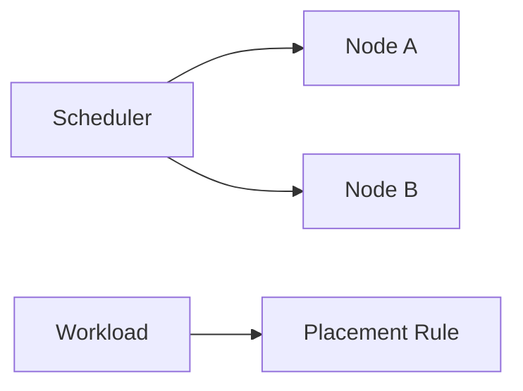

# L4.5 · Placement

This lab is about controlling where a workload runs.

In simple words: sometimes you want a pod to stay on a certain node, or avoid a node, and placement rules help with that.

### What this concept means
Placement rules control where a workload runs. Kubernetes normally schedules pods automatically, but sometimes you want to be more deliberate. You might want a workload on a specific node, or you might want to avoid placing important services together.

This is important for reliability and maintenance. For example, you might not want the payment path and the reporting path to land on the same node if that node could become unavailable. Placement rules help you make that decision explicit.




Do this first:
What you should expect to see: you understand the goal of the lab and the files involved.

1. Open `manifests/01-placement.yaml`.
2. Open `manifests/02-taints-tolerations.yaml`.
3. Notice the labels, taints, and placement instructions.

Why this matters:
- some workloads need special nodes
- you may want to spread pods across nodes for reliability
- maintenance is easier when scheduling is deliberate

Then do this:
What you should expect to see: the command runs without errors and the result matches the explanation above.

```bash
kubectl apply -f manifests/
```

Expected result:
- The command finishes without errors.
- You should see messages such as `created` or `configured` for the resources.
- A follow-up `kubectl get` command should show the objects you created.
This applies the placement rules.

Then do this:
What you should expect to see: the command runs without errors and the result matches the explanation above.

```bash
kubectl get pods -o wide
kubectl get nodes --show-labels
```

Expected result:
- The output lists the resource names or details you expected to inspect.
- You should be able to see the object or the status you are checking.
This shows where the pods ended up.

Then do this:
What you should expect to see: the command runs without errors and the result matches the explanation above.

Ask yourself whether the pod landed where you expected.

Why this matters:
- scheduling is not random in Kubernetes when you add rules
- placement rules are a way to make reliability more predictable

Check your work:
What you should expect to see: the validation command finishes successfully.
```bash
make validate-lab LAB=L4.5
```

Expected result:
- The validation command finishes successfully.
- You should see a passing message for the lab.
