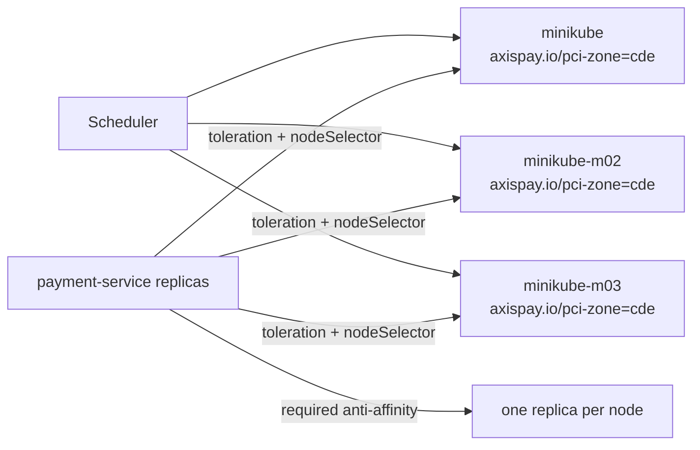

# L4.5 · Placement

This lab is about controlling where a workload runs.

In simple words: sometimes you want a pod to stay on certain nodes, avoid sharing a node with its siblings, or tolerate a special taint.

### What this concept means
Placement rules turn scheduling from "let Kubernetes choose anywhere" into "choose only nodes that meet these conditions." That matters for reliability, compliance, and capacity planning.

In this lab:
- `payment-service` gets **required** anti-affinity and spread constraints because it is on the payment path
- `fraud-service` gets **preferred** anti-affinity because it can scale more flexibly
- `payment-service` also gets a `nodeSelector` and matching `toleration` for the PCI/CDE node pool



Do this first:
What you should expect to see: you understand that these manifests patch existing Deployments rather than creating brand-new workloads.

1. Open `manifests/01-placement.yaml`.
2. Open `manifests/02-taints-tolerations.yaml`.
3. Notice the difference between:
   - pod anti-affinity
   - topology spread constraints
   - `nodeSelector`
   - `tolerations`

Why this matters:
- a scheduling rule can make a pod safer or impossible to place
- hard rules (`required`) and soft rules (`preferred`) behave very differently under pressure
- taints are a node-side refusal; tolerations only remove that refusal

Then do this:
What you should expect to see: the existing Deployments are updated in place.

```bash
kubectl apply -f manifests/
```

Expected result:

```text
$ kubectl apply -f manifests/
deployment.apps/payment-service configured
deployment.apps/fraud-service configured
deployment.apps/payment-service configured
```

The duplicate `payment-service configured` line is normal here because both manifest files patch the same Deployment.

Then do this:
What you should expect to see: the node list shows the labels that make the PCI node pool eligible for `payment-service`.

```bash
kubectl get nodes --show-labels
```

Expected result:

```text
$ kubectl get nodes --show-labels
NAME           STATUS   ROLES           AGE   VERSION   LABELS
minikube       Ready    control-plane   1d3h  v1.34.0   axispay.io/pci-zone=cde,beta.kubernetes.io/arch=arm64,kubernetes.io/hostname=minikube,node-role.kubernetes.io/control-plane=
minikube-m02   Ready    <none>          1d3h  v1.34.0   axispay.io/pci-zone=cde,beta.kubernetes.io/arch=arm64,kubernetes.io/hostname=minikube-m02
minikube-m03   Ready    <none>          1d3h  v1.34.0   axispay.io/pci-zone=cde,beta.kubernetes.io/arch=arm64,kubernetes.io/hostname=minikube-m03
```

Then do this:
What you should expect to see: the `payment-service` replicas are spread one per node.

```bash
kubectl get pods -n axispay-core -l app.kubernetes.io/name=payment-service -o wide
```

Expected result:

```text
$ kubectl get pods -n axispay-core -l app.kubernetes.io/name=payment-service -o wide
NAME                               READY   STATUS    RESTARTS   AGE   IP            NODE           NOMINATED NODE   READINESS GATES
payment-service-5b98d9d74d-2c6hv   1/1     Running   0          8m    10.244.0.32   minikube       <none>           <none>
payment-service-5b98d9d74d-kr8q2   1/1     Running   0          8m    10.244.1.27   minikube-m02   <none>           <none>
payment-service-5b98d9d74d-wm8xj   1/1     Running   0          8m    10.244.2.30   minikube-m03   <none>           <none>
```

That output is the practical meaning of the anti-affinity rule: one payment replica per hostname.

Then do this:
What you should expect to see: a fourth replica cannot be scheduled because there are only three eligible hostnames and the anti-affinity rule is hard.

```bash
kubectl scale deploy/payment-service -n axispay-core --replicas=4
kubectl get pods -n axispay-core -l app.kubernetes.io/name=payment-service -o wide
```

Expected result:

```text
$ kubectl scale deploy/payment-service -n axispay-core --replicas=4
deployment.apps/payment-service scaled

$ kubectl get pods -n axispay-core -l app.kubernetes.io/name=payment-service -o wide
NAME                               READY   STATUS    RESTARTS   AGE   IP            NODE           NOMINATED NODE   READINESS GATES
payment-service-5b98d9d74d-2c6hv   1/1     Running   0          9m    10.244.0.32   minikube       <none>           <none>
payment-service-5b98d9d74d-kr8q2   1/1     Running   0          9m    10.244.1.27   minikube-m02   <none>           <none>
payment-service-5b98d9d74d-wm8xj   1/1     Running   0          9m    10.244.2.30   minikube-m03   <none>           <none>
payment-service-5b98d9d74d-z6h9b   0/1     Pending   0          14s   <none>        <none>         <none>           <none>
```

Then do this:
What you should expect to see: `kubectl describe` tells you exactly why the pending pod cannot land anywhere.

```bash
kubectl describe pod payment-service-5b98d9d74d-z6h9b -n axispay-core
```

Expected result:

```text
$ kubectl describe pod payment-service-5b98d9d74d-z6h9b -n axispay-core
Name:             payment-service-5b98d9d74d-z6h9b
Namespace:        axispay-core
Priority:         0
Node:             <none>
Labels:           app.kubernetes.io/instance=axispay
                  app.kubernetes.io/name=payment-service
Status:           Pending
IP:
IPs:              <none>
Controlled By:    ReplicaSet/payment-service-5b98d9d74d
Tolerations:      axispay.io/pci-zone=cde:NoSchedule op=Equal
                  node.kubernetes.io/not-ready:NoExecute op=Exists for 300s
                  node.kubernetes.io/unreachable:NoExecute op=Exists for 300s
Events:
  Type     Reason            Age    From               Message
  ----     ------            ----   ----               -------
  Warning  FailedScheduling  13s    default-scheduler  0/3 nodes are available: 3 node(s) didn't match pod anti-affinity rules. preemption: 0/3 nodes are available: 3 Preemption is not helpful for scheduling.
```

This is an **expected** failure. The rule is working exactly as written.

Common failure or mistake:

```text
$ kubectl get pods -n axispay-core -l app.kubernetes.io/name=payment-service -o wide
NAME                               READY   STATUS    RESTARTS   AGE   IP       NODE     NOMINATED NODE   READINESS GATES
payment-service-5b98d9d74d-2c6hv   0/1     Pending   0          38s   <none>   <none>   <none>           <none>
payment-service-5b98d9d74d-kr8q2   0/1     Pending   0          38s   <none>   <none>   <none>           <none>
payment-service-5b98d9d74d-wm8xj   0/1     Pending   0          38s   <none>   <none>   <none>           <none>
```

Why it happens and how to fix it: the `nodeSelector` points at `axispay.io/pci-zone=cde`, but no nodes have that label. Add or correct the node labels, then wait for the scheduler to place the pods.

Why this matters:
- `required` anti-affinity is a hard availability guarantee, but it also caps scale at the number of eligible nodes
- `preferred` anti-affinity is softer and often better for bursty workloads such as `fraud-service`
- scheduler output becomes easy to read once you know whether the rule is about nodes, other pods, or taints

## Cheat Sheet / Tips & Tricks

Quick commands:
- `kubectl get nodes --show-labels` — confirm which nodes actually have `axispay.io/pci-zone=cde`.
- `kubectl get pods -n axispay-core -l app.kubernetes.io/name=payment-service -o wide` — see whether payment replicas are spread across nodes.
- `kubectl describe pod <pending-payment-pod> -n axispay-core` — read the scheduler Events when a hard rule prevents placement.
- `kubectl describe node minikube-m02` — inspect labels, taints, and capacity on one candidate node.
- `kubectl scale deploy/payment-service -n axispay-core --replicas=4` — force a scheduling test and see the hard anti-affinity rule in action.

Tips & tricks:
- `required` rules are hard gates; `preferred` rules are hints. That is the difference between `Pending` and “best effort”.
- A `nodeSelector` typo usually leaves pods Pending until you read the pod Events carefully.
- A toleration does not attract a pod to a node; it only says “this taint is not a blocker for me”.
- Anti-affinity and spread rules can improve resilience, but they also cap scale at the number of eligible nodes.

Check your work:
What you should expect to see: the validator confirms the hard payment spread and the softer fraud-service rule.

```bash
make validate-lab LAB=L4.5
```

Expected result:

```text
$ make validate-lab LAB=L4.5

L4.5 — Placement
----------------------------------------------------------------
  ✓ payment-service has REQUIRED anti-affinity
  ✓ payment-service has topologySpreadConstraints
  ✓ fraud-service uses PREFERRED (its HPA scales past the node count)

Replicas are actually on distinct nodes
----------------------------------------------------------------
  ✓ 3 payment-service replicas on 3 distinct nodes

✓ L4.5 PASSED — 4/4 checks
```
