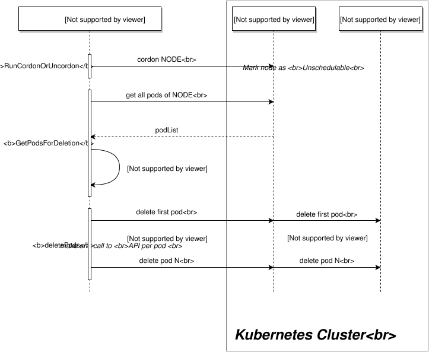

# L4.6 · PDB and drain

This lab is about protecting a workload while maintenance happens.

In simple words: you do not want to take too many pods away at once.

### What this concept means
A PodDisruptionBudget (PDB) is a maintenance safety rule. It tells Kubernetes how many pods from a workload may be voluntarily disrupted at one time during actions such as `kubectl drain`.

A PDB does **not** protect you from every outage. It protects you from voluntary eviction. That still matters a lot, because node upgrades, patches, and planned maintenance are normal platform operations.


Diagram source: Kubernetes documentation (CC BY 4.0).

Do this first:
What you should expect to see: you know which workloads get a PDB and how much disruption each one allows.

1. Open `manifests/01-pdb.yaml`.
2. Notice that most front-door and payment-path services use `maxUnavailable: 1`.
3. Notice that `postgres` uses `minAvailable: 0` because this single-instance training database may be drained during maintenance.

Why this matters:
- a drain is safe only if the replacement behavior and disruption rules agree
- a budget that is too strict can block maintenance forever
- a budget that is too loose can allow avoidable downtime

Then do this:
What you should expect to see: the six PDB objects are created or updated.

```bash
kubectl apply -f manifests/
```

Expected result:

```text
$ kubectl apply -f manifests/
poddisruptionbudget.policy/payment-service created
poddisruptionbudget.policy/edge-gateway created
poddisruptionbudget.policy/auth-service created
poddisruptionbudget.policy/merchant-service created
poddisruptionbudget.policy/fraud-service created
poddisruptionbudget.policy/postgres created
```

Then do this:
What you should expect to see: `ALLOWED DISRUPTIONS` is non-zero for the workloads that still need to permit a drain.

```bash
kubectl get pdb -A
```

Expected result:

```text
$ kubectl get pdb -A
NAMESPACE      NAME              MIN AVAILABLE   MAX UNAVAILABLE   ALLOWED DISRUPTIONS   AGE
axispay-core   fraud-service     N/A             1                 1                     18s
axispay-core   merchant-service  N/A             1                 1                     18s
axispay-core   payment-service   N/A             1                 1                     18s
axispay-data   postgres          0               N/A               1                     18s
axispay-edge   auth-service      N/A             1                 1                     18s
axispay-edge   edge-gateway      N/A             1                 1                     18s
```

This is the most important column on this screen. If it says `0`, the next eviction for that workload will be blocked.

Then do this:
What you should expect to see: `kubectl describe` shows the selector and the disruption budget status in one place.

```bash
kubectl describe pdb payment-service -n axispay-core
```

Expected result:

```text
$ kubectl describe pdb payment-service -n axispay-core
Name:                           payment-service
Namespace:                      axispay-core
Min available:                  N/A
Max unavailable:                1
Selector:                       app.kubernetes.io/instance=axispay,app.kubernetes.io/name=payment-service
Status:
    Allowed disruptions:        1
    Current:                    3
    Desired:                    2
    Total:                      3
Events:                         <none>
```

That output means: with three healthy replicas, Kubernetes is willing to let one go unavailable during a voluntary disruption.

Then do this:
What you should expect to see: the node is cordoned, the allowed pods are evicted, and the drain completes without violating the budgets.

```bash
kubectl drain minikube-m02 --ignore-daemonsets --delete-emptydir-data
```

Expected result:

```text
$ kubectl drain minikube-m02 --ignore-daemonsets --delete-emptydir-data
node/minikube-m02 cordoned
Warning: ignoring DaemonSet-managed Pods: axispay-ops/node-agent-6jtpn, kube-system/calico-node-sq5wh, kube-system/kube-proxy-8l9k4
evicting pod axispay-core/payment-service-5b98d9d74d-kr8q2
evicting pod axispay-core/fraud-service-7c689b664d-ngn4t
evicting pod axispay-async/reporting-service-5f8b8fb4cb-hg2t4
pod/payment-service-5b98d9d74d-kr8q2 evicted
pod/fraud-service-7c689b664d-ngn4t evicted
pod/reporting-service-5f8b8fb4cb-hg2t4 evicted
node/minikube-m02 drained
```

Then do this:
What you should expect to see: the payment path still has enough healthy replicas, even though one replica may be temporarily Pending while the node stays cordoned.

```bash
kubectl get pods -n axispay-core -l app.kubernetes.io/name=payment-service -o wide
```

Expected result:

```text
$ kubectl get pods -n axispay-core -l app.kubernetes.io/name=payment-service -o wide
NAME                               READY   STATUS    RESTARTS   AGE   IP            NODE           NOMINATED NODE   READINESS GATES
payment-service-5b98d9d74d-2c6hv   1/1     Running   0          28m   10.244.0.32   minikube       <none>           <none>
payment-service-5b98d9d74d-wm8xj   1/1     Running   0          28m   10.244.2.30   minikube-m03   <none>           <none>
payment-service-5b98d9d74d-xlg7n   0/1     Pending   0          41s   <none>        <none>         <none>           <none>
```

That temporary `Pending` replica is not automatically a bug. With one node cordoned and hard anti-affinity still in place, Kubernetes may have no legal place for the replacement until the node returns.

Then do this:
What you should expect to see: the node is schedulable again when maintenance is finished.

```bash
kubectl uncordon minikube-m02
```

Expected result:

```text
$ kubectl uncordon minikube-m02
node/minikube-m02 uncordoned
```

Common failure or mistake:

```text
$ kubectl drain minikube-m02 --ignore-daemonsets --delete-emptydir-data
node/minikube-m02 already cordoned
Warning: ignoring DaemonSet-managed Pods: axispay-ops/node-agent-6jtpn, kube-system/calico-node-sq5wh, kube-system/kube-proxy-8l9k4
error when evicting pods/edge-gateway-6f9cfb47b9-xn9cm -n axispay-edge (will retry after 5s): Cannot evict pod as it would violate the pod's disruption budget.
```

Why it happens and how to fix it: `ALLOWED DISRUPTIONS` is zero for that workload. Usually that means too few healthy replicas, a budget that is too strict, or a replacement pod that is not becoming Ready. Check the PDB status first, then the workload health.

Why this matters:
- safe maintenance depends on more than one YAML field
- a PDB that never allows disruption turns every patch window into an emergency
- this is where scheduling rules from L4.5 and disruption rules from L4.6 meet each other

## Cheat Sheet / Tips & Tricks

Quick commands:
- `kubectl get pdb -A` — check `ALLOWED DISRUPTIONS` before you start maintenance.
- `kubectl describe pdb payment-service -n axispay-core` — see selector, current healthy pods, desired healthy pods, and allowed evictions.
- `kubectl drain minikube-m02 --ignore-daemonsets --delete-emptydir-data` — perform a controlled node drain that respects PDBs.
- `kubectl get pods -n axispay-core -l app.kubernetes.io/name=payment-service -o wide` — watch whether replacement replicas stay healthy during the drain.
- `kubectl uncordon minikube-m02` — return the node to service when maintenance is over.

Tips & tricks:
- `kubectl drain` respects PodDisruptionBudgets, so it can pause or hang if `ALLOWED DISRUPTIONS` is `0`.
- A PDB protects only voluntary disruptions such as eviction; it does not stop crashes or node failures.
- A node stays unschedulable after a drain until you uncordon it, so do not forget the cleanup step.
- Even with a valid PDB, replacement pods can stay Pending if placement rules from L4.5 leave nowhere legal to run.

Check your work:
What you should expect to see: the validator confirms that the PDBs exist, still permit maintenance, and that no node is left cordoned.

```bash
make validate-lab LAB=L4.6
```

Expected result:

```text
$ make validate-lab LAB=L4.6

L4.6 — PodDisruptionBudgets
----------------------------------------------------------------
  ✓ PDB axispay-core/payment-service  (allowed disruptions: 1)
  ✓ PDB axispay-core/merchant-service  (allowed disruptions: 1)
  ✓ PDB axispay-core/fraud-service  (allowed disruptions: 1)
  ✓ PDB axispay-edge/edge-gateway  (allowed disruptions: 1)
  ✓ PDB axispay-edge/auth-service  (allowed disruptions: 1)
  ✓ PDB axispay-data/postgres  (allowed disruptions: 1)

Budgets must not BLOCK maintenance
----------------------------------------------------------------
  ✓ every PDB still permits a drain

No node left cordoned
----------------------------------------------------------------
  ✓ all nodes schedulable

✓ L4.6 PASSED — 8/8 checks
```
