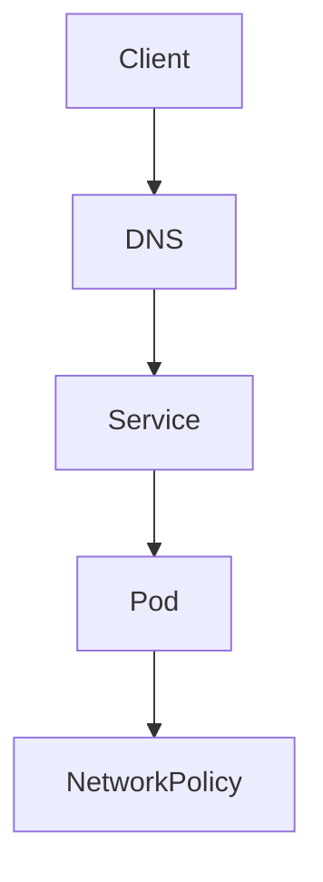

# Day 4 labs

These labs should be done in order.

What each lab teaches:
- L4.1 Service types: choose the right Service for the job
- L4.2 DNS: make services discover each other by name
- L4.3 Ingress and TLS: expose apps to the outside world safely
- L4.4 NetworkPolicy: allow only the traffic you want
- L4.5 Placement: keep workloads on the right nodes
- L4.6 PDB and drain: protect apps during maintenance
- INC-4: practice the day’s ideas together

How to work through a lab:
1. Read the lab README.
2. Review the manifest in `manifests/`.
3. Apply the YAML.
4. Check the result.
5. Run the validation command.

What success looks like:
- You can explain the purpose of the lab.
- You can run the commands and see the expected objects or outputs.
- The validation command passes.

### What this day is really teaching
Day 4 turns networking from an abstract idea into something you can see and test. You learn how names are resolved, how traffic enters the cluster, and how policies decide what is allowed.

The key lesson is that a service can be running and still be unreachable for the wrong reason. Routing, DNS, policy, and placement all affect whether the platform behaves correctly.

