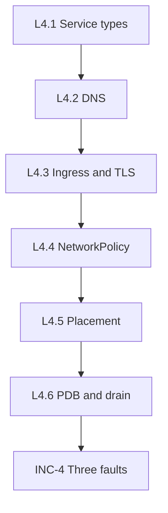

# Day 4 labs

These labs are meant to be done in order. Each one adds another part of the traffic path.

## How the labs fit together

Day 4 starts with the simplest question—"how do I reach a pod reliably?"—and ends with the operational question—"how do I maintain nodes without breaking payment traffic?"

## What each lab teaches

| Lab | Focus | Concrete skill you should practice |
|---|---|---|
| L4.1 Service types | Stable access to workloads | Read a Service manifest and predict how clients will reach it |
| L4.2 DNS | Name-based discovery | Resolve a Service name from inside the cluster and interpret the result |
| L4.3 Ingress and TLS | Safe external exposure | Prove that a hostname, path rule, and TLS secret line up |
| L4.4 NetworkPolicy | Zero-trust traffic rules | Prove why one path is allowed and another is blocked |
| L4.5 Placement | Scheduler decisions | Read node labels and pod rules and explain why a pod landed where it did |
| L4.6 PDB and drain | Safe maintenance | Drain a node and explain whether the workload still has enough healthy replicas |
| INC-4 | Incident practice | Debug multiple unrelated faults without deleting valid security controls |

## How to work through a lab

1. Read the lab README slowly before applying anything.
2. Review the manifest in `manifests/` so the object names and namespaces are familiar.
3. Apply the YAML.
4. Check the result with `kubectl get`, `kubectl describe`, `kubectl exec`, `curl`, `nslookup`, or `dig`.
5. Run the validation command.
6. If the output is wrong, compare the live object with the manifest rather than guessing.

## Small habits that make Day 4 easier

- Always note the **namespace** first. A correct name in the wrong namespace is still wrong.
- When traffic fails, check the layers in order: **DNS -> Ingress -> Service -> endpoints -> pod -> policy**.
- When the output says `<none>` or `Pending`, that is usually the clue, not noise.
- Keep the failure mode in mind: **404** means routing, **503** often means no ready backend, **timeout** often means policy or unreachable path, **NXDOMAIN** means naming.

## Useful validation commands

- `make validate-lab LAB=L4.1`
- `make validate-lab LAB=L4.3`
- `make validate-lab LAB=L4.4`
- `make validate-day4`

## Cheat Sheet / Tips & Tricks

Quick commands:
- `cd days/day4/labs/L4.3-ingress-tls` — jump straight into the lab you are working on so the README and `manifests/` folder stay side by side.
- `kubectl diff -f manifests/` — preview what a lab will change before you apply it.
- `kubectl apply -f manifests/ && make validate-lab LAB=L4.3` — the fastest repeatable lab loop after you have read the manifest.
- `kubectl get all -n axispay-edge` — do a quick namespace health check when a lab touches the edge tier.
- `kubectl run net-debug --rm -it --image=busybox:1.36 --restart=Never -- sh` — start a temporary in-cluster debug pod for `nslookup`, `wget`, and basic connectivity tests.
- `kubectl exec -n axispay-edge deploy/edge-gateway -- python3 -c "import socket; socket.getaddrinfo('payment-service.axispay-core.svc.cluster.local',8080); print('RESOLVED')"` — test DNS and the caller view from a real application pod.

Tips & tricks:
- Read the README first, then inspect `manifests/`, then apply, then validate. That order makes the kubectl output much easier to interpret.
- If a networking check fails, test from inside the cluster before blaming your laptop DNS, `/etc/hosts`, or browser cache.
- In a BusyBox debug pod, `nslookup <service>.<namespace>.svc.cluster.local` checks naming and `wget -S -O- http://<service>:8080` checks HTTP reachability.
- Use `kubectl get events -A --sort-by=.lastTimestamp | tail -n 20` when something looks stuck or mysteriously Pending.

## What success looks like

- You can run each lab without treating `kubectl` output as mysterious text.
- You can explain why the output looks the way it does.
- You can fix the smallest broken layer instead of changing five things at once.
- The per-lab validator and the end-of-day validator both pass.
