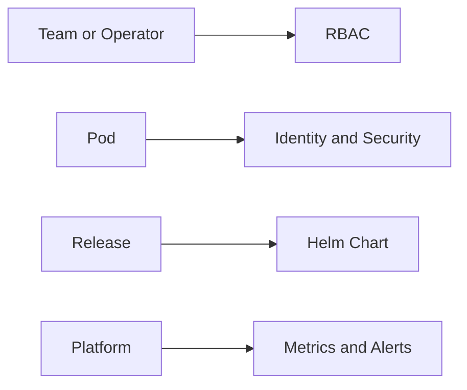

# Security, packaging and operations

This day is about running the platform in a safer and simpler way.

You will learn how to:
- give pods an identity
- control access with RBAC
- package resources with Helm
- move a release through environments
- watch the platform with metrics and dashboards
- use logs and alerts to find problems quickly

### What this day is really teaching
Day 5 is about operating the platform in a safe and repeatable way. It teaches you how to give pods the right identity, control who can act in the cluster, package resources so they are easy to install, and watch the platform with metrics and alerts.

This day is where Kubernetes stops being only about deployment and becomes about governance, reliability, and operations. It is a big step from "make it run" to "make it run well and safely".

How to use this folder:
1. Read the lab README before you start.
2. Apply the manifest or chart.
3. Check the result with `kubectl` or `helm`.
4. Run the validation command.
5. Continue to the next lab.

Use these commands when you are ready:
- `make validate-lab LAB=L5.1`
- `make validate-day5`

What success looks like:
- You understand the main idea of the day.
- You can explain what each lab is trying to teach.
- The validation command for the day passes.