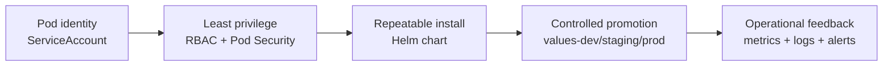

# Security, packaging and operations

Day 5 is where the course shifts from **"the app runs"** to **"the app runs safely, predictably, and observably"**.

By the end of the day you should be able to explain, with real Kubernetes objects and real commands:

- how a pod gets an identity with a `ServiceAccount`
- how Pod Security Admission rejects workloads that are too risky
- how RBAC proves who can and cannot do something
- how Helm turns many resources into one repeatable release
- how one chart is promoted through dev, staging, and production values
- how metrics, dashboards, logs, and alerts help an operator find problems fast

## What this day is really teaching

For a Java developer, Day 5 is the point where Kubernetes stops looking like "just YAML".

You start seeing the platform as four connected concerns:

1. **Identity and access** — which workload or person is acting?
2. **Packaging and release** — how do we install and upgrade safely?
3. **Promotion** — how do we move the same thing between environments without surprises?
4. **Operations** — how do we know the system is healthy, degraded, or broken?



## Day 5 at a glance

| Lab | Theme | You will work with | Main success signal |
|---|---|---|---|
| **L5.1** | Identity and pod security | `ServiceAccount`, namespace labels, admission rejection | risky pod is **forbidden** before it runs |
| **L5.2** | RBAC | `Role`, `ClusterRole`, `RoleBinding`, `kubectl auth can-i` | you can prove **yes** and **no** answers |
| **L5.3** | Helm packaging | `Chart.yaml`, `values.yaml`, templates, `helm install` | one release creates the whole platform |
| **L5.4** | Promotion | `values-dev.yaml`, `values-staging.yaml`, `values-prod.yaml` | environments differ in **numbers**, not in **shape** |
| **L5.5** | Metrics and dashboards | `ServiceMonitor`, `PrometheusRule`, `kubectl top`, HPA | you can see both platform and business signals |
| **L5.6** | Logs and alerts | structured JSON logs, Loki/Alloy, Alertmanager routing | an event can be traced from log line to routed alert |

## Before you start Day 5

What you should expect to see: the platform from earlier days is already running, and Day 5 builds operational controls around it.

- The AxisPay workloads should already exist in the cluster.
- For **L5.5** and **L5.6**, the observability stack should be installed first.
- The main Helm chart used in L5.3 and L5.4 lives at `platform/charts/axispay/`.

Useful commands before the first lab:

```bash
kubectl get ns
kubectl get pods -A -l app.kubernetes.io/part-of=axispay
helm version
```

Expected result:

```text
$ kubectl get ns
NAME                    STATUS   AGE
axispay-async           Active   18h
axispay-core            Active   18h
axispay-data            Active   18h
axispay-edge            Active   18h
axispay-observability   Active   34m
axispay-ops             Active   18h
default                 Active   18h
kube-node-lease         Active   18h
kube-public             Active   18h
kube-system             Active   18h

$ kubectl get pods -A -l app.kubernetes.io/part-of=axispay
NAMESPACE               NAME                                   READY   STATUS    RESTARTS   AGE
axispay-edge            edge-gateway-7d9fcb88fb-8w7kt         1/1     Running   0          31m
axispay-edge            auth-service-7cc8d4c4bd-9h7vg         1/1     Running   0          31m
axispay-core            payment-service-6f869d7b7c-7s9lm      1/1     Running   0          31m
axispay-core            fraud-service-5bf4cc84f8-vg2m2        1/1     Running   0          31m
axispay-async           reporting-service-77b45f665c-l8x6h    1/1     Running   0          31m
axispay-observability   alert-sink-5f5449bc6b-r4wzk           1/1     Running   0          29m
axispay-ops             node-agent-r9t8d                      1/1     Running   0          31m

$ helm version
version.BuildInfo{Version:"v3.17.3", GitCommit:"f6f4b1239e2f3f2a3d89d8e8d4a0d1d6ec1b0a92", GitTreeState:"clean", GoVersion:"go1.23.7"}
```

If `kubectl get pods -A -l app.kubernetes.io/part-of=axispay` returns nothing, finish the earlier deployment steps first. Day 5 assumes there is already something real to secure, package, and observe.

## How to use this folder

1. Start with `days/day5/labs/README.md`.
2. Do the labs in order.
3. Read the README in each lab folder before running commands.
4. Compare your terminal output with the expected transcripts in the lab.
5. Run the validation command for that lab before moving on.

Validation commands you will use repeatedly:

```bash
make validate-lab LAB=L5.1
make validate-lab LAB=L5.3
make validate-day5
```

Expected result:

```text
$ make validate-lab LAB=L5.1
[INFO] checking ServiceAccounts, token mounting and Pod Security labels
[PASS] every AxisPay pod has its own ServiceAccount
[PASS] no API token mounted except node-agent
[PASS] a privileged pod is refused at admission
[PASS] validation complete for L5.1

$ make validate-lab LAB=L5.3
[INFO] checking Helm chart structure and installed release
[PASS] chart validation succeeds
[PASS] release axispay is deployed
[PASS] selectors are immutable-safe
[PASS] validation complete for L5.3

$ make validate-day5
== Day 5 checkpoint ==
[PASS] security controls present
[PASS] Helm release healthy
[PASS] promotion values consistent
[PASS] observability objects loaded
[PASS] logs and alert routing healthy
Day 5 validation passed
```

## Cheat Sheet / Tips & Tricks

Quick commands:
- `kubectl get serviceaccount -A` — quickly see workload identities across namespaces.
- `kubectl auth can-i get secrets -n axispay-core --as=auditor@axis.example` — prove an allow/deny decision without doing the action.
- `kubectl get namespace axispay-core axispay-edge axispay-async --show-labels` — confirm Pod Security labels before debugging a forbidden pod.
- `helm lint platform/charts/axispay -f platform/charts/axispay/values.yaml` — catch chart problems before cluster install.
- `helm template axispay platform/charts/axispay -f platform/charts/axispay/values-staging.yaml | head -40` — preview the real YAML Helm will send.
- `helm upgrade --install axispay platform/charts/axispay -f platform/charts/axispay/values-staging.yaml -n axispay-core --wait --timeout 10m` — safe default for repeatable installs and upgrades.
- `helm diff upgrade axispay platform/charts/axispay -f platform/charts/axispay/values-prod.yaml` — see what promotion changes before rollout.
- `kubectl rollout status deployment/payment-service -n axispay-core` — wait for a deployment to finish changing.
- `kubectl rollout undo deployment/payment-service -n axispay-core --to-revision=<n>` — back out a bad rollout when history exists.
- `kubectl top pods -n axispay-core` — check live CPU and memory pressure.
- `kubectl get servicemonitor -A -L release` — verify Prometheus discovery labels.
- `kubectl logs -n axispay-core deploy/payment-service -f --since=10m` — stream only recent app logs during an incident.

Tips & tricks:
- `kubectl auth can-i` is the fastest way to debug “why can’t this user or service account do X?”
- Pod Security failures happen at create time; read the full `Forbidden` message because it usually names the exact missing fields.
- `helm template` is your friend when Helm feels magical; it turns the chart back into normal YAML.
- `helm upgrade --install` is easier to automate than separate install and upgrade branches.
- `kubectl rollout history` and `kubectl rollout undo` only help if old ReplicaSets were kept; `revisionHistoryLimit` matters.
- `kubectl top` needs `metrics-server`; if it fails, fix the metrics pipeline before trusting HPA behavior.
- A missing `release` label on a `ServiceMonitor` often means the target is absent from Prometheus, not merely unhealthy.
- `kubectl logs --previous` only works after a container actually restarted and old logs still exist.
- Start with `kubectl describe` when something is stuck; events often show the reason faster than scanning YAML.

## What success looks like

By the end of Day 5, you should be able to say all of these out loud and prove them with commands:

- **This pod has this identity.**
- **This user can do this, but not that.**
- **This release came from this chart and these values.**
- **Staging and production are the same shape.**
- **This alert came from these metrics.**
- **This incident can be traced through logs.**
