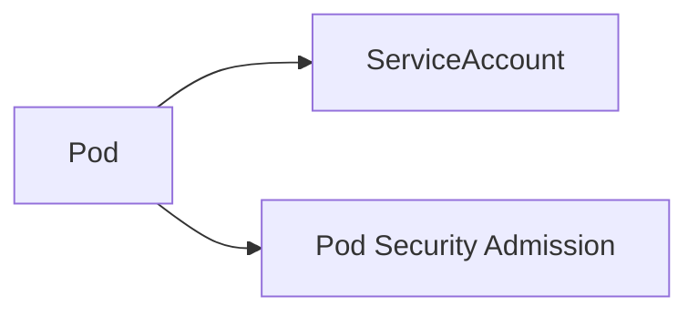

# L5.1 · Identity and pod security

This lab is about giving a pod an identity and limiting what it can do.

In simple words: a pod should not have more power than it needs.

### What this concept means
A pod can have an identity through a ServiceAccount, but that identity should be limited. The pod should not automatically receive more power than it needs, and the cluster should reject workloads that try to run too aggressively.

This is why ServiceAccounts and Pod Security Admission are often discussed together. One answers "who is this pod?" and the other answers "is this pod allowed to run in this shape?" Both are important for a safe platform.




Do this first:
What you should expect to see: you understand the goal of the lab and the files involved.

1. Open `manifests/01-serviceaccounts.yaml`.
2. Open `manifests/01-pod-security.yaml`.
3. Notice that this lab is about identity and rules at the same time.

Why this matters:
- a pod can be a real identity in the cluster
- that identity can be abused if the pod is too permissive
- pod security rules help stop risky workloads

Then do this:
What you should expect to see: the command runs without errors and the result matches the explanation above.

```bash
kubectl apply -f manifests/
```

Expected result:
- The command finishes without errors.
- You should see messages such as `created` or `configured` for the resources.
- A follow-up `kubectl get` command should show the objects you created.
This applies the service account and pod security settings.

Then do this:
What you should expect to see: the command runs without errors and the result matches the explanation above.

```bash
kubectl get serviceaccount -n axispay-core
kubectl get namespace axispay-core --show-labels
```

Expected result:
- The output lists the resource names or details you expected to inspect.
- You should be able to see the object or the status you are checking.
This shows the identity object and the security labels.

Then do this:
What you should expect to see: the command runs without errors and the result matches the explanation above.

Think about why a pod should have an identity but not a broad set of permissions.

Why this matters:
- identity and permissions are related, but they are not the same thing
- a well-limited pod is safer than a powerful one

Check your work:
What you should expect to see: the validation command finishes successfully.
```bash
make validate-lab LAB=L5.1
```

Expected result:
- The validation command finishes successfully.
- You should see a passing message for the lab.
