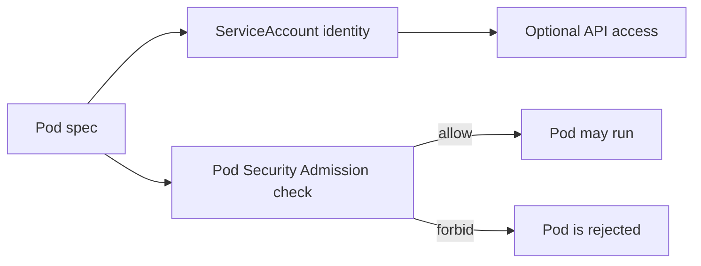

# L5.1 · Identity and pod security

This lab is about two linked questions:

1. **Who is this pod?** → `ServiceAccount`
2. **Is this pod allowed to run like this?** → Pod Security Admission

In simple words: a workload should have a clear identity, and the cluster should reject obviously risky pod shapes before they ever start.

## What this concept means

A `ServiceAccount` is the in-cluster identity for a workload. It is not the same thing as a permission grant, but it is the identity that permissions are later attached to.

Pod Security Admission is different. It checks the shape of the pod at admission time. If the namespace enforces the `restricted` standard, a privileged pod is rejected before the scheduler ever has a chance to place it.



## Do this first

What you should expect to see: you understand that this lab mixes identity objects, namespace policy labels, and a minimal RBAC setup for the special `node-agent` workload.

1. Open every file in `manifests/`.
2. Notice that the filenames are slightly quirky; read the contents, not just the names.
3. Find these real objects in the YAML:
   - `ServiceAccount/payment-service`
   - `ServiceAccount/node-agent`
   - namespace `pod-security.kubernetes.io/enforce` labels
   - `ClusterRole/axispay-node-reader`
   - `ClusterRoleBinding/axispay-node-agent`

Why this matters:

- a pod without a deliberate identity often ends up using the default one by accident
- a token mounted into a pod is a credential that can be stolen
- Pod Security Admission is valuable because it blocks a bad pod **before runtime**

## Then do this

What you should expect to see: the folder applies a mix of namespaces, service accounts, roles, and bindings that support the security checks later in the lab.

```bash
kubectl apply -f manifests/
```

Expected result:

```text
$ kubectl apply -f manifests/
serviceaccount/edge-gateway created
serviceaccount/auth-service created
serviceaccount/payment-service created
serviceaccount/axispay-core-workload created
serviceaccount/axispay-async-workload created
serviceaccount/node-agent created
namespace/axispay-core configured
namespace/axispay-edge configured
namespace/axispay-async configured
namespace/axispay-data unchanged
namespace/axispay-ops unchanged
namespace/axispay-observability configured
clusterrole.rbac.authorization.k8s.io/axispay-auditor created
role.rbac.authorization.k8s.io/axispay-deployer created
role.rbac.authorization.k8s.io/axispay-oncall created
clusterrole.rbac.authorization.k8s.io/axispay-prometheus created
clusterrole.rbac.authorization.k8s.io/axispay-node-reader created
rolebinding.rbac.authorization.k8s.io/axispay-auditor created
rolebinding.rbac.authorization.k8s.io/axispay-auditor created
rolebinding.rbac.authorization.k8s.io/axispay-auditor created
rolebinding.rbac.authorization.k8s.io/axispay-deployer created
rolebinding.rbac.authorization.k8s.io/axispay-oncall created
clusterrolebinding.rbac.authorization.k8s.io/axispay-prometheus created
clusterrolebinding.rbac.authorization.k8s.io/axispay-node-agent created
```

If you see mostly `configured` and `unchanged`, that is normal on a second run. `kubectl apply` is declarative, so reapplying should converge to the same state.

## Then do this

What you should expect to see: normal application workloads do **not** mount API tokens, but the `node-agent` account is the documented exception because it needs to read Nodes.

```bash
kubectl get serviceaccount -n axispay-core
kubectl get serviceaccount -n axispay-ops
kubectl get namespace axispay-core axispay-edge axispay-async axispay-observability --show-labels
```

Expected result:

```text
$ kubectl get serviceaccount -n axispay-core
NAME                    SECRETS   AGE
default                 0         18h
payment-service         0         14s
axispay-core-workload   0         14s

$ kubectl get serviceaccount -n axispay-ops
NAME         SECRETS   AGE
default      0         18h
node-agent   0         14s

$ kubectl get namespace axispay-core axispay-edge axispay-async axispay-observability --show-labels
NAME                    STATUS   AGE   LABELS
axispay-core            Active   18h   kubernetes.io/metadata.name=axispay-core,pod-security.kubernetes.io/audit=restricted,pod-security.kubernetes.io/enforce=restricted,pod-security.kubernetes.io/warn=restricted
axispay-edge            Active   18h   kubernetes.io/metadata.name=axispay-edge,pod-security.kubernetes.io/audit=restricted,pod-security.kubernetes.io/enforce=restricted,pod-security.kubernetes.io/warn=restricted
axispay-async           Active   18h   kubernetes.io/metadata.name=axispay-async,pod-security.kubernetes.io/audit=restricted,pod-security.kubernetes.io/enforce=restricted,pod-security.kubernetes.io/warn=restricted
axispay-observability   Active   34m   kubernetes.io/metadata.name=axispay-observability,pod-security.kubernetes.io/audit=privileged,pod-security.kubernetes.io/enforce=privileged,pod-security.kubernetes.io/warn=privileged
```

Read that last line carefully: the observability namespace is the explicit exception. Components like Alloy may need host access that the `restricted` profile would block.

## Then do this

What you should expect to see: the `node-agent` identity can read Nodes, but it cannot suddenly list pods or read secrets in the core namespace.

```bash
kubectl auth can-i list nodes --as=system:serviceaccount:axispay-ops:node-agent
kubectl auth can-i list pods -n axispay-core --as=system:serviceaccount:axispay-ops:node-agent
kubectl auth can-i get secrets -n axispay-core --as=system:serviceaccount:axispay-core:payment-service
```

Expected result:

```text
$ kubectl auth can-i list nodes --as=system:serviceaccount:axispay-ops:node-agent
yes

$ kubectl auth can-i list pods -n axispay-core --as=system:serviceaccount:axispay-ops:node-agent
no

$ kubectl auth can-i get secrets -n axispay-core --as=system:serviceaccount:axispay-core:payment-service
no
```

This is the point of the lab: identity exists, but identity does **not** automatically mean broad power.

## Then do this

What you should expect to see: a troubleshooting view that shows the cluster created the special `node-agent` identity in the place you expect.

```bash
kubectl describe serviceaccount node-agent -n axispay-ops
```

Expected result:

```text
$ kubectl describe serviceaccount node-agent -n axispay-ops
Name:                node-agent
Namespace:           axispay-ops
Labels:              <none>
Annotations:         <none>
Image pull secrets:  <none>
Mountable secrets:   <none>
Tokens:              <none>
Events:              <none>
```

Modern clusters usually project service account tokens into pods at runtime, so the ServiceAccount itself often shows `Tokens: <none>`. That is not a bug.

## Then do this

What you should expect to see: the API server rejects a privileged pod immediately because the namespace enforces the `restricted` standard.

```bash
kubectl run psa-probe --image=busybox:1.37 --restart=Never -n axispay-core --overrides='{"spec":{"containers":[{"name":"x","image":"busybox:1.37","securityContext":{"privileged":true}}]}}' -- sleep 5
```

Expected result:

```text
$ kubectl run psa-probe --image=busybox:1.37 --restart=Never -n axispay-core --overrides='{"spec":{"containers":[{"name":"x","image":"busybox:1.37","securityContext":{"privileged":true}}]}}' -- sleep 5
Error from server (Forbidden): pods "psa-probe" is forbidden: violates PodSecurity "restricted:latest":
  - privileged (container "x" must not set securityContext.privileged=true)
  - allowPrivilegeEscalation != false (container "x" must set securityContext.allowPrivilegeEscalation=false)
  - unrestricted capabilities (container "x" must set securityContext.capabilities.drop=["ALL"])
  - runAsNonRoot != true (pod or container "x" must set securityContext.runAsNonRoot=true)
  - seccompProfile (pod or container "x" must set securityContext.seccompProfile.type to "RuntimeDefault" or "Localhost")
```

That error is a **success** for this lab. The cluster is doing its job.

Common mistake:

```text
$ kubectl run psa-probe --image=busybox:1.37 --restart=Never -n some-dev-namespace --overrides='{"spec":{"containers":[{"name":"x","image":"busybox:1.37","securityContext":{"privileged":true}}]}}' -- sleep 5
Warning: would violate PodSecurity "restricted:latest": privileged=true, allowPrivilegeEscalation != false, unrestricted capabilities
pod/psa-probe created
```

Why this happens: that namespace is using `warn` only, not `enforce`.
Fix: test in `axispay-core`, `axispay-edge`, or `axispay-async`, where `pod-security.kubernetes.io/enforce=restricted` is present.

## Why this matters

- a default token in every pod is unnecessary attack surface
- a `ServiceAccount` should exist because you chose it, not because you forgot to set it
- admission control is strongest when it blocks a bad workload before it is scheduled
- exceptions should be rare, explicit, and documented, like `axispay-observability`

## Cheat Sheet / Tips & Tricks

Quick commands:
- `kubectl get serviceaccount payment-service -n axispay-core -o yaml` — confirm the app identity exists and does not auto-mount a token.
- `kubectl get serviceaccount node-agent -n axispay-ops -o yaml` — check the special case that is allowed to mount a token.
- `kubectl get namespace axispay-core axispay-edge axispay-async axispay-observability --show-labels` — verify which namespaces enforce `restricted` and which one is the documented exception.
- `kubectl auth can-i list nodes --as=system:serviceaccount:axispay-ops:node-agent` — prove the `node-agent` identity can read Nodes.
- `kubectl run psa-probe --image=busybox:1.37 --restart=Never -n axispay-core --overrides='{"spec":{"containers":[{"name":"x","image":"busybox:1.37","securityContext":{"privileged":true}}]}}' -- sleep 5` — trigger Pod Security Admission and read the exact rejection reason.

Tips & tricks:
- A `ServiceAccount` gives a pod an identity; RBAC is what turns that identity into actual permissions.
- `automountServiceAccountToken: false` reduces credential exposure, but the pod still has a ServiceAccount identity.
- Pod Security rejection happens before the pod runs, so the error from `kubectl run` is the main clue.
- `axispay-observability` is intentionally more privileged; do not copy that exception into app namespaces by habit.

## Check your work

What you should expect to see: the validator confirms identity, token-mounting, and Pod Security behavior.

```bash
make validate-lab LAB=L5.1
```

Expected result:

```text
$ make validate-lab LAB=L5.1
== L5.1 validation ==
[PASS] every AxisPay pod has its own ServiceAccount
[PASS] no API token mounted except node-agent
[PASS] node-agent mounts a token because it reads Nodes
[PASS] axispay-edge enforces restricted
[PASS] axispay-core enforces restricted
[PASS] axispay-async enforces restricted
[PASS] axispay-observability is privileged by design
[PASS] a privileged pod is refused at admission
L5.1 validation passed
```
