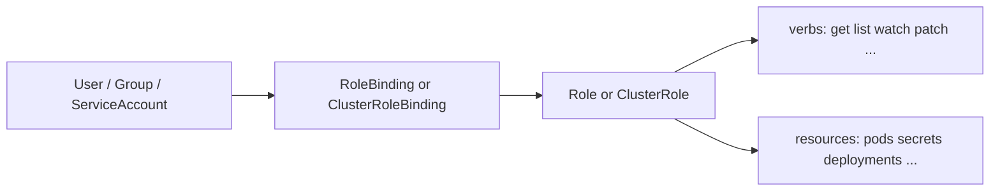

# L5.2 · RBAC

This lab is about proving access, not just declaring it.

In simple words: do not say "the auditor should only read things" unless you can show a real `yes` for what they need and a real `no` for what they must not have.

## What this concept means

RBAC is Kubernetes' authorization model. The important objects are:

- **Role / ClusterRole** — the permission rules
- **RoleBinding / ClusterRoleBinding** — the connection between a subject and those rules
- **Subjects** — users, groups, or service accounts



## Do this first

What you should expect to see: this lab creates three useful access patterns that are easy to explain.

1. An **auditor** who can inspect the platform, but not secrets and not mutation.
2. A **deployer** group that can update workloads in `axispay-core`, but cannot delete them and cannot touch the data tier.
3. A **node-agent** service account that can read Nodes and almost nothing else.

Open these files:

- `manifests/01-serviceaccounts.yaml`
- `manifests/02-roles.yaml`
- `manifests/03-bindings.yaml`

Why this matters:

- RBAC is about least privilege, not convenience
- you need proof for both the **allow** path and the **deny** path
- `kubectl auth can-i` is the fastest way to turn theory into evidence

## Then do this

What you should expect to see: the service accounts, roles, bindings, and cluster bindings are created without YAML errors.

```bash
kubectl apply -f manifests/
```

Expected result:

```text
$ kubectl apply -f manifests/
serviceaccount/edge-gateway unchanged
serviceaccount/auth-service unchanged
serviceaccount/payment-service unchanged
serviceaccount/axispay-core-workload unchanged
serviceaccount/axispay-async-workload unchanged
serviceaccount/node-agent unchanged
clusterrole.rbac.authorization.k8s.io/axispay-auditor created
role.rbac.authorization.k8s.io/axispay-deployer created
role.rbac.authorization.k8s.io/axispay-oncall created
clusterrole.rbac.authorization.k8s.io/axispay-prometheus created
clusterrole.rbac.authorization.k8s.io/axispay-node-reader created
rolebinding.rbac.authorization.k8s.io/axispay-auditor created
rolebinding.rbac.authorization.k8s.io/axispay-auditor created
rolebinding.rbac.authorization.k8s.io/axispay-auditor created
rolebinding.rbac.authorization.k8s.io/axispay-deployer created
rolebinding.rbac.authorization.k8s.io/axispay-oncall created
clusterrolebinding.rbac.authorization.k8s.io/axispay-prometheus created
clusterrolebinding.rbac.authorization.k8s.io/axispay-node-agent created
```

## Then do this

What you should expect to see: the main RBAC objects exist in the namespaces you expect.

```bash
kubectl get clusterrole axispay-auditor axispay-prometheus axispay-node-reader
kubectl get role,rolebinding -n axispay-core
kubectl get clusterrolebinding axispay-prometheus axispay-node-agent
```

Expected result:

```text
$ kubectl get clusterrole axispay-auditor axispay-prometheus axispay-node-reader
NAME                   CREATED AT
axispay-auditor        2026-08-18T19:56:41Z
axispay-prometheus     2026-08-18T19:56:41Z
axispay-node-reader    2026-08-18T19:56:41Z

$ kubectl get role,rolebinding -n axispay-core
NAME                                          CREATED AT
role.rbac.authorization.k8s.io/axispay-deployer   2026-08-18T19:56:41Z
role.rbac.authorization.k8s.io/axispay-oncall     2026-08-18T19:56:41Z

NAME                                                 ROLE                            AGE
rolebinding.rbac.authorization.k8s.io/axispay-auditor   ClusterRole/axispay-auditor   12s
rolebinding.rbac.authorization.k8s.io/axispay-deployer  Role/axispay-deployer         12s
rolebinding.rbac.authorization.k8s.io/axispay-oncall    Role/axispay-oncall           12s

$ kubectl get clusterrolebinding axispay-prometheus axispay-node-agent
NAME                 ROLE                                   AGE
axispay-prometheus   ClusterRole/axispay-prometheus        12s
axispay-node-agent   ClusterRole/axispay-node-reader       12s
```

## Then do this

What you should expect to see: the auditor can read what an auditor needs, but cannot read secrets or mutate workloads.

```bash
kubectl auth can-i get pods -n axispay-core --as=auditor@axis.example
kubectl auth can-i get deployments.apps -n axispay-core --as=auditor@axis.example
kubectl auth can-i get secrets -n axispay-core --as=auditor@axis.example
kubectl auth can-i create pods/exec -n axispay-core --as=auditor@axis.example
```

Expected result:

```text
$ kubectl auth can-i get pods -n axispay-core --as=auditor@axis.example
yes

$ kubectl auth can-i get deployments.apps -n axispay-core --as=auditor@axis.example
yes

$ kubectl auth can-i get secrets -n axispay-core --as=auditor@axis.example
no

$ kubectl auth can-i create pods/exec -n axispay-core --as=auditor@axis.example
no
```

That last `no` matters more than it first appears. `pods/exec` is often equivalent to "read every secret the app can already see".

## Then do this

What you should expect to see: the deployer group can patch and scale the app tier in `axispay-core`, but cannot delete workloads and cannot operate in the wrong namespace.

```bash
kubectl auth can-i update deployments -n axispay-core --as=engineer@axis.example --as-group=axispay-platform-team
kubectl auth can-i patch deployments/scale -n axispay-core --as=engineer@axis.example --as-group=axispay-platform-team
kubectl auth can-i delete deployments -n axispay-core --as=engineer@axis.example --as-group=axispay-platform-team
kubectl auth can-i update deployments -n axispay-data --as=engineer@axis.example --as-group=axispay-platform-team
```

Expected result:

```text
$ kubectl auth can-i update deployments -n axispay-core --as=engineer@axis.example --as-group=axispay-platform-team
yes

$ kubectl auth can-i patch deployments/scale -n axispay-core --as=engineer@axis.example --as-group=axispay-platform-team
yes

$ kubectl auth can-i delete deployments -n axispay-core --as=engineer@axis.example --as-group=axispay-platform-team
no

$ kubectl auth can-i update deployments -n axispay-data --as=engineer@axis.example --as-group=axispay-platform-team
no
```

This is good RBAC design: wide enough to do the job, narrow enough to limit blast radius.

## Then do this

What you should expect to see: `kubectl describe` makes the rules visible in a human-friendly table when you need to debug authorization quickly.

```bash
kubectl describe role axispay-oncall -n axispay-core
```

Expected result:

```text
$ kubectl describe role axispay-oncall -n axispay-core
Name:         axispay-oncall
Labels:       <none>
Annotations:  <none>
PolicyRule:
  Resources             Non-Resource URLs   Resource Names   Verbs
  ---------             -----------------   --------------   -----
  pods                  []                  []               [get list watch]
  services              []                  []               [get list watch]
  configmaps            []                  []               [get list watch]
  events                []                  []               [get list watch]
  endpoints             []                  []               [get list watch]
  pods/log              []                  []               [get list]
  pods/status           []                  []               [get list]
  pods/exec             []                  []               [create]
  pods/portforward      []                  []               [create]
  pods/eviction         []                  []               [create]
  deployments.apps      []                  []               [get list watch patch]
  statefulsets.apps     []                  []               [get list watch patch]
  replicasets.apps      []                  []               [get list watch patch]
```

## Common mistake to watch for

If you forget `--as`, you are testing **your own** identity, not the lab user.

```text
$ kubectl auth can-i get secrets -n axispay-core
yes
```

Why this happens: you are probably cluster-admin on your training cluster.
Fix: always include `--as=...` (and `--as-group=...` when the binding is to a group).

## Why this matters

- Kubernetes RBAC has no explicit `deny`, so careful scoping matters
- the proof of least privilege is a command result, not a sentence in a design doc
- service accounts need RBAC too; workloads are just users with YAML around them
- namespaces are part of the security boundary, not just an organization tool

## Cheat Sheet / Tips & Tricks

Quick commands:
- `kubectl auth can-i get pods -n axispay-core --as=auditor@axis.example` — test the happy path for the auditor role.
- `kubectl auth can-i get secrets -n axispay-core --as=auditor@axis.example` — verify the auditor is blocked from sensitive data.
- `kubectl auth can-i patch deployments/scale -n axispay-core --as=engineer@axis.example --as-group=axispay-platform-team` — prove the deployer group can scale workloads in the right namespace.
- `kubectl get rolebinding -n axispay-core -o wide` — see which subjects are bound to which roles in the core namespace.
- `kubectl describe role axispay-oncall -n axispay-core` — turn the YAML rules into a readable table while debugging access.

Tips & tricks:
- Always use `--as` and, when needed, `--as-group`; otherwise you are probably testing your own admin access.
- A `RoleBinding` is namespace-scoped, even when it points to a `ClusterRole`.
- Kubernetes RBAC has no explicit `deny`, so least privilege comes from leaving dangerous verbs and resources out.
- `pods/exec` is powerful; treat it as privileged access because it can expose app-visible secrets.

## Check your work

What you should expect to see: the validator confirms the allow and deny cases that matter most.

```bash
make validate-lab LAB=L5.2
```

Expected result:

```text
$ make validate-lab LAB=L5.2
== L5.2 validation ==
[PASS] ClusterRole axispay-auditor
[PASS] Role axispay-deployer in axispay-core
[PASS] auditor lists pods
[PASS] auditor reads deployments
[PASS] auditor reads pod logs
[PASS] auditor CANNOT read secrets
[PASS] auditor CANNOT exec
[PASS] deployer updates deployments
[PASS] deployer scales
[PASS] deployer CANNOT delete a workload
[PASS] node-agent lists nodes
[PASS] payment-service CANNOT read secrets
[PASS] simulate-rbac.py: all assertions hold
L5.2 validation passed
```
