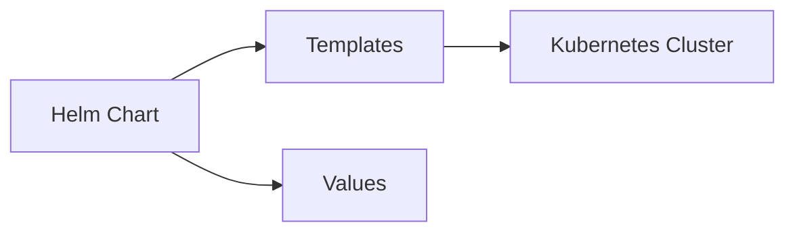

# L5.3 · Helm packaging

This lab is about packaging Kubernetes resources so they can be installed more easily.

In simple words: Helm lets you package many YAML files into one release.

### What this concept means
Helm packages Kubernetes resources into a reusable release. Instead of managing many YAML files by hand, you describe the resources in templates and values files, then let Helm turn them into real resources for the cluster.

This makes installation and upgrades more repeatable. It also makes it easier to keep the same application definition while swapping values for different environments.




Do this first:
What you should expect to see: you understand the goal of the lab and the files involved.

1. Open the chart folder in this lab.
2. List the files and folders inside it.
3. Notice that a chart contains templates and values.

Why this matters:
- installing many files one by one is slow and error-prone
- a chart makes installation repeatable
- the same chart can be used in different environments

Then do this:
What you should expect to see: the command runs without errors and the result matches the explanation above.

```bash
helm install <release-name> .
```

Expected result:
- Helm reports a successful install or upgrade.
- The release should appear in `helm list`.
This turns the chart templates into real Kubernetes resources.

Then do this:
What you should expect to see: the command runs without errors and the result matches the explanation above.

```bash
helm list
kubectl get all -n <namespace>
```

Expected result:
- The output lists the resource names or details you expected to inspect.
- You should be able to see the object or the status you are checking.
This shows that the release was created and the resources exist.

Then do this:
What you should expect to see: the command runs without errors and the result matches the explanation above.

Think about how much simpler this is than applying many YAML files by hand.

Why this matters:
- Helm is a packaging tool for Kubernetes
- it saves time and reduces mistakes

Check your work:
What you should expect to see: the validation command finishes successfully.
```bash
make validate-lab LAB=L5.3
```

Expected result:
- The validation command finishes successfully.
- You should see a passing message for the lab.
