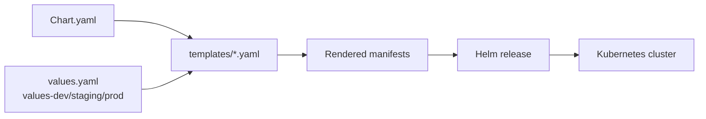

# L5.3 · Helm packaging

This lab is about turning many Kubernetes objects into one repeatable release.

In simple words: Helm lets you install the platform as **one chart** instead of managing dozens of YAML files by hand.

## What this concept means

The AxisPay chart lives at `platform/charts/axispay/`.

That chart packages:

- multiple `Deployment` objects
- `Service` objects for internal discovery
- `ServiceAccount` objects for workload identity
- `HorizontalPodAutoscaler`, `PodDisruptionBudget`, `Ingress`, `ServiceMonitor`, and `PrometheusRule` objects
- environment-specific overrides through values files



## Do this first

What you should expect to see: the chart is a real package, not just a random folder of YAML.

Open these files in `platform/charts/axispay/`:

- `Chart.yaml`
- `values.yaml`
- `values-dev.yaml`
- `values-staging.yaml`
- `values-prod.yaml`
- `templates/deployments.yaml`
- `templates/services.yaml`
- `templates/serviceaccounts.yaml`

Why this matters:

- the chart is where Kubernetes packaging becomes repeatable
- the templates keep cross-cutting settings consistent across many services
- the values files are what make promotion possible later in the day

## Then do this

What you should expect to see: Helm can lint the chart before it ever talks to the cluster.

```bash
helm lint platform/charts/axispay -f platform/charts/axispay/values.yaml
```

Expected result:

```text
$ helm lint platform/charts/axispay -f platform/charts/axispay/values.yaml
==> Linting platform/charts/axispay
[INFO] Chart.yaml: icon is recommended

1 chart(s) linted, 0 chart(s) failed
```

If lint fails, stop there. A packaging error caught offline is much cheaper than a broken install.

Common failure:

```text
$ helm lint platform/charts/axispay -f platform/charts/axispay/values.yaml
==> Linting platform/charts/axispay
[ERROR] templates/deployments.yaml: unable to parse YAML: error converting YAML to JSON: yaml: line 87: mapping values are not allowed in this context

Error: 1 chart(s) linted, 1 chart(s) failed
```

Why this happens: most often a bad indent or a stray `:` in a template block.
Fix: go to the line Helm reports, fix the template syntax, then lint again before installing.

## Then do this

What you should expect to see: `helm template` renders plain Kubernetes YAML, which is the fastest way to understand what Helm will really apply.

```bash
helm template axispay platform/charts/axispay -f platform/charts/axispay/values.yaml | head -40
```

Expected result:

```text
$ helm template axispay platform/charts/axispay -f platform/charts/axispay/values.yaml | head -40
---
# Source: axispay/templates/serviceaccounts.yaml
apiVersion: v1
kind: ServiceAccount
metadata:
  name: edge-gateway
  namespace: axispay-edge
  labels:
    app.kubernetes.io/name: axispay
    app.kubernetes.io/instance: axispay
    app.kubernetes.io/part-of: axispay
automountServiceAccountToken: false
---
# Source: axispay/templates/serviceaccounts.yaml
apiVersion: v1
kind: ServiceAccount
metadata:
  name: auth-service
  namespace: axispay-edge
  labels:
    app.kubernetes.io/name: axispay
    app.kubernetes.io/instance: axispay
    app.kubernetes.io/part-of: axispay
automountServiceAccountToken: false
---
# Source: axispay/templates/serviceaccounts.yaml
apiVersion: v1
kind: ServiceAccount
metadata:
  name: payment-service
  namespace: axispay-core
  labels:
    app.kubernetes.io/name: axispay
    app.kubernetes.io/instance: axispay
    app.kubernetes.io/part-of: axispay
```

This is an important Day 5 skill: when templating feels abstract, render the chart and read the real YAML.

## Then do this

What you should expect to see: Helm installs or upgrades the whole AxisPay platform as one release.

```bash
helm upgrade --install axispay platform/charts/axispay -f platform/charts/axispay/values.yaml -n axispay-core --create-namespace --wait --timeout 10m
```

Expected result:

```text
$ helm upgrade --install axispay platform/charts/axispay -f platform/charts/axispay/values.yaml -n axispay-core --create-namespace --wait --timeout 10m
Release "axispay" does not exist. Installing it now.
NAME: axispay
LAST DEPLOYED: Tue Aug 18 20:18:44 2026
NAMESPACE: axispay-core
STATUS: deployed
REVISION: 1
TEST SUITE: None
NOTES:
axispay 1.0.0 — release axispay
Environment: training · images axispay/*:1.0.0

Deployed:
  edge-gateway           edge   2 replica(s)
  auth-service           edge   2 replica(s)
  payment-service        core   3 replica(s)  [HPA 3–8]
  fraud-service          core   2 replica(s)  [HPA 2–6]
  reporting-service      async  3 replica(s)
  alert-sink             observability 1 replica(s)

1. Watch it come up:
   kubectl get pods -n axispay-core -w
```

## Then do this

What you should expect to see: the Helm release exists, and the installed workloads look like a packaged platform rather than one random object.

```bash
helm list -A
kubectl get pods -n axispay-core
kubectl get svc -n axispay-edge
```

Expected result:

```text
$ helm list -A
NAME     NAMESPACE      REVISION   UPDATED                                STATUS     CHART           APP VERSION
axispay  axispay-core   1          2026-08-18 20:18:44.381057 +0200 SAST deployed   axispay-1.0.0   1.0.0

$ kubectl get pods -n axispay-core
NAME                                READY   STATUS    RESTARTS   AGE
customer-service-7d57d7f785-mx9fr   1/1     Running   0          2m31s
fraud-service-5bf4cc84f8-vg2m2      1/1     Running   0          2m31s
fraud-service-5bf4cc84f8-z9j9s      1/1     Running   0          2m31s
ledger-service-84ff4959cc-hltlh     1/1     Running   0          2m31s
merchant-service-66f6798c96-6nnrt   1/1     Running   0          2m31s
payment-service-6f869d7b7c-7s9lm    1/1     Running   0          2m31s
payment-service-6f869d7b7c-j2r89    1/1     Running   0          2m31s
payment-service-6f869d7b7c-x2kq6    1/1     Running   0          2m31s
routing-service-6dd89f7c97-rxmkq    1/1     Running   0          2m31s

$ kubectl get svc -n axispay-edge
NAME            TYPE        CLUSTER-IP      EXTERNAL-IP   PORT(S)    AGE
auth-service    ClusterIP   10.111.38.201   <none>        8080/TCP   2m30s
edge-gateway    ClusterIP   10.101.60.57    <none>        8080/TCP   2m30s
```

## Then do this

What you should expect to see: `kubectl describe` is a good way to confirm Helm produced the rollout strategy, labels, probes, and service account you expected.

```bash
kubectl describe deployment payment-service -n axispay-core
```

Expected result:

```text
$ kubectl describe deployment payment-service -n axispay-core
Name:                   payment-service
Namespace:              axispay-core
CreationTimestamp:      Tue, 18 Aug 2026 20:18:47 +0200
Labels:                 app.kubernetes.io/instance=axispay
                        app.kubernetes.io/name=axispay
                        app.kubernetes.io/part-of=axispay
                        axispay.io/zone=core
Annotations:            axispay.io/owner: platform-team
Selector:               app.kubernetes.io/component=payment-service,app.kubernetes.io/instance=axispay
Replicas:               3 desired | 3 updated | 3 total | 3 available | 0 unavailable
StrategyType:           RollingUpdate
MinReadySeconds:        0
RollingUpdateStrategy:  0 max unavailable, 1 max surge
Pod Template:
  Labels:           app.kubernetes.io/component=payment-service
                    app.kubernetes.io/instance=axispay
                    app.kubernetes.io/name=axispay
                    app.kubernetes.io/part-of=axispay
                    axispay.io/zone=core
  Service Account:  payment-service
  Containers:
   payment-service:
    Image:      axispay/payment-service:1.0.0
    Port:       8080/TCP
    Limits:
      cpu:      500m
      memory:   256Mi
    Requests:
      cpu:      100m
      memory:   96Mi
    Liveness:   http-get http://:http/healthz delay=0s timeout=3s period=10s #success=1 #failure=3
    Readiness:  http-get http://:http/readyz delay=0s timeout=3s period=5s #success=1 #failure=2
Events:
  Type    Reason             Age   From                   Message
  ----    ------             ----  ----                   -------
  Normal  ScalingReplicaSet  2m    deployment-controller  Scaled up replica set payment-service-6f869d7b7c from 0 to 3
```

## Common mistake to watch for

If raw manifests from earlier days still exist in the cluster, Helm may refuse to take ownership of them.

```text
$ helm upgrade --install axispay platform/charts/axispay -f platform/charts/axispay/values.yaml -n axispay-core
Error: INSTALLATION FAILED: rendered manifests contain a resource that already exists.
Unable to continue with install: ServiceAccount "edge-gateway" in namespace "axispay-edge" exists and cannot be imported into the current release:
invalid ownership metadata; label validation error: key "app.kubernetes.io/managed-by" must equal "Helm": current value is "kubectl"
```

Why this happens: the objects were created outside Helm.
Fix: remove the old raw objects or install into a clean cluster, then rerun the Helm command.

## Why this matters

- Helm is packaging, not magic; it still creates ordinary Kubernetes objects
- `helm lint` and `helm template` are the safest way to understand a chart before install
- one chart with shared templates makes cross-cutting rules easier to keep consistent
- a real release history makes upgrade and rollback possible later

## Cheat Sheet / Tips & Tricks

Quick commands:
- `helm lint platform/charts/axispay -f platform/charts/axispay/values.yaml` — catch template and packaging mistakes before install.
- `helm template axispay platform/charts/axispay -f platform/charts/axispay/values.yaml | head -40` — preview the first rendered manifests as plain YAML.
- `helm upgrade --install axispay platform/charts/axispay -f platform/charts/axispay/values.yaml -n axispay-core --create-namespace --wait --timeout 10m` — install or upgrade the whole platform idempotently.
- `helm get values axispay -n axispay-core` — inspect the values the live release is actually using.
- `helm list -A` — confirm the release name, namespace, revision, and status.

Tips & tricks:
- `helm upgrade --install` is the safest default for CI/CD because it works for both first deploys and repeats.
- If Helm says a resource already exists and is managed by `kubectl`, you have an ownership mismatch, not a YAML problem.
- `--wait --timeout` makes rollout problems visible in the Helm command instead of failing later.
- When a template is confusing, render it first; Helm is much easier once you read the generated YAML.

## Check your work

What you should expect to see: the validator confirms the chart is sound and the release is healthy.

```bash
make validate-lab LAB=L5.3
```

Expected result:

```text
$ make validate-lab LAB=L5.3
== L5.3 validation ==
[PASS] check-helm-chart.py: all assertions hold
[PASS] helm is installed and the chart lints
[PASS] release axispay: deployed rev1
[PASS] edge-gateway is ready
[PASS] payment-service is ready
[PASS] fraud-service is ready
[PASS] audit-service is ready
[PASS] alert-sink is ready
[PASS] no Deployment selector contains a chart or version label
[PASS] payment accepted (201)
L5.3 validation passed
```
