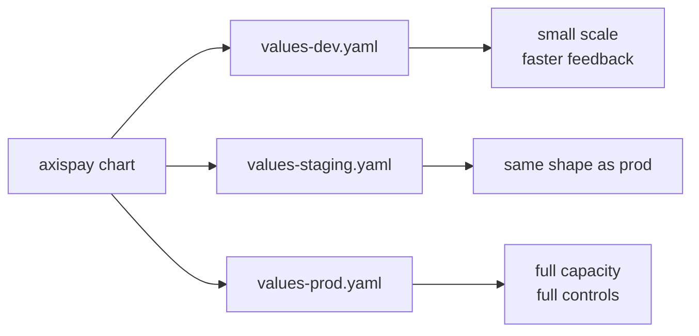

# L5.4 · Promotion

This lab is about moving the **same chart** through different environments without changing the application definition itself.

In simple words: the package stays the same; the values change in controlled ways.

## What this concept means

Promotion is safer when environments differ mainly in **size** and **externally visible settings**, not in structure.

For AxisPay, the important values files are:

- `platform/charts/axispay/values-dev.yaml`
- `platform/charts/axispay/values-staging.yaml`
- `platform/charts/axispay/values-prod.yaml`
- `platform/charts/axispay/values-slim.yaml`



## Do this first

What you should expect to see: the values files are not random copies. Each file encodes a deliberate environment story.

Read these differences carefully:

- dev: single replicas, looser capacity assumptions, observability mostly off
- staging: same shape as production, but smaller numbers
- prod: stricter rollout settings, more replicas, full alerting
- slim: classroom fallback when laptops are too small

Why this matters:

- values files are where environment differences belong
- the chart should express structure once
- promotion should not become a source of drift

## Then do this

What you should expect to see: staging and production render the same kinds of objects, even though counts and values differ.

```bash
helm template axispay platform/charts/axispay -f platform/charts/axispay/values-staging.yaml | grep '^kind:' | sort | uniq -c
helm template axispay platform/charts/axispay -f platform/charts/axispay/values-prod.yaml | grep '^kind:' | sort | uniq -c
```

Expected result:

```text
$ helm template axispay platform/charts/axispay -f platform/charts/axispay/values-staging.yaml | grep '^kind:' | sort | uniq -c
      1 kind: CronJob
      1 kind: DaemonSet
     12 kind: Deployment
      2 kind: HorizontalPodAutoscaler
      2 kind: Ingress
     10 kind: NetworkPolicy
     11 kind: PodDisruptionBudget
      1 kind: PrometheusRule
     13 kind: Service
     13 kind: ServiceAccount
      2 kind: StatefulSet
      5 kind: ServiceMonitor

$ helm template axispay platform/charts/axispay -f platform/charts/axispay/values-prod.yaml | grep '^kind:' | sort | uniq -c
      1 kind: CronJob
      1 kind: DaemonSet
     12 kind: Deployment
      2 kind: HorizontalPodAutoscaler
      2 kind: Ingress
     10 kind: NetworkPolicy
     11 kind: PodDisruptionBudget
      1 kind: PrometheusRule
     13 kind: Service
     13 kind: ServiceAccount
      2 kind: StatefulSet
      5 kind: ServiceMonitor
```

That is what you want: same shape, different sizing.

## Then do this

What you should expect to see: installing the staging values gives a smaller but structurally production-like deployment.

```bash
helm upgrade --install axispay platform/charts/axispay -f platform/charts/axispay/values-staging.yaml -n axispay-core --wait --timeout 10m
```

Expected result:

```text
$ helm upgrade --install axispay platform/charts/axispay -f platform/charts/axispay/values-staging.yaml -n axispay-core --wait --timeout 10m
Release "axispay" has been upgraded. Happy Helming!
NAME: axispay
LAST DEPLOYED: Tue Aug 18 20:42:11 2026
NAMESPACE: axispay-core
STATUS: deployed
REVISION: 2
TEST SUITE: None
NOTES:
axispay 1.0.0 — release axispay
Environment: staging · images axispay/*:1.0.0

Deployed:
  edge-gateway           edge   2 replica(s)
  auth-service           edge   2 replica(s)
  payment-service        core   2 replica(s)  [HPA 2–4]
  fraud-service          core   2 replica(s)  [HPA 2–4]
  settlement-service     async  1 replica(s)
  notification-service   async  1 replica(s)
```

## Then do this

What you should expect to see: the core namespace reflects the staging-sized rollout, HPA bounds, and disruption budgets.

```bash
kubectl get deploy,hpa,pdb -n axispay-core
kubectl rollout status deployment/payment-service -n axispay-core
```

Expected result:

```text
$ kubectl get deploy,hpa,pdb -n axispay-core
NAME                                    READY   UP-TO-DATE   AVAILABLE   AGE
deployment.apps/customer-service        2/2     2            2           1m40s
deployment.apps/fraud-service           2/2     2            2           1m40s
deployment.apps/ledger-service          2/2     2            2           1m40s
deployment.apps/merchant-service        2/2     2            2           1m40s
deployment.apps/payment-service         2/2     2            2           1m40s
deployment.apps/routing-service         2/2     2            2           1m40s

NAME                                              REFERENCE                     TARGETS    MINPODS   MAXPODS   REPLICAS   AGE
horizontalpodautoscaler.autoscaling/payment-service   Deployment/payment-service   34%/70%    2         4         2          1m39s
horizontalpodautoscaler.autoscaling/fraud-service     Deployment/fraud-service     29%/65%    2         4         2          1m39s

NAME                                               MIN AVAILABLE   MAX UNAVAILABLE   ALLOWED DISRUPTIONS   AGE
poddisruptionbudget.policy/customer-service        N/A             1                 1                     1m39s
poddisruptionbudget.policy/fraud-service           N/A             1                 1                     1m39s
poddisruptionbudget.policy/payment-service         N/A             1                 1                     1m39s

$ kubectl rollout status deployment/payment-service -n axispay-core
deployment "payment-service" successfully rolled out
```

## Then do this

What you should expect to see: a diff or preview of production shows larger numbers and stricter public endpoints, not a different application model.

```bash
helm diff upgrade axispay platform/charts/axispay -f platform/charts/axispay/values-prod.yaml
```

Expected result:

```text
$ helm diff upgrade axispay platform/charts/axispay -f platform/charts/axispay/values-prod.yaml
axispay, payment-service, Deployment (apps) has changed:
  # replicas omitted because HPA owns the field; HPA bounds will change below

axispay, payment-service, HorizontalPodAutoscaler (autoscaling) has changed:
- minReplicas: 2
- maxReplicas: 4
+ minReplicas: 6
+ maxReplicas: 20

axispay, edge-gateway, Deployment (apps) has changed:
- replicas: 2
+ replicas: 4

axispay, axispay-api, Ingress (networking.k8s.io) has changed:
- host: api.staging.axispay.local
+ host: api.axispay.example
```

If you do not have the `helm-diff` plugin installed, you may see this instead:

```text
Error: unknown command "diff" for "helm"
```

Fix: install the plugin or use `helm template ...` to compare rendered output manually.

## Troubleshooting step

What you should expect to see: if a rollout hangs, `describe` usually shows whether the problem is scheduling, images, or probes.

```bash
kubectl describe pod -n axispay-core -l app.kubernetes.io/component=payment-service
```

Expected result when things are healthy:

```text
$ kubectl describe pod -n axispay-core -l app.kubernetes.io/component=payment-service
Name:             payment-service-6f869d7b7c-kx8jt
Namespace:        axispay-core
Node:             minikube/192.168.49.2
Start Time:       Tue, 18 Aug 2026 20:42:19 +0200
Status:           Running
IP:               10.244.0.118
Controlled By:    ReplicaSet/payment-service-6f869d7b7c
Containers:
  payment-service:
    State:          Running
    Ready:          True
    Restart Count:  0
Conditions:
  Type              Status
  Initialized       True
  Ready             True
  ContainersReady   True
  PodScheduled      True
Events:
  Type    Reason     Age   From               Message
  ----    ------     ----  ----               -------
  Normal  Pulled     65s   kubelet            Container image "axispay/payment-service:1.0.0" already present on machine
  Normal  Created    65s   kubelet            Created container: payment-service
  Normal  Started    65s   kubelet            Started container payment-service
```

Common failure:

```text
$ kubectl rollout status deployment/payment-service -n axispay-core
Waiting for deployment "payment-service" rollout to finish: 1 of 2 updated replicas are available...
error: timed out waiting for the condition

$ kubectl describe pod payment-service-6f869d7b7c-kx8jt -n axispay-core
Events:
  Type     Reason     Age                From               Message
  ----     ------     ----               ----               -------
  Warning  Unhealthy  44s (x9 over 84s)  kubelet            Readiness probe failed: HTTP probe failed with statuscode: 404
```

Why this happens: a promotion accidentally changed a probe path or port.
Fix: restore the known-good chart/template behavior, then upgrade again.

## Why this matters

- promotion is safer when the chart stays stable and the values carry the environment differences
- staging should catch rollout and policy behavior before production does
- values files are part of the release design, not an afterthought
- a good diff tells you exactly what is about to change

## Cheat Sheet / Tips & Tricks

Quick commands:
- `helm template axispay platform/charts/axispay -f platform/charts/axispay/values-staging.yaml | grep '^kind:' | sort | uniq -c` — confirm staging renders the expected object shape.
- `helm diff upgrade axispay platform/charts/axispay -f platform/charts/axispay/values-prod.yaml` — preview what promotion to production would change.
- `helm upgrade --install axispay platform/charts/axispay -f platform/charts/axispay/values-staging.yaml -n axispay-core --wait --timeout 10m` — apply the staging-sized release.
- `kubectl rollout history deployment/payment-service -n axispay-core` — inspect revision history before or after a promotion.
- `kubectl rollout undo deployment/payment-service -n axispay-core --to-revision=<n>` — revert a bad rollout to a known revision.

Tips & tricks:
- Promotion should change values like replica counts, hosts, and thresholds, not the kinds of objects the chart renders.
- If `helm diff` is unavailable, compare `helm template` output between values files rather than guessing.
- `kubectl rollout undo` only works if old ReplicaSets still exist; aggressive cleanup removes your escape hatch.
- A hanging rollout is usually easier to debug with `kubectl describe pod` or `kubectl describe deployment` than by staring at the Helm output alone.

## Check your work

What you should expect to see: the validator confirms the values files exist, the environment shape is consistent, and the HPA-owned replica fields are still correct.

```bash
make validate-lab LAB=L5.4
```

Expected result:

```text
$ make validate-lab LAB=L5.4
== L5.4 validation ==
[PASS] values.yaml
[PASS] values-dev.yaml
[PASS] values-staging.yaml
[PASS] values-prod.yaml
[PASS] values-slim.yaml
[PASS] staging and production render the same set of object kinds
[PASS] security settings are identical where they must be identical
[PASS] no drift between the cluster and the chart
[PASS] payment-service does not pin .spec.replicas
[PASS] fraud-service does not pin .spec.replicas
L5.4 validation passed
```
