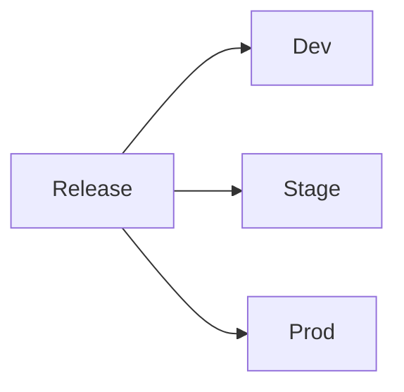

# L5.4 · Promotion

This lab is about moving the same release through different environments.

In simple words: you package once, then reuse the same release in dev, staging, or production.

### What this concept means
Promotion means taking the same release and moving it through different environments, such as development, staging, and production. The package stays the same, but the values may change to match the environment.

That is why promotion is easier when the release is packaged well. The app logic stays consistent while the environment-specific configuration changes in a controlled way.




Do this first:
What you should expect to see: you understand the goal of the lab and the files involved.

1. Open the values files in the chart folder.
2. Notice that different environments can use different values.
3. Think about what should change and what should stay the same.

Why this matters:
- the app package can stay the same
- only the environment values change
- this makes promotion more predictable

Then do this:
What you should expect to see: the command runs without errors and the result matches the explanation above.

```bash
helm upgrade --install <release-name> . -f values-<env>.yaml
```

Expected result:
- Helm reports a successful install or upgrade.
- The release should appear in `helm list`.
This installs or updates the release with the values for that environment.

Then do this:
What you should expect to see: the command runs without errors and the result matches the explanation above.

```bash
kubectl get all -n <namespace>
```

Expected result:
- The output lists the resource names or details you expected to inspect.
- You should be able to see the object or the status you are checking.
This shows the release running in the target environment.

Then do this:
What you should expect to see: the command runs without errors and the result matches the explanation above.

Compare the values file with the app behavior.

Why this matters:
- promotion is easier when the package stays stable
- values are how you change the environment without changing the app itself

Check your work:
What you should expect to see: the validation command finishes successfully.
```bash
make validate-lab LAB=L5.4
```

Expected result:
- The validation command finishes successfully.
- You should see a passing message for the lab.
