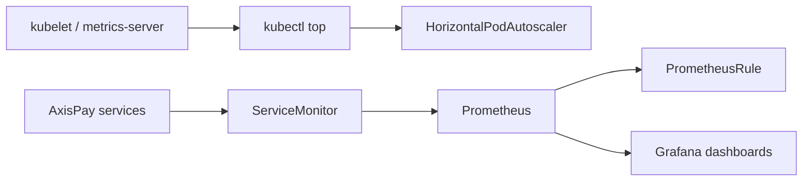

# L5.5 · Metrics and dashboards

This lab is about making the platform observable with numbers.

In simple words: metrics tell you what the system is doing, and dashboards make those numbers readable at operator speed.

## What this concept means

There are two big metric paths in this lab:

1. **Resource metrics** for `kubectl top` and HPA decisions
2. **Prometheus application metrics** for dashboards and alerts



## Do this first

What you should expect to see: the lab manifests teach Prometheus what to scrape, what to alert on, and what dashboard JSON to load.

Open these files:

- `manifests/01-servicemonitors.yaml`
- `manifests/02-prometheusrules.yaml`
- `manifests/04-grafana-dashboards.yaml`

Look for these real object names:

- `ServiceMonitor/axispay-edge`
- `ServiceMonitor/axispay-core`
- `ServiceMonitor/axispay-async`
- `ServiceMonitor/axispay-ops`
- `PrometheusRule/axispay-slo`
- dashboard ConfigMaps `axispay-dashboard-platform` and `axispay-dashboard-triage`

Why this matters:

- Prometheus does nothing useful until it knows **what** to scrape
- dashboards are only as good as the metric design behind them
- alert rules are a form of executable operational knowledge

## Then do this

What you should expect to see: the ServiceMonitors, rule set, and dashboard ConfigMaps are created cleanly.

```bash
kubectl apply -f manifests/
```

Expected result:

```text
$ kubectl apply -f manifests/
servicemonitor.monitoring.coreos.com/axispay-edge created
servicemonitor.monitoring.coreos.com/axispay-core created
servicemonitor.monitoring.coreos.com/axispay-async created
servicemonitor.monitoring.coreos.com/axispay-ops created
prometheusrule.monitoring.coreos.com/axispay-slo created
configmap/axispay-dashboard-platform created
configmap/axispay-dashboard-triage created
```

## Then do this

What you should expect to see: the Prometheus Operator can see the scrape objects, and the release label tells you whether Prometheus will actually select them.

```bash
kubectl get servicemonitor -A -l app.kubernetes.io/part-of=axispay -L release
kubectl get prometheusrule axispay-slo -n axispay-observability
```

Expected result:

```text
$ kubectl get servicemonitor -A -l app.kubernetes.io/part-of=axispay -L release
NAMESPACE               NAME                    AGE   RELEASE
axispay-async           axispay-async           22s   kube-prometheus-stack
axispay-core            axispay-core            22s   kube-prometheus-stack
axispay-edge            axispay-edge            22s   kube-prometheus-stack
axispay-observability   axispay-observability   21m   kube-prometheus-stack
axispay-ops             axispay-ops             22s   kube-prometheus-stack

$ kubectl get prometheusrule axispay-slo -n axispay-observability
NAME          AGE
axispay-slo   21s
```

If the `RELEASE` column is empty, Prometheus usually ignores the object completely. The target becomes **absent**, not **down**.

## Then do this

What you should expect to see: resource metrics and autoscaler state give you a fast picture of live workload pressure.

```bash
kubectl top pods -n axispay-core
kubectl get hpa -n axispay-core
```

Expected result:

```text
$ kubectl top pods -n axispay-core
NAME                                CPU(cores)   MEMORY(bytes)
customer-service-7d57d7f785-mx9fr   12m          58Mi
fraud-service-5bf4cc84f8-vg2m2      47m          81Mi
fraud-service-5bf4cc84f8-z9j9s      42m          79Mi
ledger-service-84ff4959cc-hltlh     9m           64Mi
merchant-service-66f6798c96-6nnrt   18m          61Mi
payment-service-6f869d7b7c-7s9lm    63m          92Mi
payment-service-6f869d7b7c-j2r89    58m          90Mi
payment-service-6f869d7b7c-x2kq6    61m          91Mi
routing-service-6dd89f7c97-rxmkq    11m          63Mi

$ kubectl get hpa -n axispay-core
NAME              REFERENCE                    TARGETS    MINPODS   MAXPODS   REPLICAS   AGE
fraud-service     Deployment/fraud-service     29%/65%    2         6         2          36m
payment-service   Deployment/payment-service   41%/70%    3         8         3          36m
```

A Java-friendly way to read that HPA line: `41%/70%` means the average CPU usage is still below the scale-up threshold.

## Then do this

What you should expect to see: the payment service exports the exact application metrics that the alerts and dashboards rely on.

```bash
kubectl exec -n axispay-core payment-service-6f869d7b7c-7s9lm -- wget -qO- http://127.0.0.1:8080/metrics | grep '^axispay_' | head
```

Expected result:

```text
$ kubectl exec -n axispay-core payment-service-6f869d7b7c-7s9lm -- wget -qO- http://127.0.0.1:8080/metrics | grep '^axispay_' | head
axispay_http_requests_total{method="POST",service="payment-service",status="201"} 1842.0
axispay_http_requests_total{method="POST",service="payment-service",status="502"} 3.0
axispay_http_request_duration_seconds_bucket{le="0.05",service="payment-service"} 1210.0
axispay_http_request_duration_seconds_bucket{le="0.1",service="payment-service"} 1662.0
axispay_http_request_duration_seconds_bucket{le="0.25",service="payment-service"} 1836.0
axispay_http_request_duration_seconds_bucket{le="0.5",service="payment-service"} 1845.0
axispay_http_request_duration_seconds_sum{service="payment-service"} 132.448
axispay_http_request_duration_seconds_count{service="payment-service"} 1845.0
axispay_payments_total{currency="ZAR",service="payment-service",status="captured"} 1269.0
axispay_payments_total{currency="ZAR",service="payment-service",status="declined"} 317.0
```

Those names matter because the `PrometheusRule` objects query them exactly.

## Then do this

What you should expect to see: a PromQL query can answer both a platform question and a business question.

```bash
curl -sG http://127.0.0.1:9090/api/v1/query --data-urlencode 'query=sum(rate(axispay_payments_total[5m]))' | jq -r '.data.result[0].value'

curl -sG http://127.0.0.1:9090/api/v1/query --data-urlencode 'query=histogram_quantile(0.99, sum by (le) (rate(axispay_http_request_duration_seconds_bucket{service="payment-service"}[5m])))' | jq -r '.data.result[0].value'
```

Expected result:

```text
$ curl -sG http://127.0.0.1:9090/api/v1/query --data-urlencode 'query=sum(rate(axispay_payments_total[5m]))' | jq -r '.data.result[0].value'
[
  1787084665.812,
  "14.866666666666665"
]

$ curl -sG http://127.0.0.1:9090/api/v1/query --data-urlencode 'query=histogram_quantile(0.99, sum by (le) (rate(axispay_http_request_duration_seconds_bucket{service="payment-service"}[5m])))' | jq -r '.data.result[0].value'
[
  1787084672.104,
  "0.18214366128784987"
]
```

Interpretation:

- about **14.9 payments per second** are flowing right now
- the payment path **p99 latency is ~182 ms**, comfortably below a 300 ms warning threshold

## Troubleshooting step

What you should expect to see: `describe` helps you spot the selector and label details that decide whether Prometheus finds a target.

```bash
kubectl describe servicemonitor axispay-core -n axispay-core
```

Expected result:

```text
$ kubectl describe servicemonitor axispay-core -n axispay-core
Name:         axispay-core
Namespace:    axispay-core
Labels:       app.kubernetes.io/instance=axispay
              app.kubernetes.io/name=axispay
              app.kubernetes.io/part-of=axispay
              release=kube-prometheus-stack
API Version:  monitoring.coreos.com/v1
Kind:         ServiceMonitor
Spec:
  Endpoints:
    Interval:        15s
    Path:            /metrics
    Port:            http
    Scrape Timeout:  10s
  Namespace Selector:
    Match Names:
      axispay-core
  Selector:
    Match Labels:
      app.kubernetes.io/part-of:  axispay
Events:                           <none>
```

Common failure:

```text
$ kubectl get servicemonitor axispay-core -n axispay-core --show-labels
NAME           AGE   LABELS
axispay-core   47s   app.kubernetes.io/part-of=axispay
```

Why this happens: the `release=kube-prometheus-stack` label is missing.
Fix: add the label and wait for the operator to reconcile. Until then the target does not even appear in Prometheus.

## Why this matters

- `kubectl top` tells you about resource pressure right now
- Prometheus metrics tell you about both technical behavior and business outcomes
- dashboards are useful only when the underlying metric model is clean
- a missing target is often a configuration-selection problem, not a runtime failure

## Cheat Sheet / Tips & Tricks

Quick commands:
- `kubectl get servicemonitor -A -l app.kubernetes.io/part-of=axispay -L release` — verify Prometheus discovery objects and the critical `release` label.
- `kubectl get prometheusrule axispay-slo -n axispay-observability` — confirm the alert rules object exists where Prometheus expects it.
- `kubectl top pods -n axispay-core` — check live CPU and memory pressure across the core services.
- `kubectl get hpa -n axispay-core` — see current autoscaler targets, min/max bounds, and replicas.
- `kubectl exec -n axispay-core deploy/payment-service -- wget -qO- http://127.0.0.1:8080/metrics | grep '^axispay_' | head` — prove the app exports the metrics your rules and dashboards depend on.

Tips & tricks:
- `kubectl top` depends on `metrics-server`; if it errors, the problem is the resource-metrics pipeline, not the app.
- An empty `release` label on a `ServiceMonitor` usually means Prometheus never selects it, so the target is absent rather than down.
- In HPA output, `current/target` means “how busy it is now” versus “when it should scale.”
- Dashboards are only as useful as the metric names and labels the app actually emits.

## Check your work

What you should expect to see: the validator confirms the metric pipeline, rule set, and dashboard provisioning are all in place.

```bash
make validate-lab LAB=L5.5
```

Expected result:

```text
$ make validate-lab LAB=L5.5
== L5.5 validation ==
[PASS] check-promql.py: all assertions hold
[PASS] Prometheus Operator CRDs present
[PASS] kube-prometheus-stack-operator present
[PASS] kube-prometheus-stack-grafana present
[PASS] all ServiceMonitors labelled release=kube-prometheus-stack
[PASS] PrometheusRule axispay-slo applied
[PASS] 9 alert rules loaded
[PASS] 2 dashboard ConfigMaps
[PASS] axispay_http_requests_total exported
[PASS] axispay_http_request_duration_seconds_bucket exported
[PASS] axispay_payments_total exported
L5.5 validation passed
```
