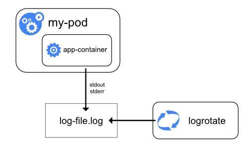

# L5.6 · Logs and alerts

This lab is about turning raw events into something an operator can act on quickly.

In simple words: logs explain **what happened**, and alerts decide **when a human should care right now**.

## What this concept means

A good log pipeline and a good alerting pipeline solve different problems:

- **Logs** give detailed evidence after or during an incident
- **Alerts** reduce a large stream of signals into a small set of actionable pages


_Diagram source: Kubernetes documentation (CC BY 4.0)._



_Diagram source: Kubernetes documentation (CC BY 4.0)._

## Do this first

What you should expect to see: the manifests in this lab build an end-to-end alerting path, not just a single rule.

Open these files:

- `manifests/01-servicemonitors.yaml`
- `manifests/02-prometheusrules.yaml`
- `manifests/03-alertmanager-config.yaml`
- `manifests/04-grafana-dashboards.yaml`
- `manifests/05-observability-netpol.yaml`
- `manifests/06-alert-sink.yaml`

Find these real objects in the YAML:

- `AlertmanagerConfig/axispay-routing`
- `Deployment/alert-sink`
- `Service/alert-sink`
- webhook receivers `payments-oncall`, `finance-ops`, `risk-team`, `platform-oncall`
- network policies that isolate `axispay-observability` and `axispay-ops`

Why this matters:

- logs without structure are hard to query under pressure
- alerts without routing are just local noise
- alerts without inhibition rules often page five times for one root cause

## Then do this

What you should expect to see: the alerting and observability objects are created successfully.

```bash
kubectl apply -f manifests/
```

Expected result:

```text
$ kubectl apply -f manifests/
servicemonitor.monitoring.coreos.com/axispay-edge unchanged
servicemonitor.monitoring.coreos.com/axispay-core unchanged
servicemonitor.monitoring.coreos.com/axispay-async unchanged
servicemonitor.monitoring.coreos.com/axispay-ops unchanged
prometheusrule.monitoring.coreos.com/axispay-slo unchanged
alertmanagerconfig.monitoring.coreos.com/axispay-routing created
configmap/axispay-dashboard-platform unchanged
configmap/axispay-dashboard-triage unchanged
networkpolicy.networking.k8s.io/default-deny-all created
networkpolicy.networking.k8s.io/allow-dns-egress created
networkpolicy.networking.k8s.io/allow-prometheus-scrape created
networkpolicy.networking.k8s.io/allow-node-agent-to-apiserver created
networkpolicy.networking.k8s.io/allow-observability-internal created
networkpolicy.networking.k8s.io/allow-observability-egress created
deployment.apps/alert-sink created
serviceaccount/alert-sink created
service/alert-sink created
servicemonitor.monitoring.coreos.com/axispay-observability created
```

## Then do this

What you should expect to see: the routing tree, sink deployment, and service are all present in the observability namespace.

```bash
kubectl get prometheusrule,alertmanagerconfig,deploy,svc -n axispay-observability
```

Expected result:

```text
$ kubectl get prometheusrule,alertmanagerconfig,deploy,svc -n axispay-observability
NAME                                                  AGE
prometheusrule.monitoring.coreos.com/axispay-slo      47m

NAME                                                         AGE
alertmanagerconfig.monitoring.coreos.com/axispay-routing     18s

NAME                           READY   UP-TO-DATE   AVAILABLE   AGE
deployment.apps/alert-sink     1/1     1            1           17s

NAME                   TYPE        CLUSTER-IP      EXTERNAL-IP   PORT(S)    AGE
service/alert-sink     ClusterIP   10.96.214.111   <none>        8080/TCP   17s
```

## Then do this

What you should expect to see: application logs are structured JSON on stdout, which makes them queryable later.

```bash
kubectl logs -n axispay-core deploy/payment-service --tail=5
```

Expected result:

```text
$ kubectl logs -n axispay-core deploy/payment-service --tail=5
{"ts":"2026-08-18T18:56:01.284Z","level":"info","service":"payment-service","correlation_id":"b9b5e4bc-39d6-46ee-bf63-8fe6c18cfb73","payment_id":"pay_01j5k7b0v7h7m7r6rj6m9y5q3a","merchant_reference":"AXP-4471-ZA","msg":"payment authorized","duration_ms":84}
{"ts":"2026-08-18T18:56:01.312Z","level":"info","service":"payment-service","correlation_id":"b9b5e4bc-39d6-46ee-bf63-8fe6c18cfb73","payment_id":"pay_01j5k7b0v7h7m7r6rj6m9y5q3a","msg":"ledger write complete","duration_ms":21}
{"ts":"2026-08-18T18:56:05.778Z","level":"warn","service":"payment-service","correlation_id":"4cb6e7af-8e6c-4d6b-8c11-9cc4c39ff493","merchant_reference":"AXP-4472-ZA","msg":"acquirer timeout, retrying","attempt":1}
{"ts":"2026-08-18T18:56:06.119Z","level":"info","service":"payment-service","correlation_id":"4cb6e7af-8e6c-4d6b-8c11-9cc4c39ff493","payment_id":"pay_01j5k7b5y7w8k03m27m1v6z6tq","msg":"payment captured","duration_ms":192}
{"ts":"2026-08-18T18:56:09.003Z","level":"info","service":"payment-service","correlation_id":"a0d87918-0cb2-4c65-a5c7-91deba59f726","msg":"health check served","path":"/readyz","status":200}
```

Notice the fields that matter under pressure: `service`, `level`, and `correlation_id`.

## Then do this

What you should expect to see: the alert sink exposes the routing tree so you can prove who would receive which alert.

```bash
kubectl exec -n axispay-observability deploy/alert-sink -- python3 -c "import urllib.request,json;print(json.dumps(json.load(urllib.request.urlopen('http://127.0.0.1:8080/api/v1/routes')),indent=2))"
```

Expected result:

```text
$ kubectl exec -n axispay-observability deploy/alert-sink -- python3 -c "import urllib.request,json;print(json.dumps(json.load(urllib.request.urlopen('http://127.0.0.1:8080/api/v1/routes')),indent=2))"
{
  "default": "platform-default",
  "routes": [
    {
      "receiver": "payments-oncall",
      "matchers": [
        "severity=critical",
        "team=payments"
      ]
    },
    {
      "receiver": "finance-ops",
      "matchers": [
        "team=finance-ops"
      ]
    },
    {
      "receiver": "risk-team",
      "matchers": [
        "team=risk"
      ]
    },
    {
      "receiver": "platform-oncall",
      "matchers": [
        "severity=critical"
      ]
    }
  ],
  "inhibit_rules": 4
}
```

This is the operationally important part: routing is **provable**, not assumed.

## Then do this

What you should expect to see: a Loki-style query can pull only the error lines for one service.

```bash
curl -sG http://127.0.0.1:3100/loki/api/v1/query_range --data-urlencode 'query={namespace="axispay-core",service="payment-service"} | json | level="warn"' --data-urlencode 'limit=2' | jq -r '.data.result[0].values[][1]'
```

Expected result:

```text
$ curl -sG http://127.0.0.1:3100/loki/api/v1/query_range --data-urlencode 'query={namespace="axispay-core",service="payment-service"} | json | level="warn"' --data-urlencode 'limit=2' | jq -r '.data.result[0].values[][1]'
{"ts":"2026-08-18T18:56:05.778Z","level":"warn","service":"payment-service","correlation_id":"4cb6e7af-8e6c-4d6b-8c11-9cc4c39ff493","merchant_reference":"AXP-4472-ZA","msg":"acquirer timeout, retrying","attempt":1}
{"ts":"2026-08-18T18:57:44.101Z","level":"warn","service":"payment-service","correlation_id":"1884d758-2817-42c4-b8db-df37c335b85b","merchant_reference":"AXP-4478-ZA","msg":"issuer returned soft decline","reason_code":"51"}
```

That works because the log lines are structured JSON, not free-form text.

## Troubleshooting step

What you should expect to see: if the sink is unhealthy, `describe` shows readiness details, recent events, and the service account in one place.

```bash
kubectl describe deployment alert-sink -n axispay-observability
```

Expected result:

```text
$ kubectl describe deployment alert-sink -n axispay-observability
Name:                   alert-sink
Namespace:              axispay-observability
CreationTimestamp:      Tue, 18 Aug 2026 21:03:11 +0200
Labels:                 app.kubernetes.io/name=alert-sink
                        app.kubernetes.io/instance=axispay
                        app.kubernetes.io/part-of=axispay
Selector:               app.kubernetes.io/instance=axispay,app.kubernetes.io/name=alert-sink
Replicas:               1 desired | 1 updated | 1 total | 1 available | 0 unavailable
Pod Template:
  Labels:           app.kubernetes.io/component=observability
                    app.kubernetes.io/instance=axispay
                    app.kubernetes.io/name=alert-sink
                    app.kubernetes.io/part-of=axispay
  Service Account:  alert-sink
  Containers:
   alert-sink:
    Image:      axispay/alert-sink:1.0.0
    Port:       8080/TCP
    Limits:
      cpu:      150m
      memory:   192Mi
    Requests:
      cpu:      25m
      memory:   64Mi
    Startup:    http-get http://:http/startupz delay=0s timeout=1s period=2s #success=1 #failure=30
    Liveness:   http-get http://:http/healthz delay=0s timeout=3s period=10s #success=1 #failure=3
    Readiness:  http-get http://:http/readyz delay=0s timeout=3s period=5s #success=1 #failure=2
Events:
  Type    Reason             Age   From                   Message
  ----    ------             ----  ----                   -------
  Normal  ScalingReplicaSet  31s   deployment-controller  Scaled up replica set alert-sink-5f5449bc6b from 0 to 1
```

Common failures:

```text
$ curl -sG http://127.0.0.1:3100/loki/api/v1/query_range --data-urlencode 'query={namespace="axispay-core",service="payment-service"} | json | level="error"'
{"status":"success","data":{"resultType":"streams","result":[]}}
```

Why this happens: either the selector is too narrow, the logs are not JSON, or Alloy/Loki is not actually ingesting data.
Fix: first confirm Alloy is running, then widen the query, then verify the log format.

Another common failure when the log collector is blocked by security policy:

```text
$ kubectl get pods -n axispay-observability -l app.kubernetes.io/name=alloy
No resources found in axispay-observability namespace.
```

Why this happens: the observability namespace is not allowed to run the collector shape it needs.
Fix: check the namespace security posture and the collector installation before debugging the query itself.

## Why this matters

- structured logs make correlation IDs genuinely useful
- alert routing is part of the system design, not an afterthought
- inhibition rules reduce duplicate pages during one real incident
- a queryable sink lets you prove the alert topology end to end

## Cheat Sheet / Tips & Tricks

Quick commands:
- `kubectl logs -n axispay-core deploy/payment-service --tail=20` — inspect the latest structured application log lines quickly.
- `kubectl logs -n axispay-core deploy/payment-service -f --since=10m` — stream only recent logs while reproducing an issue.
- `kubectl logs -n axispay-core <pod> --previous` — fetch logs from the last crashed container instance if a pod restarted.
- `kubectl get alertmanagerconfig axispay-routing -n axispay-observability -o yaml` — inspect the routing rules that decide who gets paged.
- `kubectl exec -n axispay-observability deploy/alert-sink -- python3 -c "import urllib.request,json;print(json.dumps(json.load(urllib.request.urlopen('http://127.0.0.1:8080/api/v1/routes')),indent=2))"` — prove the alert sink sees the expected routing tree.

Tips & tricks:
- JSON logs are much easier to query than plain text; look first for fields like `service`, `level`, and `correlation_id`.
- `kubectl logs --previous` only works if the container actually restarted and the old log file has not been cleaned up yet.
- If a Loki query returns nothing, widen the query before assuming the app is silent; the selector may be too narrow.
- Alerts without working routing are just noise; always prove both the rule and the receiver path.

## Check your work

What you should expect to see: the validator confirms the log pipeline assumptions and the alert routing objects.

```bash
make validate-lab LAB=L5.6
```

Expected result:

```text
$ make validate-lab LAB=L5.6
== L5.6 validation ==
[PASS] log lines are JSON carrying service, level and correlation_id
[PASS] Alloy DaemonSet has ready pods
[PASS] Loki present
[PASS] correlation_id stays in the body, not in the labels
[PASS] alert-sink is ready
[PASS] alert-sink has endpoints
[PASS] AlertmanagerConfig axispay-routing applied
[PASS] route to payments-oncall
[PASS] route to finance-ops
[PASS] route to risk-team
[PASS] 4 inhibit rules — one fault produces one page
[PASS] /api/v1/routes responds
L5.6 validation passed
```
