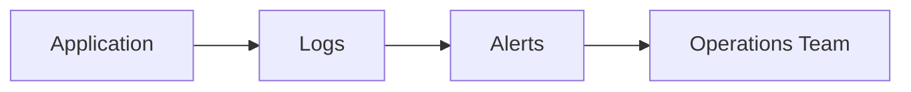

# L5.6 · Logs and alerts

This lab is about turning logs and signals into alerts that people can act on.

In simple words: logs tell you what happened, and alerts tell you when you should care now.

### What this concept means
Logs tell you what happened, and alerts tell you when something needs attention now. In a system with many moving parts, you need both. Logs give context, while alerts reduce the time it takes to notice a problem.

Good alerts are specific and actionable. A noisy or vague alert is not useful. The point is to turn an operational signal into a clear message that someone can act on.




Do this first:
What you should expect to see: you understand the goal of the lab and the files involved.

1. Open the files in `manifests/`.
2. Read the alert rules and routing config.
3. Notice that alerts need clear rules and a place to go.

Why this matters:
- a system can be noisy
- alerts help reduce that noise into something actionable
- a good alert saves time during incidents

Then do this:
What you should expect to see: the command runs without errors and the result matches the explanation above.

```bash
kubectl apply -f manifests/
```

Expected result:
- The command finishes without errors.
- You should see messages such as `created` or `configured` for the resources.
- A follow-up `kubectl get` command should show the objects you created.
This adds the alerting configuration.

Then do this:
What you should expect to see: the command runs without errors and the result matches the explanation above.

```bash
kubectl get prometheusrule -A
kubectl get alertmanagerconfig -A
```

Expected result:
- The output lists the resource names or details you expected to inspect.
- You should be able to see the object or the status you are checking.
This shows that the alerting objects were created.

Then do this:
What you should expect to see: the command runs without errors and the result matches the explanation above.

Look at the alert rule and ask: what event should trigger it, and who should see it?

Why this matters:
- an alert is only useful if it is clear and actionable
- a bad alert becomes noise very quickly

Check your work:
What you should expect to see: the validation command finishes successfully.
```bash
make validate-lab LAB=L5.6
```

Expected result:
- The validation command finishes successfully.
- You should see a passing message for the lab.
