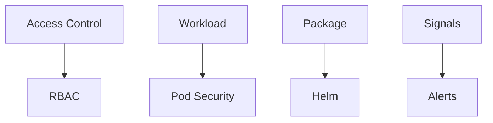

# Day 5 labs

These labs should be done in order.

What each lab teaches:
- L5.1 Identity and pod security: understand who the pod is and what it can do
- L5.2 RBAC: give people only the access they need
- L5.3 Helm packaging: install the platform with one command
- L5.4 Promotion: move a release from one environment to the next
- L5.5 Metrics and dashboards: watch the platform health
- L5.6 Logs and alerts: spot problems quickly

How to work through a lab:
1. Open the lab folder.
2. Read the README.
3. Apply the manifest or chart.
4. Check the result.
5. Run the validation command.

What success looks like:
- You can explain the purpose of the lab.
- You can run the commands and see the expected objects or outputs.
- The validation command passes.

### What this day is really teaching
Day 5 is the operations day. It focuses on the questions that matter once the platform is already running: who can do what, how do we package and release changes, and how do we notice when things go wrong.

The common lesson is that healthy systems are not only deployed well. They are also governed well, monitored well, and upgraded in a controlled way.

