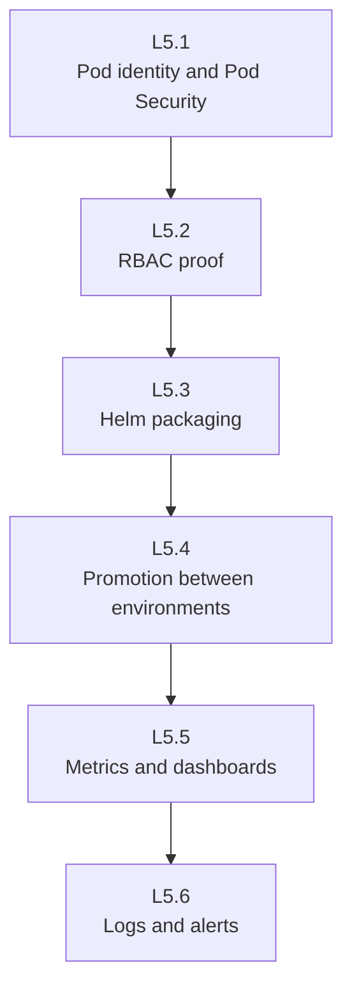

# Day 5 labs

Do these labs in order. Each one adds a piece of the operating model that a real platform team needs.

## The flow of the day



## What each lab teaches

| Lab | What you will do | Why it matters |
|---|---|---|
| **L5.1 Identity and pod security** | inspect `ServiceAccount` usage and force Pod Security Admission to reject a bad pod | a workload should have a clear identity and should not be allowed to run in a dangerous shape |
| **L5.2 RBAC** | apply roles and bindings, then prove access with `kubectl auth can-i` | access control is only useful when you can prove both allowed and denied actions |
| **L5.3 Helm packaging** | lint, template, and install the AxisPay chart | packaging reduces drift and makes installs repeatable |
| **L5.4 Promotion** | compare values files and promote the same chart through environments | production should be a bigger version of the same thing, not a different thing |
| **L5.5 Metrics and dashboards** | register scrape targets, inspect rules, query metrics, and read HPA state | operators need visible signals before users report a problem |
| **L5.6 Logs and alerts** | inspect structured logs, Loki-style queries, and Alertmanager routing | fast incident response depends on clear evidence and actionable pages |

## Where the important files are

- **Lab manifests** live under each lab's `manifests/` directory.
- **The shared Day 5 chart** used in L5.3 and L5.4 is at `platform/charts/axispay/`.
- **Validation scripts** live under `platform/admin/validate/`.

## How to work through a lab

1. Read the lab README completely before typing.
2. Open the manifest or chart files that the lab mentions.
3. Run the commands exactly as shown.
4. Compare your output with the expected transcript.
5. If your output differs, read the troubleshooting note before continuing.
6. Run the lab validator.

## The command pattern you will see repeatedly

```bash
kubectl apply -f manifests/
kubectl get ...
kubectl describe ...
make validate-lab LAB=L5.2
```

Expected result:

```text
$ kubectl apply -f manifests/
serviceaccount/payment-service created
clusterrole.rbac.authorization.k8s.io/axispay-auditor created
rolebinding.rbac.authorization.k8s.io/axispay-auditor created

$ kubectl get rolebinding -n axispay-core
NAME               ROLE                            AGE
axispay-auditor    ClusterRole/axispay-auditor    8s
axispay-deployer   Role/axispay-deployer          8s
axispay-oncall     Role/axispay-oncall            8s

$ kubectl describe role axispay-oncall -n axispay-core
Name:         axispay-oncall
Namespace:    axispay-core
PolicyRule:
  Resources             Non-Resource URLs   Resource Names   Verbs
  ---------             -----------------   --------------   -----
  pods,services         []                  []               [get list watch]
  pods/log,pods/status  []                  []               [get list]
  pods/exec             []                  []               [create]

$ make validate-lab LAB=L5.2
[PASS] the roles exist
[PASS] the auditor can do the job
[PASS] the restriction that matters
[PASS] validation complete for L5.2
```

## Day 5 prerequisites to remember

- L5.3 and L5.4 assume `helm` is installed.
- L5.5 and L5.6 assume the observability stack exists.
- If a lab command says **Forbidden**, that is often a **good** result on Day 5.
- If a Prometheus target is missing entirely, think **selector labels** before you think **network**.

## Cheat Sheet / Tips & Tricks

Quick commands:
- `ls days/day5/labs` — see the lab folders from the repo root.
- `cd days/day5/labs/L5.2-rbac` — jump straight into a lab when you already know the folder name.
- `kubectl apply -f days/day5/labs/L5.2-rbac/manifests/` — apply a lab without changing directories.
- `make validate-lab LAB=L5.2` — validate one lab before moving on.
- `make validate-day5` — run the full Day 5 checkpoint at the end.
- `kubectl get events -A --sort-by=.lastTimestamp` — scan recent cluster-wide events when a lab behaves differently.

Tips & tricks:
- Read the lab README first, then open the YAML it mentions; Day 5 labs often expect you to notice names and labels before applying.
- If a lab says `Forbidden`, double-check whether that is the expected success signal before trying to “fix” it.
- When `kubectl apply` works but the result looks wrong, use `kubectl describe <kind> <name> -n <ns>` next; events are usually the fastest clue.
- For observability labs, check labels and selectors before network assumptions; a target that is not selected often looks like a runtime failure.

## What success looks like

- You can explain the purpose of every Day 5 object, not just apply it.
- You can read `kubectl`, `helm`, and observability output without guessing.
- You can show at least one **intentional deny** and explain why it is correct.
- Each `make validate-lab LAB=...` command passes.
