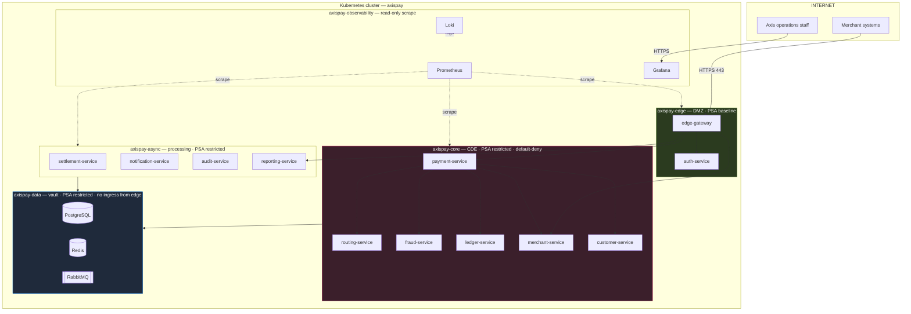
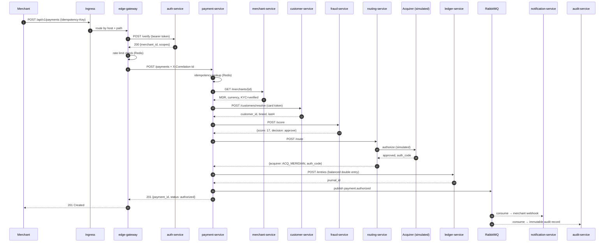
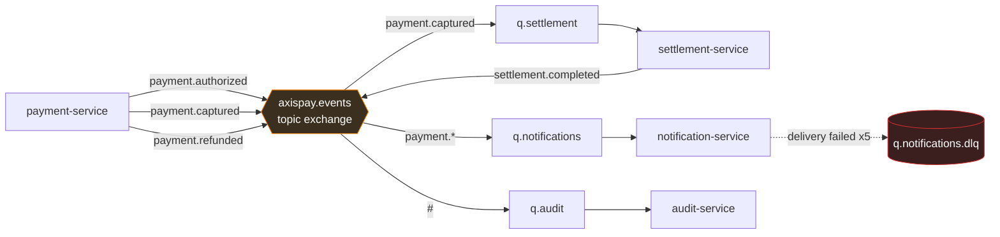
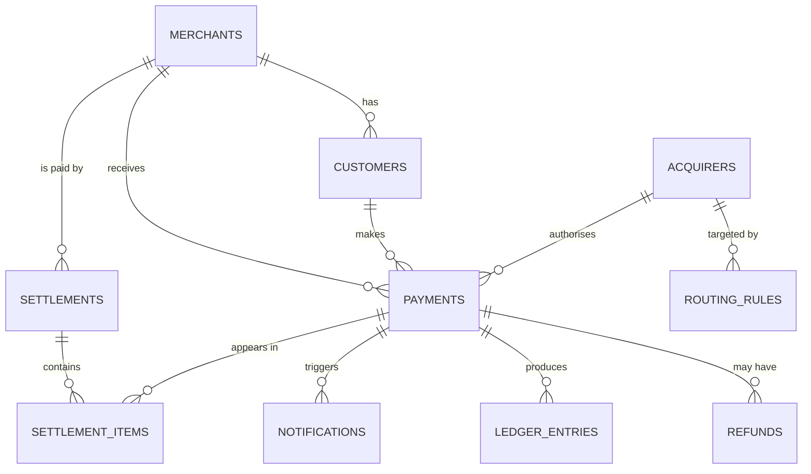
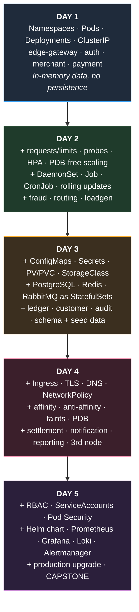

# AxisPay — Platform Architecture

> **AxisPay** is a fictional payment orchestration platform operated by the fictional **Axis Financial Services (Pty) Ltd**. Every merchant, customer, card token, transaction, acquirer and bank reference in this repository is invented. No real institution, product or cardholder is represented, and no real card data is used anywhere in the course.

---

## 1. The business, in one page

Axis Financial Services sells a single product: **one API that a merchant integrates once, and which then reaches every card acquirer in the region.**

A merchant in Cape Town selling to customers in Nairobi and London would otherwise need three acquiring relationships, three integrations, three settlement files and three reconciliation processes. AxisPay collapses that into one integration. AxisPay decides — per transaction, in about 40 milliseconds — which acquirer to route to, based on currency, card brand, amount, cost and live success rates.

### 1.1 What Axis is paid for

| Revenue line | Mechanism |
|---|---|
| Merchant discount rate (MDR) | Basis points on every captured transaction (e.g. 180 bps = 1.80%) |
| Fixed per-transaction fee | Flat minor-currency amount per authorisation |
| FX margin | Spread when settlement currency ≠ transaction currency |
| Value-added services | Fraud scoring tier, advanced reporting, faster settlement |

### 1.2 Why this platform is a good teaching vehicle

Payments impose constraints that make every Kubernetes concept *matter*, rather than being abstract:

| Constraint | Which Kubernetes topic it forces students to take seriously |
|---|---|
| **Money must never be double-charged** | Idempotency, at-least-once messaging, graceful shutdown, `preStop`, SIGTERM handling |
| **Authorisation must answer in < 300 ms** | Resource requests/limits, CPU throttling, HPA, readiness probes, DNS `ndots` latency |
| **Cardholder data is regulated (PCI-DSS)** | Namespaces, NetworkPolicy, RBAC, Secrets, securityContext, Pod Security Admission |
| **The ledger must never lose an entry** | PersistentVolumes, StatefulSets, reclaim policies, backup/restore, RPO |
| **Settlement runs at 23:00 every night** | CronJob, `concurrencyPolicy`, `activeDeadlineSeconds`, Job backoff |
| **Merchants have contractual uptime SLAs** | PodDisruptionBudget, anti-affinity, topology spread, rolling updates, SLO/error budget |
| **Every action must be auditable for 7 years** | Append-only audit service, event-driven architecture, log aggregation |

An engineer who can operate this can operate most enterprise systems. That is the point.

---

## 2. Service inventory

Sixteen workloads plus a data tier and an observability stack. Every service is Python 3.13 + FastAPI, every service exposes REST, every service ships with seed data, and every service talks to at least two others.

### 2.1 Edge tier — namespace `axispay-edge`

| Service | Port | Type | Responsibility | Talks to |
|---|---|---|---|---|
| **edge-gateway** | 8080 | Deployment | Single public entry point. Terminates the merchant API contract, validates bearer tokens, enforces per-merchant rate limits, injects `X-Correlation-Id`, fans out to core services. | auth-service, payment-service, merchant-service, reporting-service, Redis |
| **auth-service** | 8080 | Deployment | Issues and validates JWTs. Exchanges merchant API keys for short-lived tokens. Holds no cardholder data. | merchant-service, Redis |

### 2.2 Core tier — namespace `axispay-core` *(the Cardholder Data Environment — CDE)*

| Service | Port | Type | Responsibility | Talks to |
|---|---|---|---|---|
| **payment-service** | 8080 | Deployment | The orchestrator. Owns the payment lifecycle: `created → risk_checked → routed → authorized → captured → settled`, plus `refunded`, `voided`, `declined`, `failed`. Enforces idempotency. | merchant, customer, fraud, routing, ledger, PostgreSQL, Redis, RabbitMQ |
| **routing-service** | 8080 | Deployment | Selects the acquirer. Evaluates ordered routing rules against currency, card brand, amount band, issuer country and live acquirer success rate. Simulates the acquirer authorisation call. | PostgreSQL, Redis |
| **fraud-service** | 8080 | Deployment | Returns a risk score 0–100 and a decision (`approve` / `review` / `decline`) from velocity counters, amount deviation, country mismatch and merchant history. | Redis, PostgreSQL |
| **ledger-service** | 8080 | Deployment | Double-entry ledger. Every payment produces balanced debit/credit entries. Entries are append-only — corrections are new entries, never updates. | PostgreSQL |
| **merchant-service** | 8080 | Deployment | Merchant master data: legal entity, KYC status, MCC, MDR, settlement currency and bank reference, webhook endpoint. | PostgreSQL, Redis |
| **customer-service** | 8080 | Deployment | Cardholder profiles and card **tokens**. Stores `tok_…` references, brand and last-4 only. No PAN exists anywhere in this platform, not even in fixtures. | PostgreSQL |

### 2.3 Async tier — namespace `axispay-async`

| Service | Port | Type | Responsibility | Talks to |
|---|---|---|---|---|
| **settlement-service** | 8080 | Deployment | Batches captured payments per merchant per currency; computes gross, fees and net; produces a settlement file reference. | PostgreSQL, RabbitMQ |
| **notification-service** | 8080 | Deployment | Consumes payment events; delivers merchant webhooks and simulated email/SMS with exponential-backoff retry and a dead-letter queue. | RabbitMQ, PostgreSQL, merchant-service |
| **audit-service** | 8080 | Deployment | Consumes every event and writes an immutable audit record with actor, action, entity and correlation ID. Write-only from the platform's perspective. | RabbitMQ, PostgreSQL |
| **reporting-service** | 8080 | Deployment | Read-only aggregates: daily volume, approval rate, top merchants, acquirer mix, refund rate. Deliberately read-heavy so it can be scaled independently. | PostgreSQL (read) |

### 2.4 Workers and platform agents — namespace `axispay-async` / `axispay-ops`

| Workload | Type | Responsibility | Taught in |
|---|---|---|---|
| **settlement-cron** | CronJob (`0 23 * * *`) | Triggers the nightly settlement batch | D2 M2.5 |
| **recon-worker** | Job | Reconciles ledger entries against a simulated acquirer statement and reports breaks | D2 M2.5 |
| **node-agent** | DaemonSet | Node-level collector — one per node, reports node payment-host health | D2 M2.5 |
| **db-migrate** | Init container / Job | Applies schema migrations before services start | D3 M3.6 |
| **loadgen** | Deployment | Generates realistic merchant traffic so scaling, probes, HPA and upgrades can be observed under load | D2 onward |

### 2.5 Data tier — namespace `axispay-data`

| Component | Type | Storage | Purpose |
|---|---|---|---|
| **PostgreSQL 17** | StatefulSet (D3) | PVC 5 Gi, RWO | System of record: merchants, customers, payments, ledger, settlements, audit |
| **Redis 7.4** | StatefulSet (D3) | PVC 1 Gi, RWO | Idempotency keys, rate-limit counters, fraud velocity windows, merchant config cache |
| **RabbitMQ 4.x** | StatefulSet (D3) | PVC 2 Gi, RWO | Event backbone: `payment.authorized`, `payment.captured`, `payment.refunded`, `settlement.completed`, `audit.event` |

### 2.6 Observability — namespace `axispay-observability` *(Day 5)*

| Component | Purpose |
|---|---|
| **Prometheus** | Scrapes `/metrics` from every service; stores time series |
| **Grafana** | The AxisPay Payments Operations dashboard |
| **Loki + Alloy** | Log aggregation; Alloy runs as a DaemonSet |
| **Alertmanager** | Routes payment SEV-1s; silences and inhibition rules |

---

## 3. Namespace design and trust zones

Namespaces are not folders. In AxisPay they are **trust boundaries** that map to a PCI-DSS-style segmentation model, and they are what NetworkPolicy and RBAC are anchored to on Days 4 and 5.



### 3.1 The segmentation rules students will implement on Day 4

| # | Rule | Enforced by |
|---|---|---|
| S1 | Only `axispay-edge` may receive traffic from outside the cluster | Ingress + NetworkPolicy |
| S2 | `axispay-edge` may reach `axispay-core`, but **never** `axispay-data` directly | NetworkPolicy default-deny + explicit allow |
| S3 | Only `axispay-core` and `axispay-async` may reach `axispay-data` | NetworkPolicy namespace selector |
| S4 | `axispay-observability` may scrape all namespaces but may not be reached by them | NetworkPolicy + RBAC |
| S5 | Every namespace denies all egress except DNS and its declared dependencies | NetworkPolicy egress rules |
| S6 | Nothing in `axispay-core` runs as root or with a writable root filesystem | Pod Security Admission `restricted` |

**Teaching note.** Students almost always write their first NetworkPolicy without a DNS egress rule and then spend twenty minutes debugging why every service call fails with a name-resolution error. This is a *deliberate* stop on Day 4 — it teaches the additive-policy model faster than any slide.

---

## 4. Request flow — a single card payment

This is the flow students trace on Day 1 and instrument on Day 5. It is the reference sequence for the whole week.



### 4.1 Latency budget (the SLO students defend on Day 5)

| Hop | Budget | Cumulative |
|---|---|---|
| Ingress → edge-gateway | 5 ms | 5 ms |
| Token verification (cached) | 8 ms | 13 ms |
| Merchant lookup (cached) | 6 ms | 19 ms |
| Customer resolve | 12 ms | 31 ms |
| Fraud score | 25 ms | 56 ms |
| Routing + acquirer | 120 ms | 176 ms |
| Ledger write | 30 ms | 206 ms |
| Event publish (async) | 4 ms | 210 ms |
| Response assembly | 15 ms | **225 ms** |
| **Headroom to SLO** | | **75 ms** |

**SLO: p99 authorisation latency < 300 ms; availability 99.9% monthly.**
That 75 ms of headroom is what CPU throttling from a badly-set limit consumes — which is exactly how Day 2's resource module is motivated.

---

## 5. Event-driven flows



| Event | Published by | Consumed by | Routing key |
|---|---|---|---|
| `payment.authorized` | payment-service | notification, audit | `payment.authorized` |
| `payment.captured` | payment-service | notification, audit, settlement | `payment.captured` |
| `payment.refunded` | payment-service | notification, audit, settlement | `payment.refunded` |
| `payment.declined` | payment-service | notification, audit | `payment.declined` |
| `settlement.completed` | settlement-service | notification, audit | `settlement.completed` |
| `audit.event` | all services | audit | `audit.#` |

**Delivery semantics: at-least-once.** Consumers must be idempotent. This is stated on Day 1 and becomes concrete on Day 2 when a rolling update causes duplicate deliveries and students see the audit table's unique constraint do its job.

---

## 6. Data model

Full DDL lives in `data/schema/`. Seed fixtures in `data/seed/`.



### 6.1 Tables

| Table | Owner service | Rows seeded | Notes |
|---|---|---|---|
| `merchants` | merchant-service | 25 | KYC status, MDR bps, settlement currency, webhook URL |
| `customers` | customer-service | 400 | Card **token** only — `tok_…`, brand, last4, expiry |
| `payments` | payment-service | 5,000 | 30 days of history; realistic status and approval-rate distribution |
| `refunds` | payment-service | 180 | ~3.6% refund rate |
| `ledger_entries` | ledger-service | ~10,400 | Strictly balanced per journal; append-only |
| `settlements` | settlement-service | 30 | One batch per merchant per currency per day |
| `settlement_items` | settlement-service | ~4,600 | Links captured payments to a batch |
| `audit_events` | audit-service | ~15,000 | Append-only, correlation-ID indexed |
| `notifications` | notification-service | ~5,200 | Includes deliberate failures for retry/DLQ teaching |
| `acquirers` | routing-service | 5 | `ACQ_MERIDIAN`, `ACQ_VELA`, `ACQ_KOPANO`, `ACQ_NORTHSTAR`, `ACQ_ATLAS` |
| `routing_rules` | routing-service | 12 | Priority-ordered; currency/brand/amount-band conditions |

### 6.2 Identifier and money conventions

| Thing | Format | Example |
|---|---|---|
| Merchant ID | `MER_` + 10 upper alnum | `MER_7QK2XD9P4A` |
| Payment ID | `pay_` + 24 hex | `pay_9f2c41ab77de0c3518be4d6a` |
| Payment reference | `AXP-YYYYMMDD-` + 8 hex | `AXP-20260803-4c9a1f77` |
| Card token | `tok_` + 24 hex | `tok_a71ef4c2900bd5386ff1240e` |
| Correlation ID | UUIDv4 | `3f0a…` |
| Settlement batch | `STL_` + YYYYMMDD + `_` + 6 alnum | `STL_20260803_K4M2XZ` |

**Money is always stored as an integer in minor units** with a separate ISO-4217 currency code. `amount_minor = 129900` with `currency = 'ZAR'` is R1,299.00. There is no floating point anywhere in the money path. Students are told exactly once, on Day 1, and it is enforced by a `CHECK` constraint in the schema.

Currencies in play: **ZAR, USD, EUR, GBP, NGN, KES, BWP.**

### 6.3 Fictional merchant sample

`Kalahari Coffee Roasters` · `Zambezi Logistics` · `Table Bay Outfitters` · `Sahara Digital Media` · `Ubuntu Health Supplies` · `Lagos Fresh Foods` · `Nairobi Cloud Services` · `Okavango Safari Co` · `Drakensberg Wines` · `Gaborone Auto Parts` · `Cape Fold Analytics` · `Serengeti Textiles` … (25 total in `data/seed/01-merchants.sql`)

---

## 7. Service contract — uniform across all services

Every service implements the same operational surface. This uniformity is a teaching decision: once a student understands one service's endpoints, they understand all sixteen, and probe/metric/policy manifests become predictable.

| Path | Method | Purpose | Used by |
|---|---|---|---|
| `/healthz` | GET | **Liveness.** Returns 200 unless the process is unrecoverable. Never checks dependencies. | kubelet |
| `/readyz` | GET | **Readiness.** Returns 200 only when *this* instance can serve — checks DB pool, Redis, MQ. | kubelet, Endpoints |
| `/startupz` | GET | **Startup.** Returns 200 once initialisation completes. | kubelet |
| `/metrics` | GET | Prometheus exposition | Prometheus |
| `/api/v1/…` | * | Business API | Other services |
| `/api/v1/_info` | GET | Version, git SHA, pod name, node name — makes load-balancing visible | Students, in labs |

`/api/v1/_info` returning the pod name is how students *prove* a Service is load-balancing on Day 1, prove a rolling update is progressing on Day 2, and prove anti-affinity spread the replicas on Day 4. It is deliberately built in.

### 7.1 Standard environment contract

Every service reads the same variables, supplied by ConfigMap and Secret from Day 3:

```
SERVICE_NAME, SERVICE_VERSION, LOG_LEVEL, ENVIRONMENT
DATABASE_URL          (Secret)
REDIS_URL             (ConfigMap host + Secret password)
RABBITMQ_URL          (Secret)
JWT_SIGNING_KEY       (Secret)
DOWNSTREAM_<NAME>_URL (ConfigMap — cluster DNS names)
POD_NAME, POD_IP, NODE_NAME  (Downward API)
```

The Downward API injection on Day 1 is what makes `/api/v1/_info` work, so it is introduced early and used constantly.

---

## 8. Deployment topology by day

The platform is built once and never rebuilt. Each day adds a layer; nothing is discarded.



### 8.1 Workload count and shape at the end of each day

| | D1 | D2 | D3 | D4 | D5 |
|---|---|---|---|---|---|
| Namespaces | 3 | 4 | 5 | 5 | 6 |
| Deployments | 4 | 7 | 10 | 13 | 13 |
| StatefulSets | 0 | 0 | 3 | 3 | 3 |
| DaemonSets | 0 | 1 | 1 | 1 | 2 |
| Jobs / CronJobs | 0 | 1 / 1 | 2 / 1 | 2 / 1 | 2 / 1 |
| Services | 4 | 7 | 13 | 16 | 20 |
| ConfigMaps / Secrets | 0 / 0 | 0 / 0 | 8 / 5 | 10 / 6 | 12 / 7 |
| PVCs | 0 | 0 | 3 | 3 | 5 |
| Ingresses | 0 | 0 | 0 | 2 | 2 |
| NetworkPolicies | 0 | 0 | 0 | 9 | 9 |
| Running pods (approx) | 6 | 12 | 19 | 26 | 34 |

---

## 9. Lab environment specification

### 9.1 Host requirements

| | Minimum | Recommended |
|---|---|---|
| OS | Ubuntu 24.04 LTS | **Ubuntu 26.04 LTS** |
| vCPU | 4 | 8 |
| RAM | 8 GB | 16 GB |
| Free disk | 40 GB | 60 GB |
| Network | Outbound HTTPS for one-time image pull | Same |

Windows/macOS students may run Ubuntu in a VM, but must allocate the figures above **to the VM**, not to the host.

### 9.2 Cluster profiles

**Profile A — recommended (8 vCPU / 16 GB host)**

```bash
minikube start -p axispay \
  --nodes=3 \
  --cpus=2 \
  --memory=4096 \
  --disk-size=20g \
  --kubernetes-version=v1.36.2 \
  --driver=docker \
  --container-runtime=containerd \
  --cni=calico \
  --addons=metrics-server,ingress,storage-provisioner
```

**Profile B — minimum (4 vCPU / 8 GB host)**

```bash
minikube start -p axispay \
  --nodes=2 \
  --cpus=2 \
  --memory=3072 \
  --disk-size=20g \
  --kubernetes-version=v1.36.2 \
  --driver=docker \
  --container-runtime=containerd \
  --cni=calico \
  --addons=metrics-server,ingress,storage-provisioner
```

On Profile B, Day 5 uses the slim observability values file (`charts/axispay/values-slim.yaml`) and the topology-spread lab runs across 2 nodes instead of 3.

### 9.3 Three environment decisions that must be right on Monday morning

| Decision | Why it cannot be changed later |
|---|---|
| **`--cni=calico`** | Minikube's default CNI does **not** enforce NetworkPolicy. Without Calico, every Day 4 policy lab silently passes while enforcing nothing — the worst possible outcome in a security module. CNI cannot be changed without deleting the cluster, which would destroy four days of student work. |
| **`--nodes` ≥ 2** | Anti-affinity, topology spread, taints, cordon and drain are all no-ops on a single node. A third node can be added non-destructively on Day 4 with `minikube node add -p axispay`, but going from 1 to 2 mid-week is far more disruptive than starting with 2. |
| **Multi-node + `hostPath` storage** | Minikube's default storage provisioner is node-local. A pod rescheduled to another node cannot reach its data. This is *taught deliberately* on Day 3 as a real-world constraint, with `nodeAffinity` on the PV as the mitigation — but the instructor must know it is coming. |

### 9.4 Image strategy — build locally, no registry

All images are built directly into the Minikube node's container runtime. There is no registry, no push, no pull-rate limit and no dependency on a corporate proxy allowing `docker.io` at lab time.

```bash
eval $(minikube -p axispay docker-env)
make build-all              # builds all 16 images into the node
```

Manifests therefore use `imagePullPolicy: IfNotPresent` with locally-tagged images such as `axispay/payment-service:1.0.0`.

**One-time internet requirement:** base images (`python:3.13-slim`, `postgres:17-alpine`, `redis:7.4-alpine`, `rabbitmq:4-management-alpine`) plus the Calico, ingress-nginx and metrics-server images must be pulled once during setup. `scripts/setup/02-preload-images.sh` does this and caches them, so the classroom can be offline from Monday onward.

**Deliberate teaching exception:** the Day 1 `ImagePullBackOff` incident uses a non-existent tag on purpose. This is the only place a pull failure is expected, and it is scripted.

### 9.5 Resource budget

| Tier | CPU requests | Memory requests |
|---|---|---|
| Application services (13 × ~1.5 avg replicas) | 950 m | 1,250 Mi |
| Data tier (PostgreSQL, Redis, RabbitMQ) | 250 m | 576 Mi |
| Workers, agents, loadgen | 150 m | 256 Mi |
| Observability stack (Day 5) | 325 m | 1,024 Mi |
| Kubernetes system (CoreDNS, Calico, ingress, metrics-server) | ~700 m | ~800 Mi |
| **Total requested at peak (Friday)** | **~2.4 vCPU** | **~3.9 GiB** |
| **Allocatable, Profile A (3 × 2 CPU / 4 GB)** | 6 vCPU | ~10.5 GiB |
| **Allocatable, Profile B (2 × 2 CPU / 3 GB)** | 4 vCPU | ~5.0 GiB |

Profile B has roughly 1 GiB of headroom on Friday. That is why the slim observability values file exists — and it is also a genuine teaching moment about capacity planning, which the instructor should use rather than apologise for.

---

## 10. Version pins

Pinned in `VERSIONS.env` and referenced by every script, manifest and chart. Nothing in this repository floats on `:latest`.

| Component | Version | Note |
|---|---|---|
| Ubuntu | 26.04 LTS | 24.04 LTS supported |
| Kubernetes | v1.36.2 | Latest stable at build time; v1.33–v1.36 supported |
| Minikube | current stable | Must support the pinned Kubernetes version |
| containerd | bundled with Minikube | |
| Calico | bundled with `--cni=calico` | NetworkPolicy enforcement |
| Helm | 3.x | |
| PostgreSQL | 17-alpine | |
| Redis | 7.4-alpine | |
| RabbitMQ | 4-management-alpine | |
| Python | 3.13-slim | Service base image |
| FastAPI / Uvicorn | current | Pinned in `images/_shared/requirements.txt` |
| ingress-nginx | Minikube addon | |
| kube-prometheus-stack | current | Day 5 |
| Loki + Alloy | current | Day 5 |

**API-version currency check.** Every manifest in this repository targets APIs that are stable in v1.36: `apps/v1`, `v1`, `networking.k8s.io/v1` (Ingress *and* NetworkPolicy), `autoscaling/v2` (HPA), `policy/v1` (PDB), `rbac.authorization.k8s.io/v1`, `batch/v1` (Job *and* CronJob), `storage.k8s.io/v1`. No beta APIs are used in any lab. Gateway API and `autoscaling/v1` are discussed but not deployed.

---

## 11. Security model taught across the week

| Layer | Control | Day |
|---|---|---|
| Network perimeter | Ingress + TLS termination | 4 |
| East-west network | NetworkPolicy default-deny in the CDE | 4 |
| Workload identity | ServiceAccounts, projected tokens | 5 |
| Human identity | Client certificates, kubeconfig contexts | 5 |
| Authorisation | RBAC, least privilege by verb and resource | 5 |
| Container hardening | `runAsNonRoot`, `readOnlyRootFilesystem`, dropped capabilities, no privilege escalation | 3 |
| Namespace enforcement | Pod Security Admission `restricted` on core/data | 5 |
| Secrets | Kubernetes Secrets + honest limitations + external manager patterns | 3 |
| Data at rest | PVC + etcd encryption-at-rest discussion | 3, 5 |
| Auditability | Immutable audit-service + correlation IDs + log aggregation | 3, 5 |

### 11.1 What this course deliberately does not claim

This platform is **not PCI-DSS compliant** and is not presented as such. It is a *teaching model* that uses PCI-shaped constraints to make security controls feel consequential. Real compliance requires QSA assessment, key management, network scanning, formal change control and much else that is out of scope. The instructor states this explicitly in M1.1 and again in M5.1 — overclaiming here would be a disservice to students who work in regulated environments.

---

*Document owner: Enterprise Solutions Architect · Version 1.0 · Phase 1*
