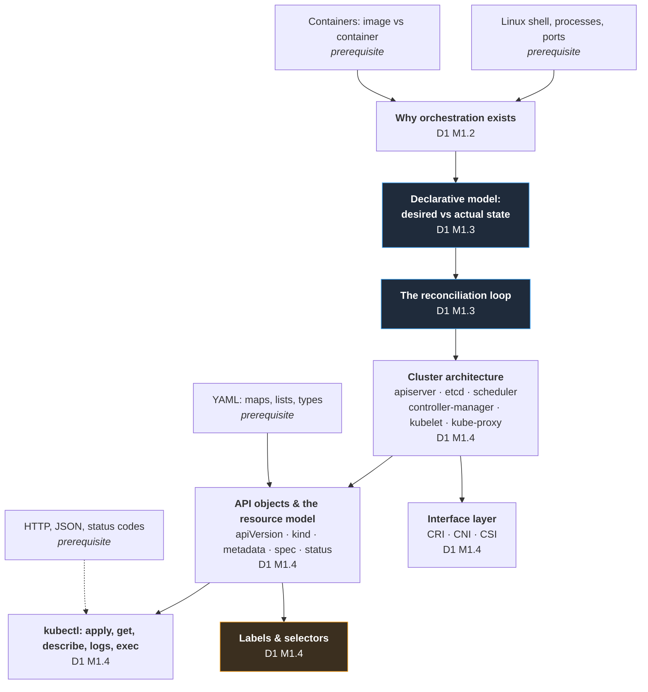
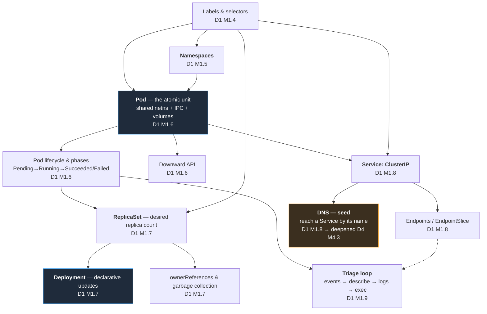
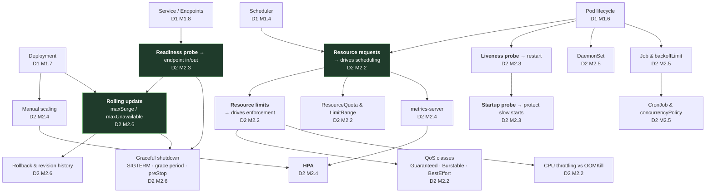
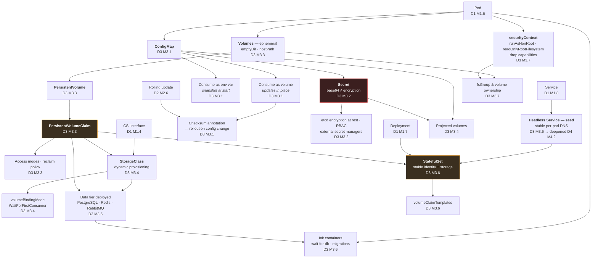
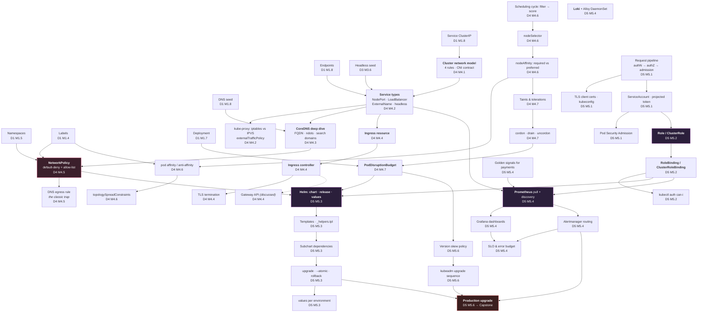

# Concept Dependency Map

**Rule enforced by this document:** no concept is taught, and no lab is run, before every one of its prerequisites has been taught. This is a directed acyclic graph. It was built by listing prerequisites *first* and deriving the teaching order *from* them — not by writing an agenda and rationalising it afterwards.

Three violations were found during construction and are resolved explicitly in §7. They are documented rather than hidden, because an instructor needs to know where the seams are.

---

## 1. How to read this

```
Concept A
    ↓  (A must be understood before B is meaningful)
Concept B
```

Each node carries its teaching location: **`D<day> M<module>`**.

- **Hard edge** (solid, `-->`) — B is *incomprehensible* without A. Never reorder.
- **Soft edge** (dashed, `-.->`) — B is *harder* without A, but teachable. Reorder only with a written justification.

---

## 2. The spine — Layer 0 to Layer 4

Everything in the course hangs off this. If a student loses the thread here, nothing later lands.



> **Why the reconciliation loop is the root of the tree.** Every controller in Kubernetes — ReplicaSet, Deployment, StatefulSet, DaemonSet, Job, HPA, the Ingress controller, cert-manager, an Operator — is the same loop with a different `spec`. Teach it once, properly, on Monday morning, and every subsequent object is a variation the student can predict rather than memorise. Teach it late and the whole week is rote learning.
>
> **Why labels and selectors sit this high.** Labels are the *only* mechanism by which Kubernetes objects find each other. Services find Pods by label. Deployments own ReplicaSets by label. NetworkPolicies select workloads by label. Anti-affinity groups by label. Prometheus discovers targets by label. A student weak on labels will fail on Day 1, Day 2, Day 4 and Day 5 — and will not know why. This is the highest-leverage twenty minutes in the course.

---

## 3. Workload layer — Layers 5 to 9



**Ordering justification for Day 1.**

| Edge | Why it cannot be reversed |
|---|---|
| Namespace → Pod | Every Pod is created *into* a namespace. Teaching Pods first means silently using `default`, which then has to be untaught. |
| Pod → ReplicaSet | A ReplicaSet is defined as "N copies of this Pod template". Without the Pod, there is nothing to replicate. |
| ReplicaSet → Deployment | A Deployment manages ReplicaSets. Students who meet Deployment first believe Deployment creates Pods directly, and are then unable to explain rollbacks on Day 2. **This 10-minute detour buys the entire Day 2 update model.** |
| Pod + Labels → Service | A Service is a label selector plus a virtual IP. Both halves must exist first. |
| Service → Endpoints | Endpoints are the *output* of the selector. Teaching them first inverts cause and effect — and "no endpoints" is the single most common Service bug, so students must understand the direction of the arrow. |

---

## 4. Reliability layer — Day 2



**Three edges that carry the whole day.**

1. **`requests` → HPA.** The HPA computes `desiredReplicas = ceil(currentReplicas × currentUtilisation / targetUtilisation)`, where utilisation is a percentage *of the request*. With no request there is no denominator and the HPA reports `<unknown>` and does nothing. Teaching HPA before requests produces a lab that silently fails and a student who concludes "HPA doesn't work."

2. **Readiness probe → rolling update.** A rolling update advances when new pods become *Ready*. With no readiness probe, "Ready" means "the container process started", so the rollout completes while the application is still loading its connection pool — and traffic is dropped. Every zero-downtime deployment story in the industry rests on this single edge.

3. **Readiness probe → graceful shutdown.** On termination, the pod must leave the Endpoints list *before* it stops accepting connections, or in-flight payments are severed. This is `preStop` + readiness working together, and it only makes sense once both are understood.

---

## 5. State layer — Day 3



**Why StatefulSet cannot be taught on Day 1 with the other controllers** — even though the source syllabus groups them together under "Managing Workloads".

A StatefulSet is defined entirely in terms of things a Day 1 student has not met:

| StatefulSet feature | Requires |
|---|---|
| Stable persistent storage per replica | PersistentVolumeClaim (D3 M3.3) |
| `volumeClaimTemplates` | StorageClass and dynamic provisioning (D3 M3.4) |
| Stable network identity `pod-0.svc…` | Headless Service (D3 M3.6) |
| Ordered, graceful deployment and scaling | Pod lifecycle + graceful shutdown (D2 M2.6) |
| The reason it exists at all | Contrast with Deployment's interchangeable pods (D1 M1.7) |

Taught on Day 1, StatefulSet is a vocabulary exercise. Taught on Day 3 — the hour after students have watched a database pod get rescheduled and lose its data — it is obvious. This is the single most important resequencing decision in the course.

---

## 6. Networking, placement, security and operations — Days 4 and 5



**Load-bearing edges in the back half of the week.**

| Edge | Consequence of getting it wrong |
|---|---|
| **DNS deep dive → NetworkPolicy** | Students must already know that every service call begins with a UDP/TCP 53 lookup to CoreDNS in `kube-system`. Without it, their first default-deny policy breaks everything and they cannot reason about why. Taught in this order, the fix is *derivable* rather than copied. |
| **RBAC → Prometheus** | Prometheus discovers targets by calling the API server with a ServiceAccount token. Its ClusterRole is the first real-world RBAC object students meet, and it lands the day's security lesson far harder than a synthetic "read-only auditor" example. |
| **PDB → cluster upgrade** | Draining a node without PodDisruptionBudgets evicts every replica of the payment service simultaneously. The capstone upgrade *requires* the PDBs written on Day 4 — this is the clearest demonstration all week that Thursday's work protects Friday's. |
| **Helm ← everything** | Helm is deliberately last. A student who learns Helm before raw manifests can install charts but cannot debug them. The chart built in M5.3 packages exactly the manifests the students wrote themselves over four days, so `helm template` output is instantly recognisable. |

---

## 7. Ordering violations found — and how they are resolved

Building the DAG surfaced three places where the ideal order conflicts with a fixed constraint. Each is resolved by an explicit **seed-then-deepen** pair rather than by pretending the dependency does not exist.

### V1 — DNS is needed on Day 1 but taught on Day 4

**Conflict.** The moment a ClusterIP Service exists (D1 M1.8), students reach it as `http://payment-service:8080`. That is DNS. But CoreDNS internals, FQDN forms, search domains and `ndots` belong with the networking module on Day 4.

**Resolution.** A 10-minute **seed** in D1 M1.8: *"Kubernetes runs a DNS server; a Service is reachable by its name inside its namespace, and by `name.namespace` across namespaces. We will open up how this works on Thursday."* Full treatment in D4 M4.3, which opens by explicitly calling back to the seed.

**Why this is correct, not a compromise.** You cannot teach Services without naming them. Deferring the *mechanism* while giving the *fact* is standard instructional practice, and the callback on Day 4 reinforces both.

### V2 — Headless Services are needed on Day 3 but belong in the Day 4 Service taxonomy

**Conflict.** `StatefulSet` (D3 M3.6) requires a headless Service for stable per-pod DNS. The complete Service-type taxonomy is D4 M4.2.

**Resolution.** **Seed** in D3 M3.6: headless Service introduced as *"a Service with `clusterIP: None`, which returns pod IPs instead of a virtual IP — which is what gives `postgres-0` a stable name."* Taught only to the depth StatefulSet requires. D4 M4.2 then places it in the full taxonomy alongside ClusterIP, NodePort, LoadBalancer and ExternalName.

### V3 — Troubleshooting is needed from hour four but is a Day 5 module

**Conflict.** The first injected incident is Day 1, 16:30. The formal troubleshooting module is D5 M5.5.

**Resolution.** This is not really a conflict — it is the correct design. The **6-step triage loop is taught on Day 1 (M1.9)** as a *method*, before students have enough Kubernetes knowledge for it to be a symptom lookup table. That is precisely why it works: they learn to *investigate* rather than to *recognise*. D5 M5.5 then consolidates four days of applied practice into decision trees and a written incident-record discipline.

**The 6-step triage loop, taught Day 1 and used 8 times:**

```
1. What is the desired state?      kubectl get <kind> -o yaml
2. What is the actual state?       kubectl get pods -o wide
3. What does the cluster say?      kubectl describe / kubectl get events --sort-by=...
4. What does the app say?          kubectl logs [--previous] [-c container]
5. Can I reproduce it from inside? kubectl exec / kubectl debug / kubectl port-forward
6. What changed?                   kubectl rollout history / git diff
```

---

## 8. Master concept → day matrix

Read down a column to see everything a student must already hold before that day begins.

| Concept | D1 | D2 | D3 | D4 | D5 |
|---|:--:|:--:|:--:|:--:|:--:|
| Reconciliation loop | **teach** | use | use | use | use |
| Cluster architecture | **teach** | use | use | use | use |
| Labels & selectors | **teach** | use | use | use | use |
| Namespaces | **teach** | use | use | use | use |
| Pod | **teach** | use | use | use | use |
| Downward API | **teach** | use | use | use | use |
| Deployment / ReplicaSet | **teach** | use | use | use | use |
| Service (ClusterIP) | **teach** | use | use | deepen | use |
| DNS | *seed* | use | use | **teach** | use |
| Triage loop | **teach** | use | use | use | consolidate |
| Requests / limits / QoS | | **teach** | use | use | use |
| ResourceQuota / LimitRange | | **teach** | use | use | use |
| Probes | | **teach** | use | use | use |
| Scaling / HPA | | **teach** | use | use | use |
| DaemonSet | | **teach** | use | use | use |
| Job / CronJob | | **teach** | use | use | use |
| Rolling update / rollback | | **teach** | use | use | use |
| Graceful shutdown | | **teach** | use | use | use |
| ConfigMap | | | **teach** | use | use |
| Secret | | | **teach** | use | use |
| Volumes / PV / PVC | | | **teach** | use | use |
| StorageClass / CSI | | | **teach** | use | use |
| StatefulSet | | | **teach** | use | use |
| Headless Service | | | *seed* | **teach** | use |
| Init containers | | | **teach** | use | use |
| securityContext | | | **teach** | use | use |
| Cluster network model | | | | **teach** | use |
| Service types / kube-proxy | | | | **teach** | use |
| Ingress + TLS | | | | **teach** | use |
| NetworkPolicy | | | | **teach** | use |
| Affinity / anti-affinity / spread | | | | **teach** | use |
| Taints / tolerations / drain | | | | **teach** | use |
| PodDisruptionBudget | | | | **teach** | use |
| AuthN / TLS / ServiceAccount | | | | | **teach** |
| Pod Security Admission | | | | | **teach** |
| RBAC | | | | | **teach** |
| Helm | | | | | **teach** |
| Prometheus / Grafana / Loki | | | | | **teach** |
| SLO / error budget | | | | | **teach** |
| Cluster upgrade | | | | | **teach** |

---

## 9. Lab dependency chain

Labs obey the same DAG. Each lab's artefacts are consumed by later labs; nothing is thrown away.


### 9.1 Recovery points

A single lab must never be able to destroy the week. Every lab ends by writing its state, and `scripts/validate/checkpoint-day<N>.sh` can rebuild any day's end-state from manifests in under four minutes.

| Checkpoint | Restores | Runtime |
|---|---|---|
| `checkpoint-day1.sh` | 3 namespaces, 4 Deployments, 4 Services | ~2 min |
| `checkpoint-day2.sh` | + resources, probes, HPA, DaemonSet, Job, CronJob | ~3 min |
| `checkpoint-day3.sh` | + ConfigMaps, Secrets, PVCs, data tier, seed data | ~4 min |
| `checkpoint-day4.sh` | + Ingress, NetworkPolicies, placement rules, PDBs | ~4 min |
| `checkpoint-day5.sh` | + RBAC, Helm release, observability stack | ~5 min |

A student who arrives late, breaks their cluster, or joins on Wednesday can be productive within five minutes. This is not a nicety — over a five-day course it is the difference between one lost student and one lost classroom.

---

*Document owner: Instructional Designer + Principal Software Engineer · Version 1.0 · Phase 1*
